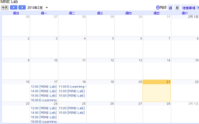

*********************************
新增教學大綱、靜態頁面、更新或課程講義
*********************************

新增靜態頁面
***********

**靜態頁面** 會列出所有課程底下所有的靜態頁面，這些頁面能協助您管理所有學生能夠快速存取的課程重要頁面。
靜態頁面不見得以一個特定的順序分布，端看您課程內容的需求。
舉例來說，您的靜態頁面可能包含您的教學大綱或您的評分標準。

.. image:: Images/image155.png

當您創建一個靜態頁面，會在您課程頁面上方的導覽列沿著 **教材** ， **課程資訊** 以及其他標籤的地方顯示名稱。
舉例來說，接著導覽列包含一個 **教學大綱** 靜態頁面和一個 **專題** 靜態頁面。

.. image:: Images/image157.png
    

新增一個靜態頁面:

1. 在導覽列上，點擊 **課程內容** ，之後點擊 **靜態頁面** 。

.. image:: Images/image159.png

2. 在右上角，點擊 **新增頁面** ，接下來內容就會顯示。

.. image:: Images/image161.png

3. 在對話框的右側，點擊 **編輯** ，就會開啟對話框。

.. image:: Images/image163.png

4. 在 **顯示名稱** 欄位，填入您想要顯示在您課程中導覽列的名稱。

5. 以您的內容取代佔位文字。

6. 點擊 **儲存** 。

新增一個時程表
************

為您的課程創建一個時程表，您可以創建一個 Google 行事曆讓學生可以合併進他們個人時程表中，或者您可以使用 HTML 去創建一個動態行事曆讓學生可以點擊連結。
您也可以同時將兩種行事曆都使用在您課程中。

Google 行事曆
============

您的 Google 行事曆應包含所有釋出日期以及截止日期。
您可以連結他們到您的課程中，您的行事曆看起來像接下來的行事曆 BerkeleyX's CS 169.2x 課程。
https://www.google.com/calendar/embed?src=edx.org_mcjhp2tv3ul2etfpb43hd388p4@group.calendar.google.com&amp;ctz=America/New_York_

.. image:: Images/image165.png

要創建一個 Google 行事曆，請先登入您的 Google 帳號，透過 **Calendar** 。
您就可以輸入您的行事曆資訊。您也可以在您的課程中任何地方創建一個連結到這個行事曆。

動態 HTML 時程表
===============

您可以創建一個動態 HTML 時程表頁面，來手動更新課程的進展。
下面的樣板是改編自 Dan Klein 和 Pieter Abbeel 教授創建的版本。

在下面是一個範例課程行事曆，展現出三週課程行事曆的方式。
如您所見，教材在第三周後沒有連結，也就是說資訊尚未被釋出。

這個課程使用如下方式釋出行事曆：

1. 當週課程在星期一釋出。 
2. 所有作業在星期三釋出，截止日期在則設定下星期的星期六。
3. 所有考試在星期五釋出，截止日期則設定在下星期的星期六 (九天後)。

.. image:: Images/image285.png

創建一個動態 HTML 行事曆：

1. 在導覽列上，點擊 **課程內容** ，之後點擊 **靜態頁面** 。

.. image:: Images/image159.png

2. 點擊右上角的 **建立新頁** 。接下來內容會顯示：

.. image:: Images/image161.png

3. 在對話框的右側，點擊 **編輯** ，就會開啟對話框。

4. 在編輯中開啟，並在 **顯示名稱** 中填入 **時程表** 。

5. 點擊 **HTML** 標籤。
  
 
.. image:: Images/image163.png
  
 
6. 進入 `附錄 B <appendices/b.html>` 並且複製編碼給動態行事曆樣板。
  
 
7. 在 Studio 編輯之中，以動態行事曆樣板編碼取代在 HTML 標籤上的佔位編碼。
  
  
課程講義
*******
  
 
在 Edge 上您的課程講義是列在 **課程資訊** 頁面上的 **課程講義** 側邊欄。
為了新增這些項目，您必須創建一個檔案以及上傳這個檔案到 **檔案及上傳** 頁面。
當您做了這件事之後，系統會替這個檔案產生網址，之後您就可以使用這個 URL 創建一個連結到 **課程講義** 側邊欄。
您可以在 **課程更新** 頁面創建這個連結。

  
.. note::
	
    您不能上傳影片到 **檔案及上傳** 頁面，一方面是檔案上傳大小的限制，另一方面我們希望您把檔案上傳到 YouTube。

上傳一個檔案到檔案及上傳頁面
========================
  
 
檔案與上傳頁面列出講義、圖片以及其他您想整合到您課程的內容。

  
.. image:: Images/image160.png
  
 
舉例來說，如果您想要匯入一部卡通到您的每週更新當中，您可以上傳圖片到 **檔案及上傳** 。
當您做了這件事之後，系統會替這個檔案產生網址，之後您就可以使用這個 URL 創建一個圖片連結到課程之中。
同樣的，如果您想要匯入一份講義到 **課程資訊** 頁面或是課程中 **課程大綱** 頁面，
您先上傳講義到這裡，之後在課程頁面或是 **課程大綱** 之下創建一個連結給講義。

 
您也可以使用 **檔案及上傳** 頁面來集中所有的檔案，這些檔案除非您將連結公佈出去，不然學生並不會看到。
  

舉個例子，如果您創建一個 Word 檔案並使用在您的班級，然後再創建一個從 Word 複製內容過來的 PDF 副本，
如此一來原始的 Word 檔案跟 PDF 副本都能並存在 **檔案及上傳** 頁面上，但僅分享 PDF 檔案的連結。
如果您稍後從您的個人電腦中刪除這個檔案，或者一位同事要求使用您的課程中的其中一個檔案，但是會更改您講義的日期，您就可以簡單地在 **檔案及上傳** 頁面找到原始 Word 檔。
  
 
請注意當您命名您的檔案名稱新增到 **檔案及上傳** 頁面時您應該小心。因為這個檔案名稱會變成 URL 的一部分，當學生開啟連結的時候會看到檔案名稱。
請避免使用像是 "AnswerKey.pdf." 的檔案名稱。
  
 
.. warning::

	在上傳檔案時，如果和已經上傳的檔案有相同的檔案名稱，將會導致原本的檔案被覆蓋掉。
  當您嘗試上傳一個已經有相同檔案名稱檔案存在的情況發生時，目前沒有警告訊息通知您。
	
        
 
上傳一個檔案到 **檔案及上傳** 頁面：
  
 
1. 在導覽列上，點擊 **課程內容** ，之後點擊 **檔案及上傳** 。
  
 
2. 在 **檔案及上傳** 頁面，點擊 **上傳新檔案** 。
  
 
.. image:: Images/image162.png
  
 
3. 在 **檔案及上傳** 的對話框中，點擊 **選擇檔案** 。
  
 
4. 在 **開啓** 的對話框中，選擇您想要的檔案後點擊 **開啓** 。
   
新增另外的檔案，請繼續點擊 **載入其他檔案** 。欲關閉對話框，點擊在右上角的 **X** 。
當您關閉對話框，檔案出現在 **檔案及上傳** 頁面上。
  
5. 決定您重新上傳檔案的 URL。
   要做到這件事，在 **檔案及上傳** 頁面上，選擇列表中的檔案，在 **URL** 列右側可以看到這個 URL。
   您將會需要使用這個 URL 來顯示一張圖片或創建一個超連結。

  
 
.. image:: Images/image164.png
  
 
.. note::

    目前來說，您不能在檔案上傳到 **檔案及上傳** 頁面後刪除檔案，您可以上傳一個相同檔名的檔案覆蓋原始檔案，但是您無法刪除它。
      
  
  
新增項目給講義側邊欄 
=================================
  
 
1. 在導覽列上，點擊 **課程內容** ，之後點擊 **更新** 。
  
 

  
 
2. 在右側選擇 **課程講義** 側邊欄，之後點擊 **編輯** 。
  
 
.. image:: Images/image168.png
  
 
3. 在 XML 對話框中，顯示、創建連結給您的檔案。
  
 

* 為了創建一個連結給一個文件，請輸入接下來的語法。
  要注意的是 **URL OF FILE** 欄位應該輸入的是於 **檔案及上傳** 上傳檔案時，第五步提示給您的 URL。
  **LINK TEXT** 則是您想顯示在 **課程講義** 側邊欄上的訊息。

.. code-block:: html

    
<a href="[URL OF FILE]">[LINK TEXT]</a>

* 為了創建一個連結給一張您已經上傳的圖片，請輸入接下來的語法。
  要注意的是 **URL OF FILE** 欄位應該輸入的是於 **檔案及上傳** 上傳檔案時，第五步提示給您的 URL。

.. code-block:: html

    

 
  
 
4. 點擊 **儲存** 。您的檔案會出現在 **課程講義** 之下。
  
 
新增一個公告或更新
***************
  
 
	您可以新增公告或更新來歡迎學生來到這個班級，提醒學生考試，通知學生課程行事曆的變動，以及學生需要銘記的重要步驟。
	這些更新出現在 edX 或 Edge 的 **課程資訊** 標籤上。
	因為您的課程會自動開啟到 **課程資訊** 頁面，學生登入時將會馬上看到更新。
    
  
 
    1. 在 **課程內容** 選單上點擊 **更新** ，開啟 **課程更新** 頁面。
  
 
    .. image:: Images/image185.png

  
 
    2. 點擊 **新增更新** ，接著對話框開啟。
  
 
    .. image:: Images/image187.png
  
 
    這個對話框的內容格式必須是 HTML，您可以參考 `附錄 A <appendices/a.html>` 內的說明填入。
  
 
    3. 以 HTML 輸入您的更新，之後點擊 **儲存** 。
