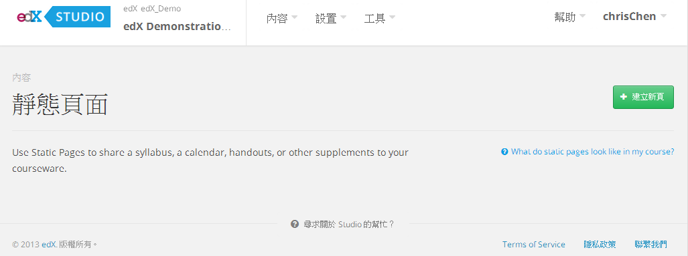
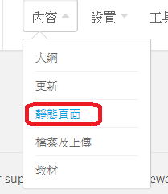
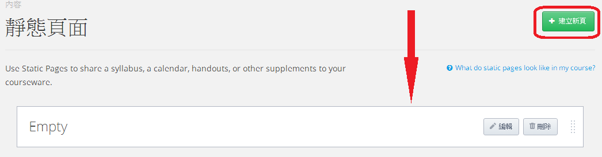
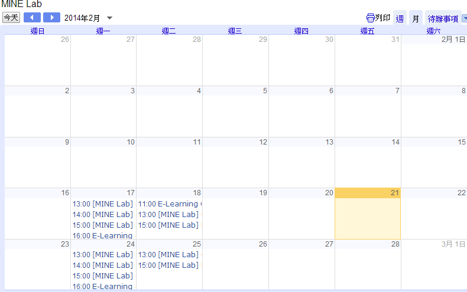
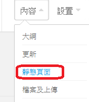
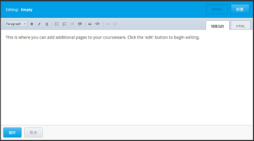
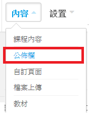

*******************************************************
新增教學大綱、靜態頁面、更新或課程講義
*******************************************************

新增靜態頁面
*****************

**Static Pages** 帶您到您想要學生能夠簡單存取的課程重要頁面表單。
靜態頁面經常應用在整個課程而不是一個特定的順序。
舉例來說，您的靜態頁面可能包含您的教學大綱或您的 grading policy 資訊。

當您創建一個靜態頁面，會在您課程頁面上方的 navigation bar 沿著 **Courseware** ， **CourseInfo** 以及其他標籤的地方顯示名稱。
舉例來說，接著 navigation bar 包含一個 **Syllabus** 靜態頁面和一個 **Projects** 靜態頁面。

.. image:: Images/image157.png
    

新增一個靜態頁面:

1. 在navigation bar上，點擊 **Course Content** ，之後點擊 **Static Pages** 。

2. 在右上角，點擊 **New Page** 。 接下來entry就會顯示。

3. 在Box的右側，點擊 **Edit** 。 就會開啟dialog box。

.. image:: Images/image163.png

4. 在 **display_name** 欄位，填入您想要顯示在您課程中navigation bar的名稱。

5. 以您的內容取代placeholder文字。

6. 點擊 **Save**.

新增一個行事曆
**************

為您的課程創建一個行事曆，您可以創建一個Google行事曆讓學生可以合併進他們個人行事曆中，或者您可以使用HTML去創建一個動態行事曆讓學生可以點擊連結。
您也可以同時將兩種行事曆都使用在您課程中。

Google行事曆
===============

您的Google行事曆應包含所有釋出日期以及截止日期。您可以連結他們到您的課程中。您的行事曆看起來像接下來的行事曆for BerkeleyX's CS 169.2x 課程。
馬上看這個行事曆，點擊
https://www.google.com/calendar/embed?src=edx.org_mcjhp2tv3ul2etfpb43hd388p4@group.calendar.google.com&amp;ctz=America/New_York_

創建一個Google行事曆，存取您的Google帳號，之後點擊頁面上方的 **Calendar** 。您就可以輸入您的行事曆資訊。您也可以在您的課程中任何地方創建一個連結到這個行事曆。

動態HTML行事曆
=====================

您可以創建一個動態HTML行事曆頁面，來手動更新課程的進展。下面的樣板是改編自Dan Klein和Pieter Abbeel教授創建的版本。

在下面是一個範例課程行事曆，展現出三週課程行事曆的方式。如您所見，教材在第三周後沒有連結，也就是說資訊尚未被釋出。

這個課程使用如下方式釋出行事曆：

1. 所有lessons在星期一被釋出。 
2. 所有回家作業在星期三被釋出，以及截止日期在接下來一周的星期六。
3. 所有考試在星期五被釋出，截止日期則設定在下星期的星期六 (9天後) 。

.. image:: Images/image285.png

創建一個動態HTML行事曆：

1. 在navigation bar上，點擊 **Course Content** ，之後點擊 **Static Pages**.

2. 在右上角，點擊 **New Page** 。接下來entry顯示。

3. 在Box右側，點擊 **Edit** 。接著dialog box開啟.

4. 在編輯中開啟，並且填入 **Schedule ** 在 **display_name** box中。

5. 點擊 **HTML** 標籤。
  
 
.. image:: Images/image163.png
  
 
6. 進入 `Appendix B <appendices/b.html>` 並且複製編碼給動態行事曆template。
  
 
7. 在Studio編輯之中，以動態行事曆template編碼取代在HTML標籤上的placeholder編碼。
  
  
課程講義  
***************
  
 
在Edge上您的課程講義是有用的在 **Course Info** 頁面上的 **Course Handouts** sidebar 。
為了新增這些項目，您必須創建一個檔案以及上傳這個檔案到 **Files & Uploads** 頁面。
當您做了這件事，一個URL就會為了這個檔案被創造，之後您就會看到這個URL創建了一個連結給這個在**Handouts** sidebar上的檔案。
您可以在 **Course Updates** 頁面創建這個連結。

  
.. note::
	
    您不能上傳影片到 **Files & Uploads** 頁面。

上傳一個檔案到檔案與上傳頁面 (File & Uploads)
=========================================
  
 
檔案與上傳頁面列出講義、圖片以及其他您想整合到您課程的內容。

  

  
 
舉例來說，如果您想要匯入一部卡通到您的每週更新當中，您可以上傳圖片到 **Files & Uploads**。
當您做了這件事之後，這個檔案就會一個專屬的URL，之後您就可以使用這個URL來創建一個連結圖片到課程之中。
同樣的，如果您想要匯入一個講義到 **Course Info** 頁面或在一個課程中的 **Course Handouts** section，
您先上傳講義到這裡，之後在這個課程或是 **Course Handouts** 之下創建一個連結給講義。

  
 
您也可以使用 **Files & Uploads** 頁面來使您所有課程的內容在一個地方。
如果您創建一個連結給它，內容只有學生可以看到。
這樣您就可以保持舊版的內容。
  
 
舉個例子，如果您創建一個Word檔案並使用在您的班級，然後再創建一個從Word複製內容過來的PDF副本，
您就可以連結到PDF檔但仍保持原始Word檔在 **Files Uploads** 頁面上。
如果您稍後從您的個人電腦中刪除這個檔案，或者一位同事要求使用您的課程中的其中一個檔案，但是會更改您講義的日期，您就可以簡單地在 **Files Uploads** 頁面找到Word檔。

  
 
請注意當您命名您的檔案名稱新增到 **Files & Uploads** 頁面時您應該小心。因為這個檔案名稱會變成URL的一部分，當學生開啟連結的時候會看到檔案名稱。
請避免使用像是"AnswerKey.pdf." 的檔案名稱。
  
 
.. warning::

	在上傳檔案時，如果和已經上傳的檔案有相同的檔案名稱，將會導致原本的檔案被覆蓋掉。
    當您嘗試上傳一個已經有相同檔案名稱檔案存在的情況發生時，目前沒有警告訊息通知您。
	
        
 
上傳一個檔案到  **Files & Uploads** 頁面：
  
 
1. 在navigation bar上，點擊 **Course Content** ，之後點擊 **Files & Uploads** 。
  
 
2. 在 **>Files & Uploads** 頁面，點擊 **Upload New File** 。
  
 

  
 
3. 在 **Upload New File** 中的dialog box，點擊 **Choose File**。
  
 
4. 在 **Open** 中的dialog box，選擇您想要的檔案，並且點擊 **Open** 。
   
新增另外的檔案，點擊 **Load Another File**。關閉dialog box，點擊在右上角的 **x** 。
當您關閉dialog box，檔案出現在 **Files & Uploads** 頁面上。
  
5. 決定您重新上傳檔案的URL。要做到這件事，在 **Files & Uploads** 頁面上，選擇列表中的檔案。在 **URL** 列右側，
您可以看到這個URL您將會需要使用這個來顯示一張圖片或創建一個超連結。

  
 

  
 
.. note::

    目前來說，您不能在檔案上傳到 **File & Upload** 頁面後刪除檔案，您可以上傳一個相同檔名的檔案覆蓋原始檔案，但是您無法刪除它。
      
  
  
新增項目給講義Sidebar 
=================================
  
 
1. 在navigation bar上，點擊 **Course Content** ，之後點擊 **Updates** 。
  
 
image:: Images/image166.png
  
 
2. 在右側選擇 **Course Handouts** sidebar ，之後點擊 **Edit** 。
  
 

  
 
3. 在XML box中，顯示、創建連結給您的檔案。
  
 

* 為了創建一個連結給一個文件，請輸入接下來的語法。要注意的是 URL OF FILE 欄位應該輸入的是於 **Upload a File** 上傳檔案時，第五步提示給您的 URL。LINK TEXT 則是您想顯示在 **Handouts** 側邊欄上的訊息。

.. code-block:: html

    
<a href="[URL OF FILE]">[LINK TEXT]</a>

* 為了創建一個連結給一張您已經上傳的圖片，輸入接下來的語法，應注意 URL OF FILE 欄位要輸入的是於 **Upload a File to Your Assets Tab** 上傳檔案時，第五步提示給您的 URL .

.. code-block:: html

    

 
  
 
4. 點擊 **Save** 。您的檔案會出現在 **Course Handouts** 之下。
  
 
新增一個公告或更新
*****************************
  
 
	您可以新增公告或更新來歡迎學生來到這個班級，
	提醒學生考試，通知學生課程行事曆的變動，以及call out學生需要銘記的重要步驟。
	這些更新出現在edX或Edge的 **Course Info** 標籤上。
	因為您的課程自動開啟到 **Course Info** 頁面，學生登入時將會馬上看到更新。
    
  
 
    1. 在 **Course Content** menu上，點擊 **Updates** 。 **Course Updates** 頁面開啟。
  
 
    .. image:: Images/image185.png

  
 
    2. 點擊 **New Update** ，接著對話框開啟。
  
 
    .. image:: Images/image187.png
  
 
    這個box的內容格式必須是HTML。作為一個template您可能使用來匯入placeholders，
	請參考 `Appendix A <appendices/a.html>`。
  
 
    3. 以HTML輸入您的更新，之後點擊 **Save** 。
