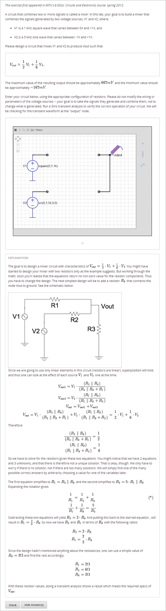
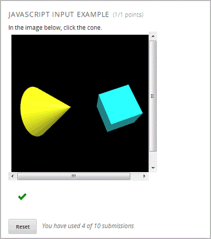
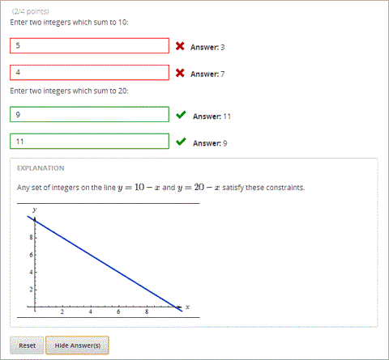
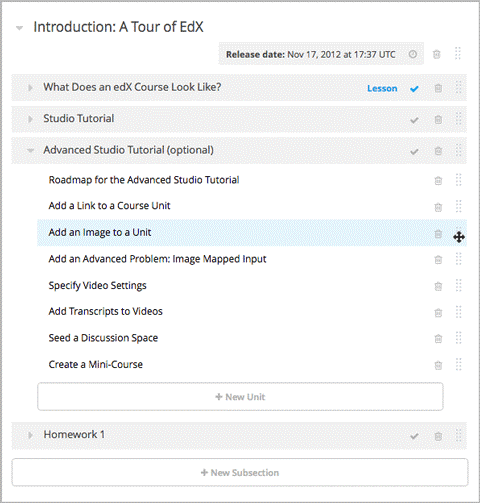
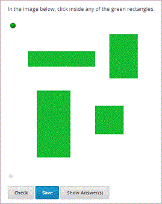
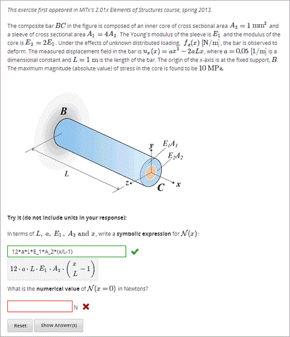
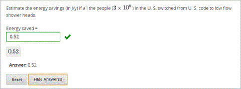
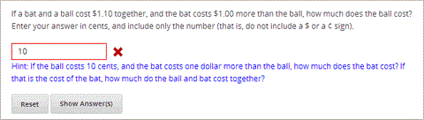

.. _Advanced Problems:

進階題型
=================

拖放、電路示意圖生成器及數學表達等皆為進階題型。當要新增題型時，這些問
題會置於進階標籤中。本工作室提供建置這些題目的範本，但題目會直接在 **進階
編輯** 中開放，並且要以 XML 格式製作。

-  :ref:`Circuit Schematic Builder` In circuit schematic problems, students
   create and modify circuits on an interactive grid and submit
   computer-generated analyses of the circuits for grading.
-  :ref:`Custom JavaScript Display and Grading` With custom JavaScript display
   and grading problems, you can incorporate problem types that you've created
   in HTML into Studio via an IFrame.
-  :ref:`Write-Your-Own-Grader` Write-your-own-grader problems
   evaluate students' responses using an embedded Python script that you
   create. These problems can be any type.
-  :ref:`Drag and Drop` Drag and drop problems require students to drag text
   or objects to a specific location on an image.
-  :ref:`Image Mapped Input` Image mapped input problems require students to
   click a specific location on an image.
-  :ref:`Math Expression Input` Math expression input problems require
   students to enter a mathematical expression as text, such as
   e=m\*c^2.
-  :ref:`Problem Written in LaTeX` This problem type allows you to convert
   problems that you've already written in LaTeX into the edX format.
   Note that this problem type is still a prototype, however, and may
   not be supported in the future.
-  :ref:`Problem with Adaptive Hint` These problems can give students
   feedback or hints based on their responses. Problems with adaptive
   hints can be text input or multiple choice problems.

這些問題很容易在 Studio 中取得。要發問的話請按在 **新增組件** 底下點選 **題型**，
並點選 **進階標籤** ，然後點選想新增的題型名稱。

.. _Circuit Schematic Builder:

電路示意圖生成器
-------------------------

在電路示意圖題目部份，學生能夠調整電路元件如互動網格上的電壓源 、電容器、
電組器以及金氧半導體場效電晶體 ，然後他們要交出就系統中電路上直流電、交
流電或暫態之分析並以此打分。 

建立電路示意生成器題型
~~~~~~~~~~~~~~~~~~~~~~~~~~~~~~~~~~~~~~~~~~

#. 在您想要建立題型的單元中，點選 **新增組件** 底下的題型，然後點選 **進階** 標籤。
#. 點選 **電路生成器** 。
#. 在出現的組件中點選 **編輯** 。
#. 在組件編輯器中，以自己的編碼取代範例編碼。
#. 點選 **儲存** 。

.. _Custom JavaScript Display and Grading:

自訂 JavaScript 程式語言顯示與打分
-------------------------------------

自訂 JavaScript 程式語言顯示與打分題型(也稱為自訂 JavaScript 程式語言題型
或 JS 輸入題型)讓您能夠建置使用 JavaScript 程式語言的自訂題型或工具，然
後將題型或工具直接新增於 Studio 中。當在建置 JS 輸入題型時， Studio 將題型
內嵌於內建框架中(IFrame)，如此學生便能夠在 LMS 中與其互動。您能夠使用
JavaScript 程式語言或基本 Python 語言為學生的作業打分數，而成績會整合在
EdX 打分系統中。
所建置的 JS 題型必須是 HTML 格式、 JavaScript 程式語言及串接式表單(CSS)。
您能夠使用任何應用工具，例如 Google 網頁應用程式開發工具(GWT)，來建置
自己的 JS 輸入題型。 

自訂 JavaScript 程式語言顯示與打分題型
~~~~~~~~~~~~~~~~~~~~~~~~~~~~~~~~~~~~~~~~~~~~~~~~~~~~~~

#. 建立自己的 JavaScript 程式並上傳所有與此應用程式有關的檔案到 **檔案與上傳** 
頁面。
#. 在您想要建立題型的單元中，點選 **新增組件** 底下的題型，然後點選 **進階** 標籤。
#. 點選 **自訂 JavaScript 程式語言顯示與打分** 。
#. 在出現的組件中點選 **編輯** 。
#. 在組件編輯器中，根據您的題型編修範例編碼。

   - 所有的題型有超過一種的元素。大部分的題型皆與同源政策(SOP)相符，意即所
有元素有相同的協定、主機以及埠。例如, **http**://**store.company.com**:**81**/subdirectory_1/JSInputElement.html and
     **http**://**store.company.com**:**81**/subdirectory_2/JSInputElement.js have the same protocol
     (http), host (store.company.com), and port (81).

    如果問題中的任何元素使用不同的協定、主機或埠 ，則需要略過同源政策。
例如 **https**://**info.company.com**/JSInputElement2.html
     uses a different protocol, host, and port. To bypass the SOP, change
     **sop="false"** in line 8 of the example code to **sop="true"**. For more information, see the same-origin policy
     page on the `Mozilla Developer Network <https://developer.mozilla.org/en-US/docs/Web/JavaScript/Same_origin_policy_for_JavaScript>`_
     or on `Wikipedia <http://en.wikipedia.org/wiki/Same_origin_policy>`_.
#. 如果想要使題目有 **儲存** 鈕的話，點選 **設定** 標籤，然後在 **最大嘗試次數** 中設定
一個大於 0 的數字。
#. 點選儲存。

重設範例題型
^^^^^^^^^^^^^^^^^^^^^^^^^^^^^

要重設上述範例題型，則需要以下檔案：

   - webGLDemo.html
   - webGLDemo.js
   - webGLDemo.css
   - three.min.js

You'll create the first three files using the code in :ref:`Appendix F`. The three.min.js file is a library
file that you'll download.

#. Go to :ref:`Appendix F` and use the code samples to create the following files.

   - webGLDemo.html
   - webGLDemo.js
   - webGLDemo.css

#. Download the **three.min.js** file. To do this, go to the `three.js home page <http://threejs.org>`_,
   and then click **Download** in
   the left pane. After the .zip file has finished downloading, open the .zip file, and then
   open the **build** folder to access the three.min.js file.

    **Note** If you need to bypass the SOP, you'll also need the **jschannel.js** file. To do
    this, go to the `jschannel.js <https://github.com/mozilla/jschannel/blob/master/src/jschannel.js>`_
    page, copy the code for the file into a text editor, and then save the file as jschannel.js.

#. 在 **檔案及上傳** 頁面，上傳所有剛建立或下載的檔案。
#. 建立一個新的自訂 JavaScript 顯示與給分範例題目組件。
#. 在 **設定** 標籤，將 **最大嘗試次數** 設定一個大於 0 的數字。
#. 在題目組件編輯器中，將以下的編碼替代範例編碼。
#. 點選 **儲存** 。 

JavaScript 程式語言題型編碼
#############################

::

    <problem display_name="webGLDemo">
    In the image below, click the cone.

    
    <customresponse cfn="vglcfn">
        <jsinput
            gradefn="WebGLDemo.getGrade"
            get_statefn="WebGLDemo.getState"
            set_statefn="WebGLDemo.setState"
            width="400"
            height="400"
            html_file="/static/webGLDemo.html"
        />
    </customresponse>
    </problem>

.. note::    當要建立題目時，請注意以下要點‧ 

             - webGLDemo.js file  界定三種  JavaScript 程式語言功能
 **(WebGLDemo.getGrade,WebGLDemo.getState**,  以及
 **WebGLDemo.setState)**.
  JavaScript

             - JavaScript 程式語言輸入題型編碼使用
 **WebGLDemo.getGrade, WebGLDemo.getState**,  以及
 **WebGLDemo.setState** 來打分、儲存或復原題型。這些功能全球皆通用

             -  **WebGLDemo.getState** 以及 **WebGLDemo.setState** 是可任意選擇的。如
果想要保有這些題型的狀態時必須界定這些功能。
   **寬** 和  **高** 

             - 寬 和 高 代表內鍵框架中應用程式的尺寸。

             - 當打開題目時，圓錐和立方體都是藍色或 「未經選擇」 。當點選一次點選其中
一個形狀時，該形狀會變黃色，或成為 「已選擇」。若不選擇的話則再點選一
次。繼續點選形狀以做選擇。

             - 當使用者 **點選** 查詢而圓錐(黃色)被選擇時則代表回答被評為正確。

             - 點選 **查詢** 或 **儲存** 登記題目的現況。

.. _Write-Your-Own-Grader:

自行評分  (自訂 Python 語言輸入)
-------------------------------------------------------

在自行評分題型中(也稱為自訂 Python 語言輸入) ，評估的是學生使用在課程裡面
創造及嵌入 Python 語言。這些題目可以是任何類型，數值輸入及文字輸入是常
見的自行評分方式。 

建立自行評分題型
~~~~~~~~~~~~~~~~~~~~~~~~~~~~~~~~~~~~~~

要建立自行評分題型：

#. 在您想要建立題型的單元中，點選 **新增組件** 底下的題型，然後點選 **進階** 標籤。
#. 點選 **自訂 Python 語言輸入** 。
#. 在出現的組件中點選 **編輯** 。
#. 在組件編輯器中，以自己的編碼取代範例編碼。
#. 點選 **儲存** 。

For more information about write-your-own-grader problems, see `CustomResponse XML and Python
Script <https://edx.readthedocs.org/en/latest/course_data_formats/custom_response.html>`_.

.. _Drag and Drop:

拖放
-------------

在拖放的問題中，學生藉由託拉文字或物件到一圖像的特定位置來回答問題。 

建立拖放題目
~~~~~~~~~~~~~~~~~~~~~~~~~~~~~~

要建立拖放題目：

#. 在您想要建立題型的單元中，點選 **新增組件** 底下的題型，然後點選 **進階** 標籤。
#. 點選 **拖放** 。
#. 在出現的組件中點選 **編輯** 。
#. 在組件編輯器中，以自己的編碼取代範例編碼。
#. 點選 **儲存** 。

For more information about drag and drop problems, see `XML Format of Drag and Drop Input
<http://data.edx.org/en/latest/course_data_formats/drag_and_drop/drag_and_drop_input.html>`_.

.. _Image Mapped Input:

圖像映射輸入
------------------

在圖像映射輸入題目中，學生點選一限定範圍中的圖樣，  藉由加上題目主體的
座標來界定此範圍。 

建立影像映射輸入題目
~~~~~~~~~~~~~~~~~~~~~~~~~~~~~~~~~~~~

要建立影像映射輸入題目：

#. 在您想要建立題型的單元中，點選 **新增組件** 底下的題型，然後點選 **進階** 標籤。
#. 點選 **影像映射輸入** 。
#. 在出現的組件中點選 **編輯** 。
#. 在組件編輯器中，以自己的編碼取代範例編碼。
#. 點選 **儲存** 。

.. _Math Expression Input:

數學表達式輸入
---------------------

在數學表達式輸入題目中，學生輸入代表數學公式的文字，而 Studio 將文字轉換
為具象徵性的表達式並呈現於學生所打字的下方。不像數值輸入題目只允許整數
及些許常數，數學表達式題目能夠包含更多複雜且具象徵性的表達式。

When you create a math expression input problem for your students in
Studio, you'll use `MathJax <http://www.mathjax.org>`_ to change your
plain text into "beautiful math." For more information about how to use
MathJax in Studio, see :ref:`MathJax in Studio`.

建立數學表達式題目
~~~~~~~~~~~~~~~~~~~~~~~~~~~~~~~~~~~~~~

要建立數學表達式題目：

#. 在您想要建立題型的單元中，點選 **新增組件** 底下的題型，然後點選 **進階** 標籤。
#. 點選 **數學表達式輸入** 。
#. 在出現的組件中點選 **編輯** 。
#. 在組件編輯器中，以自己的編碼取代範例編碼。
#. 點選 **儲存** 。

For more information, see `Symbolic Response
<https://edx.readthedocs.org/en/latest/course_data_formats/symbolic_response.html>`_.

.. _Problem Written in LaTeX:

以 LaTeX 寫成的題目 
------------------------

如果原有題目已經是以 LaTeX  寫成，您能夠使用這種題目類型輕易地轉換編碼
為 XML。在將編碼貼到 LaTeX  編輯器後，只需要多些微調整。請注意這種題目
類型仍在雛型階段且未來可能不予以支援，所以請謹慎使用。

.. note:: If you want to use LaTeX to typeset mathematical expressions
          in problems that you haven't yet written, use any of the other problem
          templates together with `MathJax <http://www.mathjax.org>`_. For more
          information about how to create mathematical expressions in Studio using
          MathJax, see *A Brief Introduction to MathJax in Studio*.

建立以 LaTeX 寫成的題目
~~~~~~~~~~~~~~~~~~~~~~~~~~~~~~~~~

要建立以 LaTeX  寫成的題目：

#. 在您想要建立題型的單元中，點選 **新增組件** 底下的題型，然後點選 **進階** 標籤。
#. 點選 **以 LaTeX 寫成的題目** 。
#. 在出現的組件中點選 **編輯** 。
#. 在左下角的組件編輯器中，點選開始原始編譯器。
#. 以自己的編碼替代範例編碼。
#. 在左下角的 LaTeX 原始編譯器中，點選 **儲存及編碼為 edX XML** 。

.. _Problem with Adaptive Hint:

具有適應性暗示之題型
--------------------------

具有適應性暗示之題型是要評估學生的回答，然後根據學生的回答給予回饋或暗
示，如此學生更能在下次回答正確。這種問題能夠是文字輸入或單選題題目。 

建立具有適應性暗示之題型
~~~~~~~~~~~~~~~~~~~~~~~~~~~~~~~~~~~~~~

To create a problem with an adaptive hint:

#. 在您想要建立題型的單元中，點選 **新增組件** 底下的題型，然後點選 **進階** 標籤。
#. 點選 **具有適應性暗示之題型** 。
#. 在出現的組件中點選 **編輯** 。
#. 以自己的編碼替代範例編碼。
#. 點選 **儲存** 。
