.. _Common Problems:

############################
常見題型
############################

常見題型是指多重選擇題或學生能夠容易選擇、填寫的題型。您可使用 Studio
簡易編輯模式建立各種題型，毋須使用 XML 或進階編輯模式。
Studio 平台中的常見題型如下：

-  :ref:`Checkbox` In checkbox problems, students select one or more options
   from a list of possible answers.
-  :ref:`Dropdown` In dropdown problems, students select one answer from a
   dropdown list.
-  :ref:`Multiple Choice` Multiple choice problems require students to
   select one answer from a list of choices that appear directly below
   the question.
-  :ref:`Numerical Input` Numerical input problems require answers that
   include only integers, fractions, and a few common constants and
   operators.
-  :ref:`Text Input` In text input problems, students enter a short text
   answer to a question.

建立各項題型可點選題型之下的 **增加新項目** ，點選 **常見題型** ，選擇題型名稱。
( **多選按鈕** 題型須另從 **空白常見題型** 中建立)
11.1.

.. _Checkbox:

*******************
多選按鈕
*******************

在多選按鈕題型中，可設定一至多個選項，其中至少有一個正確答案，學生必
須完全選出此題的正確答案，才可繼續作答。

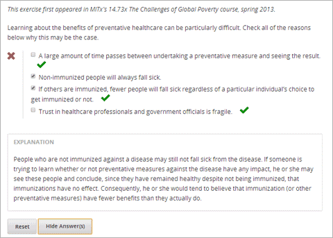

==========================
建立多選按鈕題型
==========================

#. 在增加新項目之下點選題型
#. 在選擇題型項目類型畫面中，從常見題型類型標籤中點選多選按鈕
#. 點選題型項目上的編輯
#. 在項目編輯模式中輸入題目敘述，並分別在各行輸入選項文字。
#. 選出所有的正確選項後，點選多選按鈕

   .. image:: Images/ProbComponent_CheckboxIcon.gif
   
   ，完成此步驟時，各選項旁會
出現方括弧  [  ]

#. 在正確解答的方括弧內輸入 x
#. 在項目編輯模式中選擇題目敘述文字，然後點選提示按鈕

   .. image:: Images/ProbCompButton_Explanation.gif
   ，將圖示新
增至敘述文字旁。

#. 各種設定說明位於設定功能標籤。
#. 點選儲存。

上述示範的題型範本可參考下列：

::

    Learning about the benefits of preventative healthcare can be particularly 
    difficult. Check all of the reasons below why this may be the case.

    [x] A large amount of time passes between undertaking a preventative measure 
    and seeing the result. 
    [ ] Non-immunized people will always fall sick. 
    [x] If others are immunized, fewer people will fall sick regardless of a 
    particular individual's choice to get immunized or not. 
    [x] Trust in healthcare professionals and government officials is fragile. 

    [explanation]
    People who are not immunized against a disease may still not fall sick from 
    the disease. If someone is trying to learn whether or not preventative measures 
    against the disease have any impact, he or she may see these people and conclude, 
    since they have remained healthy despite not being immunized, that immunizations 
    have no effect. Consequently, he or she would tend to believe that immunization 
    (or other preventative measures) have fewer benefits than they actually do.
    [explanation]

.. _Dropdown:

*******************
下拉選單
*******************

此題型讓學生從下拉選單中直接選出正確答案，和選擇題不同的是，學生必須
點選下拉清單才能看到該題的答案選項內容。

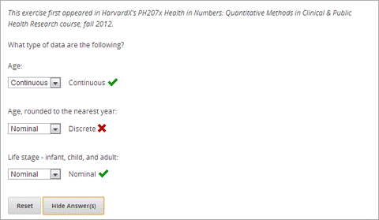

==========================
建立下拉選單題型
==========================

步驟如下：

#. 在增加 **新項目** 之下點選 **題型** 
#. 在 **選擇題型項目類型** 畫面中，從 **常見題型類型** 標籤中點選 **下拉選單** 
#. 點選 **題型項目** 上的編輯
#. 在項目編輯模式中輸入題目敘述，在同一行欄位中輸入選項文字，並各個
項目以逗號區分。
#. 選擇答案項目，然後點選下拉選單按鈕
      
   .. image:: Images/ProbCompButton_Dropdown.gif
      
  ，完成此步驟時，各選項旁會出現雙方括弧[[ ]]
      
#. 在正確解答的兩側標註括號( )
#. 在項目編輯模式中選擇題目敘述文字，然後點選提示按鈕

   .. image:: Images/ProbCompButton_Explanation.gif
   ，將圖示新增至敘述文字旁。

#. 各種設定說明位於設定功能標籤。
#. 點選儲存。

上述示範的題型範本可參考下列：

::

    What type of data are the following?

    Age:
    [[Nominal, Discrete, (Continuous)]]
    Age, rounded to the nearest year:
    [[Nominal, (Discrete), Continuous]]
    Life stage - infant, child, and adult:
    [[(Nominal), Discrete, Continuous]]

.. _Multiple Choice:

*******************
選擇題
*******************

此題型讓學生從條列的選項清單中選出正確答案，和下拉選單不同的是，各個
選項內容直接顯示在題目的下方。

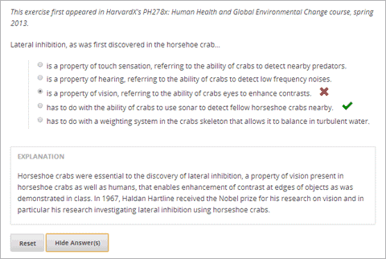

==================================
建立選擇題型
==================================

#. 在增加新項目之下點選 **題型** 
#. 在 **選擇題型項目** 類型畫面中，從 **常見題型類型** 標籤中點選 **選擇題** 
#. 點選題型項目上的 **編輯** 
#. 在項目編輯模式中輸入題目敘述，並分別在各行輸入選項文字。
#. 選擇答案項目，然後點選選擇題按鈕
   
   .. image:: Images/ProbCompButton_MultChoice.gif
   
   ，完成此步驟時，各選項旁會
出現圓括弧( )
   
#. 在正確解答的圓括弧內標註 x 
   
#. 在項目編輯模式中選擇題目敘述文字，然後點選提示按鈕

   .. image:: Images/ProbCompButton_Explanation.gif
   ，將圖示新
增至敘述文字旁。

#. 各種設定說明位於設定功能標籤。
#. 點選儲存。

上述示範的題型範本可參考下列：

::

    Lateral inhibition, as was first discovered in the horsehoe crab:

    ( ) is a property of touch sensation, referring to the ability of crabs to 
    detect nearby predators.
    ( ) is a property of hearing, referring to the ability of crabs to detect 
    low frequency noises.
    (x) is a property of vision, referring to the ability of crabs eyes to 
    enhance contrasts.
    ( ) has to do with the ability of crabs to use sonar to detect fellow horseshoe 
    crabs nearby.
    ( ) has to do with a weighting system in the crabs skeleton that allows it to 
    balance in turbulent water.

    [Explanation]
    Horseshoe crabs were essential to the discovery of lateral inhibition, a property of 
    vision present in horseshoe crabs as well as humans, that enables enhancement of 
    contrast at edges of objects as was demonstrated in class. In 1967, Haldan Hartline 
    received the Nobel prize for his research on vision and in particular his research 
    investigating lateral inhibition using horseshoe crabs.
    [Explanation]

.. _Numerical Input:

*******************
數值輸入
*******************

在數值輸入題型中，學生直接以數字或數學運算式填答。 

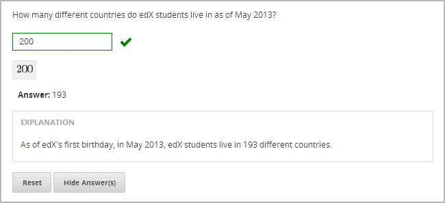

備註：學生的答案不必與解答完全一致。您可設定容錯率或公差，請參閱下方
說明指引。
為符合數值輸入可以包含整數、分數、常見常數(如圓周率)，同時也可包含平
方根、log2、三角函數及其反函數(如正弦、反正弦)。Studio 改變數學符號的
輸入方式，請參考下列範例：

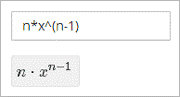

==================================
建立數值輸入題型
==================================

#. 在增加新項目之下點選 **題型** 
#. 在 **選擇題型項目** 類型畫面中，從 **常見題型類型** 標籤中點選 **數值輸入** 
#. 點選題型項目上的 **編輯** 
#. 在項目編輯模式中輸入題目敘述，並分別在各行輸入選項文字。

#. 選擇答案項目，然後點數值輸入題型按鈕

   .. image:: Images/ProbCompButton_NumInput.gif
   
   ，完成此步驟時，答案旁會
出現等號  = 
        
#. (選用)如果要設定容錯率或公差，可在答案後方以+- **數字** 標註，也可加上百
分比符號。例如容錯率為 2%則在答案後方標註+-2%，公差為 5 標註+-5。 
   

#. 在項目編輯模式中選擇題目敘述文字，然後點選提示按鈕

   .. image:: Images/ProbCompButton_Explanation.gif
   ，將圖示新
增至敘述文字旁。

#. 各種設定說明位於 **設定功能** 標籤。
#. 點選 **儲存** 。

上述示範的題型範本可參考下列：

::

   How many different countries do edX students live in as of May 2013?

   = 193 +- 5%
    
   [explanation]
   As of edX's first birthday, in May 2013, edX students live in 193 different countries.
   [explanation]

**範例說明**

The following are a few more examples of the way that Studio renders numerical input
text that students enter.

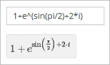
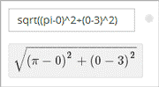
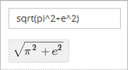
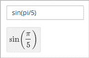

For more information, see `Formula Equation Input 
<https://edx.readthedocs.org/en/latest/course_data_formats/formula_equation_input.html>`_.

.. _Text input:

*******************
文字輸入
*******************

在文字輸入題型中，答案可包含數字、文字、標點符號。學生所輸入的答案必
須完全符合正確解答，無論是拼字、標點符號都須一致，因此建議您將填答次
數設定為一次以上，允許打字錯誤的情況發生。 

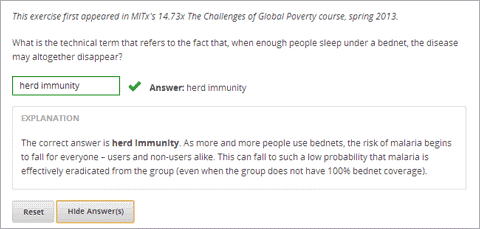

==================================
建立文字輸入題型
==================================

步驟如下：

#. 在增加新項目之下點選 **題型** 
#. 在 **選擇題型項目** 類型畫面中，從 **常見題型類型** 標籤中點選 **文字輸入** 
#. 點選題型項目上的 **編輯** 
#. 在項目編輯模式中輸入題目敘述，並分別在各行輸入選項文字。

#. 選擇答案項目，然後點數值輸入題型按鈕
   
   .. image:: Images/ProbCompButton_TextInput.gif
   
   ，完成此步驟時，答案旁
會出現等號  = 
  
   
#. 在項目編輯模式中選擇題目敘述文字，然後點選提示按鈕

   .. image:: Images/ProbCompButton_Explanation.gif
   ，將圖示新
增至敘述文字旁。

#. 各種設定說明位於 **設定功能** 標籤。
#. 點選 **儲存** 。

上述示範的題型範本可參考下列：

::

    What is the technical term that refers to the fact that, when enough people 
    sleep under a bednet, the disease may altogether disappear?
    = herd immunity

    [explanation]
    The correct answer is herd immunity. As more and more people use bednets, 
    the risk of malaria begins to fall for everyone – users and non-users alike. 
    This can fall to such a low probability that malaria is effectively eradicated 
    from the group (even when the group does not have 100% bednet coverage).
    [explanation]
    
=========================================
文字輸入題型的多重答案
=========================================

您可設定一個以上的正確解答，例如正確答案為 Dr. Martin Luther King, Junior,
時，同時您也可以設定 Martin Luther King,、Doctor Martin Luther King,  等為
正確答案。
設定方法：在正確答案前標註  or=，如下圖所示：

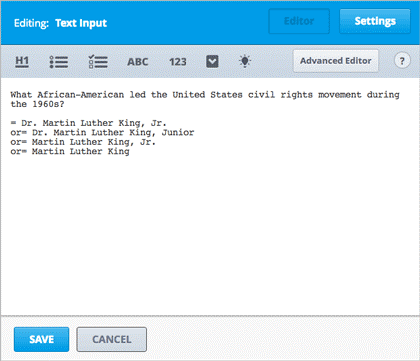

=========================================
區分大小寫字母與文字輸入題型
=========================================

By default, text input problems do not require a case sensitive response. You can change this
and require a case sensitive answer.

To make a text input response case sensitive, you must use the :ref:`Advanced Editor`.

In the advanced editor, you see that the **type** attribute of the **stringresponse** 
element equals **ci**, for *case insensitive*. For example:

::

    <stringresponse answer="Michigan" type="ci">
      <textline size="20"/>
    </stringresponse>

To make the response case sensitive, change the value of the **type** attribute to **cs**.

::

    <stringresponse answer="Michigan" type="cs">
      <textline size="20"/>
    </stringresponse>
    
=============================================
文字輸入題型的文字長度設定
=============================================

預設的填答文字長度限制為 20 字元以內，可視正確答案內容或學生可能填寫
的其他答案，調整文字長度限制。

If the default response field length is not sufficient, you can change it using the :ref:`Advanced Editor`.

在進階編輯模式中， **textline** 標籤的 size 屬性為 20，表示文字長度限制為 20
字元。

::

    <stringresponse answer="Democratic Republic of the Congo" type="ci">
      <textline size="20"/>
    </stringresponse>

To change the response field length, change the value of the **size** attribute:

::

    <stringresponse answer="Democratic Republic of the Congo" type="ci">
      <textline size="40"/>
    </stringresponse>
