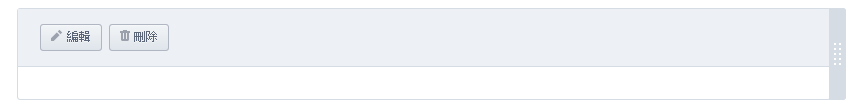
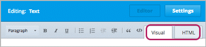
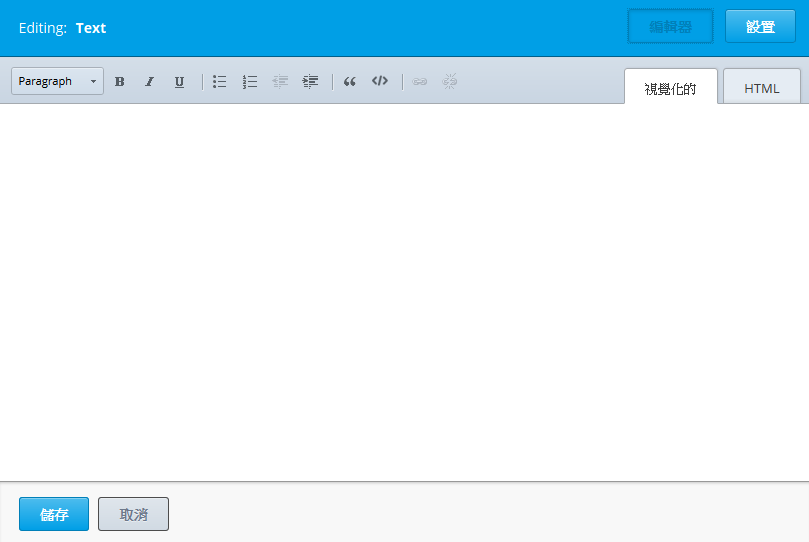
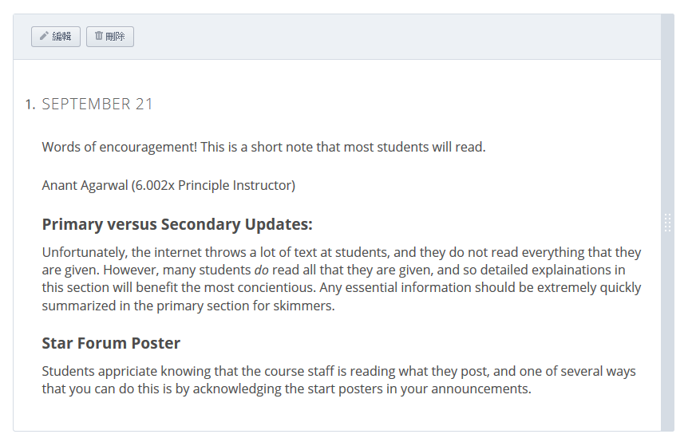
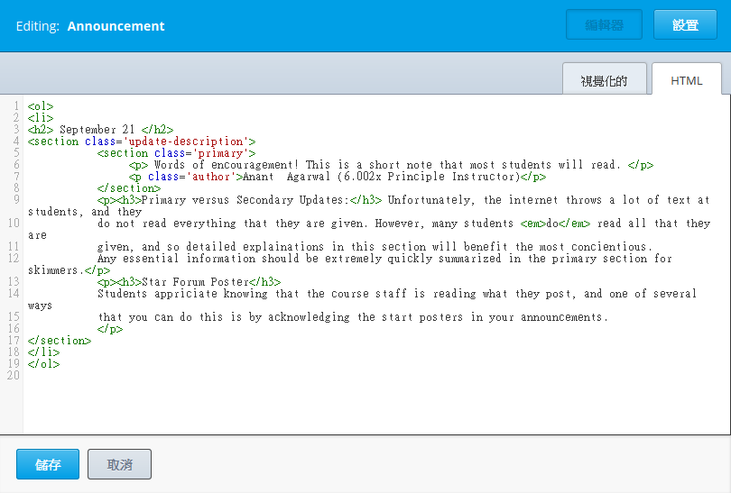
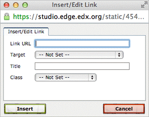
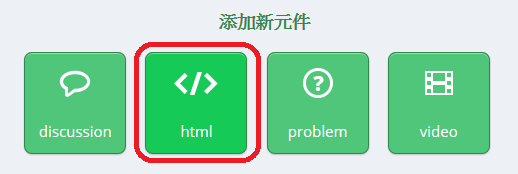

.. _Working with HTML Components:

<<<<<<< HEAD
=======
    .. image:: Images/C07_01.png
>>>>>>> 529851508041f3ac8bbe1c63416923240662ea04

#############################
使用 HTML 組件
#############################

***********************
前言
***********************

HTML 組件是建構課程的基本要素，利用 HTML 組件新增與格式化文字、連結、圖片等。

請見以下主題內容，取得更多資訊：

* :ref:`The User Interface`
* :ref:`Create an HTML Component`
* :ref:`Add a Link in an HTML Component`
* :ref:`Add an Image to an HTML Component`
* :ref:`Import LaTeX Code`

.. note:: Review :ref:`Organizing Your Course Content` and :ref:`Best Practices for HTML Markup` before you start working with HTML components.

.. _The User Interface:

*****************************************
使用者介面
*****************************************

<<<<<<< HEAD
使用 HTML 組件編輯器新增 HTML 組件，編輯器提供兩種觀看模式： **視覺模式**
與  **HTML 模式** 。點下編輯器右上角的按鍵，可互換兩種模式。
=======

>>>>>>> 529851508041f3ac8bbe1c63416923240662ea04

<<<<<<< HEAD
-  **視覺模式** 提供「所見即所得」功能，使用編輯器上方的格式化功能時，能夠
立即看見結果。每次開啟 HTML 組件，系統預設採用視覺模式。
=======

>>>>>>> 529851508041f3ac8bbe1c63416923240662ea04

  以下清單是視覺模式提供的格式化功能。

  .. image:: Images/HTML_VisualView_Toolbar.gif

  #. 選擇樣式，如：標題 1、標題 2 或段落。
  #. 文字粗體
  #. 文字斜體
  #. 文字加底線
  #. 新增項目符號清單
  #. 新增編號清單
  #. 減少縮排
  #. 縮排
  #. 引號
  #. 字型（如：使用 Courier 字體）
  #. 新增連結
  #. 刪除現有的連結

 視覺模式透過學習管理平台顯示內容，請見下圖範例。 

  .. image:: Images/HTMLComponent_VisualView_LMS.gif

- **HTML 模式** 允許使用者直接用 HTML 語法編輯內容。

<<<<<<< HEAD
  .. image:: Images/HTML_HTMLView.gif
=======

>>>>>>> 529851508041f3ac8bbe1c63416923240662ea04

  .. note:: 使用 HTML模式時，建議切換到視覺模式確認編輯成果，特別在新增圖片或
新增連結時，可以做雙重確認。 

.. _Create an HTML Component:

*****************************
新增 HTML 組件
*****************************

新增 HTML 組件的步驟：

<<<<<<< HEAD
1. 在 **新增組件**，點下 **html**。
=======

>>>>>>> 529851508041f3ac8bbe1c63416923240662ea04

  .. image:: Images/NewComponent_HTML.gif

2. 出現清單，點下 **文字**。
在畫面下方出現空白組件。

  .. image:: Images/HTMLComponent_Edit.gif

3. 點下 **編輯**。請見上圖範例。
開啟 HTML 組件編輯器，同時進入視覺模式。

  .. image:: Images/HTMLEditor.gif

4. 在視覺模式或 HTML 模式，輸入文字與使用格式化功能。

5. 輸入名稱（希望給學生看到的名稱）。點下編輯器右上角的 **設定**，在 **顯示名
稱** 欄位輸入文字。

   點下右上角的 **編輯**，回到原本的編輯模式。 

6. 點下 **儲存**。

在 HTML 組件內，可以新增連結與圖片，或是匯入 LaTex 程式碼。取得更多資
訊，請見：

* :ref:`Add a Link in an HTML Component`
* :ref:`Add an Image to an HTML Component`
* :ref:`Import LaTeX Code`

.. _Add a Link in an HTML Component:

***********************************
在 HTML 組件增加連結
***********************************

在 HTML 組件增加網站連結、課程單元連結、或是檔案，必須使用 **輸入／編輯
連結** 的對話框。

For more information, see:

* :ref:`Add a Link to a Website`
* :ref:`Add a Link to a Course Unit`
* :ref:`Add a Link to a File`

.. _Add a Link to a Website:

============================
增加網址
============================

操作步驟：

#. 選擇要成為連結的文字。

#. 點下工具列的連結圖示。

#.  **輸入／編輯連結** 的對話框會被開啟，在 **連線網址** 欄位，輸入要連線的網址。

   .. image:: Images/HTML_Insert-EditLink_Website.gif

#. 若是想以新視窗開啟連結，使用 **目標** 欄位的下拉式選單，選擇於 **新視窗開啟
連結** 。系統預設是不開啟新視窗。

#. 點下 **輸入** 。

#. 儲存並測試連結。

.. _Add a Link to a Course Unit:

============================
連線至課程單元
============================

連線至課程單元的步驟，說明如下：

#. 必須先取得該課程單元的識別號碼。請至 Studio 開啟單元，找到畫面右下角
的 **單元位置**，複製 **單元識別碼** 欄位的單元識別號碼。
   
   .. image:: Images/UnitIdentifier.gif

#. 開啟要增加連結的 HTML 組件編輯器

#. 選擇要成為連結的文字。

#. 點下工具列的連結圖示。

#.  **輸入／編輯連結** 的對話框會被開啟，在 **連線網址** 欄位，輸入

   ``/jump_to_id/<unit identifier>``

  貼上單元識別號碼取代<unit identifier>，並且確認有加上斜線  (/)  。請見下
圖。

   .. image:: Images/HTML_Insert-EditLink_CourseUnit.gif

#. 若是想以新視窗開啟連結，使用 **目標** 欄位的下拉式選單，選擇於 **新視窗開啟
連結** 。系統預設是不開啟新視窗。

#. 點下 **輸入** 。

#. 儲存並測試連線。

.. _Add a Link to a File:

============================
連線至特定檔案
============================

You can add a link in an HTML component to any file you've uploaded for the course. For more information about uploading files, see :ref:`Add Files to a Course`.

#. 進入 **檔案與上傳** 頁面，複製檔案的網址。

   .. image:: Images/HTML_Link_File.gif

#. 選擇要成為連結的文字。

#. 點下工具列的連結圖示。

#.  **輸入／編輯** 連結的對話框會被開啟，在 **連線網址** 欄位，輸入

   ``/static/FileName.type``

   貼上檔案網址取代< FileName.type >，
確認有加上斜線  (/)  ，請見下圖。

   .. image:: Images/HTML_Insert-EditLink_File.gif

#. 若是想以新視窗開啟連結，使用 **目標** 欄位的下拉式選單，選擇於 **新視窗開啟
連結** 。系統預設是不開啟新視窗。

<<<<<<< HEAD
#. 點下 **輸入** 。
=======

>>>>>>> 529851508041f3ac8bbe1c63416923240662ea04

#. 儲存並測試連線。

.. _Add an Image to an HTML Component:

***********************************
在 HTML 組件新增圖片
***********************************

You can add any image that you have uploaded for the course to an HTML component. For more information about uploading images, see :ref:`Add Files to a Course`.

.. note:: Review :ref:`Best Practices for Describing Images` when you add images to HTML components.

To add an image, you'll need the URL of the image that you uploaded to the course. You'll then create a link to the image in the HTML component.

#. 進入 **檔案與上傳** 頁面，複製圖片的網址。

#. 進入 HTML 組件，切換至 HTML 模式。

#. 找到要放置圖片的位置，依照下圖的語法，輸入圖片語法標籤。

   ``

``

   例如：圖片語法標籤應該會與下圖範例類似，差別僅在於圖片網址與描述說
明。

   ``

``

#. 切換到視覺模式檢查圖片。

.. _Import LaTeX Code:

****************************************
匯入 LaTeX 程式碼至 HTML 組件
****************************************

匯入 LaTeX 程式碼後，可以新增與顯示數學公式，請見下圖。

.. image:: Images/HTML_LaTeX_LMS.gif

.. warning:: LaTeX 處理器是 Studio 作為轉換 LaTeX 程式碼為 XML 之用，屬於第三方工具，
使用時請留意。若要使用此處理器，請與 PM（專案管理人員）共同操作。

系統不會預設開啟此功能，請至課程的進階設定，修改設定。

在 HTML 組件包含 LaTeX 程式碼，請依照下列步驟：

#. 開啟課程的規則序號。

   #. 進入 Studio 的 **設定** ，點下 **進階設定** 。
   #. 進入 **進階設定** 頁面，下拉畫面至 **使用 LaTeX 程式編輯** 的規則序號。
   #. 找到 **使用 LaTeX 程式編輯** 的規則序號旁邊的規則屬性欄位，將 **否** 換成 **是** 。
   #. 點下 **儲存改變** 。

#. 進入要新增組件的單元，點下在 **新增組件** 的 **html** ，再點下 **用 LaTeX 寫電子文本** ，產生新的組件。

#. 點下新組件右上方的 **上傳** 。

   .. image:: Images/HTML_LaTeX.gif

#. 選擇要上傳的檔案，然後點下 **開啟** ，檔案會被上傳至 LaTeX 編輯器。

   The file loads in the LaTeX editor.

   .. image:: Images/HTML_LaTeXEditor.gif

#. 若想要修改檔案。

#. 進入 LaTeX 編輯器，找到畫面左下的 **使用儲存與編輯成 edX XML** ，點下此
功能。

  組件編輯器將被關閉，同時開啟單元頁面，便可觀看用 LaTeX 編輯的內容。

   .. image:: Images/HTML_LaTeX_CompEditor.gif

#. 同樣在單元頁面，點下 **預覽** ，檢查檔案在學習管理平台顯示的樣式。

   * 若發現有誤，回到單元頁面，點下 **編輯** ，再度開啟組件。找到組件編輯器的左下方，點下 **開啟 Latex 來源編輯器** ，重新編輯 LaTeX 程式碼。

