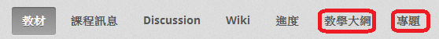

.. _Setting up a New Course:

###########################
建立新課程
###########################

*******************
綜覽
*******************

This chapter describes how to create and set up your course:

#. :ref:`Create a New Course`
#. :ref:`Edit Your Course`
#. :ref:`Use the Course Checklist`
#. :ref:`Add Course Team Members`
#. :ref:`Set Important Dates for Your Course`
#. :ref:`Describe Your Course`
#. :ref:`Add a Course Image`
#. :ref:`Add a Course Video`
#. :ref:`Set Course Requirements`
#. :ref:`Add Files to a Course`
#. :ref:`Add Static Pages`
#. :ref:`Add a Course Update`
#. :ref:`Add Course Handouts`
#. :ref:`Add Textbooks`

Also see the chapters :ref:`Establish a Grading Policy`, :ref:`Organizing Your Course Content`, and :ref:`Guidelines for Creating Accessible Content`.

.. _Create a New Course:
  
*******************
建立新課程
*******************

#. 登入Studio
#. 點選 **新課程**.
#. 輸入課程名稱、授課學校等課程資訊後點選 **建立**.

  .. image:: Images/new_course_info.png
     :width: 800

  .. note::  您所輸入的課程資訊字數限制為65字元以下，在此輸入的文字將成為URL網址的一部分，儲存前請務必仔細確認。課程建立後，若需修改URL網址，必須向edX聯繫尋求協助(網址：http://help.edge.edx.org)

  *  **課程名稱**：在此輸入課程的標題，其首字母須為大寫。

  *  **組織**：輸入所屬單位名稱，請勿輸入空格及特殊符號。
  
  *  **課程編號**：輸入主題縮寫與號碼，例如公共衛生207課程，在此欄位以PH207表示。數學101x課程，輸入Math101x，請勿輸入空格及特殊符號。

    *備註: 若您的課程開放給全球學生選修，請確認課程標號中加註“x”；僅供所屬單位學生選修時，則不加註“x”。* 

4. 點選 **儲存**

You then see the empty Course Outline.

.. _Edit Your Course:

************************
編輯課程
************************
建立新課程時，Studio 會自動開啟編輯畫面，閒置過久時將自動登出。

點選課程名稱，開啟編輯畫面後，將進入課程大綱頁面，後續詳細說明建立新課程時的各項功能。

 .. image:: Images/open_course.png
  :width: 800
 
To open the course, click the course name. 

When you open a course, you go to the Course Outline. The next topic discusses working with your course outline.

The rest of this page discusses other tasks you must do to set up your course.

.. _Use the Course Checklist:

************************
使用工作檢查清單
************************

您可利用工作檢查清單功能確認課程建置進度。

課程檢查清單項目包含：

* 開始建置新課程
* 初擬課程大綱
* 發展 edX 支援工具
* 初擬課程介紹資訊

從課程清單點選工作 **檢查清單**。

 .. image:: Images/checklist.png
  :width: 800
 

如上圖所示，將滑鼠停留在 **新增課程團隊人員**功能時，畫面上就會顯示編輯功能按鈕，也可展開或摺疊工作檢查清單，勾選已完成的工作項目。Studio 將自動儲存更新的項目，課程團隊人員皆可進行檢視。

.. _Add Course Team Members:

************************
新增課程團隊人員
************************

課程團隊人員是指協助建置課程內容的相關人員，其中具備管理者功能的成員能夠新增、移除課程團隊人員名單，並將管理者功能授權給其他成員。 除了管理者功能以及授權功能之外，其他的團隊人員能夠使用編輯課程以及執行各項平台功能。

.. note::  課程團隊人員能夠刪除其他成員建立的內容項目。

課程團隊人員必須註冊 Studio 帳號，並進行啟用。

設定步驟如下：

#. 確認您的帳號具備管理者功能
#. 確認成員已註冊 Studio 帳號
#. 在 **功能設定**表單中，選擇 **課程團隊**
#. 點選 **新增團隊人員**
#. 輸入成員的電子郵件信箱，然後點選 **新增成員**

.. _Set Important Dates for Your Course:

***********************************
設定重要時程
***********************************
在 **功能設定**表單中點選 **課程表和細節**。依照網頁上的項目逐一設定課程開課以及報名的起迄日期和時間。 

.. image:: Images/schedule.png

Follow the on-screen text to enter the course and enrollment schedule.

.. note::

網頁上所顯示的時間與您的瀏覽器所設定的時區相同，而學生看到的時間則是世界標準時間 UTC。

.. _`Describe Your Course`:

************************
撰寫課程簡介
************************

課程簡介包含摘要、先修課程、課程人員介紹以及常見問題，學生可於課程摘要網頁上瀏覽簡介內容。

edX.org 平台上的課程簡介位於課程目錄，學生必須參加該門課程才能夠瀏覽簡介內容。

#. 在功能設定選單中點選 **課程表和細節**
#. 下拉網頁至 **課程介紹**，在 **課程綜覽**欄位中撰寫課程簡介。

.. image:: Images/course_overview.png
  :width: 800

3. 依照黑色字體的內文說明編輯簡介內容，請勿更動 HTML 程式碼。包含欄位輸入提示的 HTML 程式碼範本，請參閱附件一 :doc:`appendices/a`.

   .. note:: There is no save button. Studio automatically saves your changes.
 
4. 點選 **課程摘要頁面**，檢視學生瀏覽的課程簡介畫面。

.. _`Add a Course Image`:

************************
新增課程圖片
************************

在此新增的課程圖片將上傳至課程摘要頁面，供學生瀏覽。
圖片尺寸應大於 660 *240 畫素，檔案格式為 JPG、PNG

#. 在 **功能設定**表單中點選 **課程表和細節** 
#. 下拉網頁至 **課程圖片**
#. 從本機電腦選擇圖片後，點選 **上傳課程圖片**，並依照網頁提示上傳圖片。
#. 檢視課程摘要頁面，確認圖片上傳成功

.. _`Add a Course Video`:

************************
新增課程影片
************************
學生可在課程摘要頁面上觀看影片。

#. 將課程影片上傳至 YouTube，記下位於影片網址  “watch?v =”  和“&feature”之間的 ID 編碼，如下圖以綠色方框標示的部分。

  .. image:: Images/image127.png
    :width: 800
    
2. 從 **功能設定表單**中選擇 **課程表和細節**
#. 下拉網頁至 **課程介紹影片**
#. 在影片框下方輸入 YouTube 影片的 ID 編碼，輸入完成後，Studio 自動儲存與更新您的影片
#. 檢視課程摘要頁面，測試學生所看到的影片內容。

.. _`Set Course Requirements`:

************************
設定課程必要條件
************************
The estimated Effort per Week appears on the Course Summary page that students see.

#. 從 **功能設定**表單選擇 **課程表和細節**
#. 下拉網頁至 **必要條件**
#. 在 **每週學習時數**欄位，輸入學生於每週課程所需投入的學習時數
#. 檢視課程摘要頁面，測試學生所看到的影片內容。

.. _`Add Files to a Course`:

**********************
新增課程檔案
**********************

新增課程檔案時，必須從課程項目、更新或講課題綱中增加檔案連結。在建立檔案連結之前，學生無法瀏覽該課程檔案。
 
.. note:: 檔案名稱會成為 URL網址的一部分，當學生開啟檔案時，即可看到檔案名稱，因此避免將檔案名稱設為 AnswerKey.pdf 等文字。
  
.. warning:: 上傳新檔案時，若檔案名稱和現有的檔案名稱相同時，現有檔案將被新檔案覆蓋取代。

設定步驟如下：
 
#. 在 **內容表單**中選擇 **檔案與上傳**
#. 點選 **上傳新檔案**
#. 在 **上傳新檔案**對話框中點選 **選擇檔案**
#. 在 **開啟**對話框中選擇要上傳的檔案後，點選 **開啟**
#. 欲新增其他檔案時，點選 **上傳其他檔案**
#. 點選右上角的 **x** 關閉對話框

當您關閉對話框後，新增課程檔案將顯示於 **檔案與上傳**頁面

==================
尋找檔案
==================
檔案依照上傳時間排序，最近上傳的檔案至於最上方。

在 **檔案與上傳**頁面中最多列出 50 個檔案項目，檔案數量超過 50 個時，將顯示
於下一頁，檔案總數會標示於網頁上方。

您可透過下列兩種方式尋找檔案：

* 使用網頁上的<>按鈕至上一頁和下一頁的網頁。

* 在網頁最下方，輸入頁碼即可前往對應編號的網頁。

  
  .. image:: Images/file_pagination.png

  
==================
取得檔案連結網址
==================
從課程項目、更新或講課題綱中增加檔案連結至檔案時，必須取得 URL 網址。
在 **檔案與上傳**頁面，確認檔案的位置，URL 網址欄位中即顯示連結數值，在該欄位上連續點擊兩下選擇網址後，再進行複製。
 
==================
鎖定檔案
==================
系統將已上傳的檔案設定為，無論是否註冊該門課程，只要擁有檔案網址的使用者皆可存取。點選鎖定圖示，即可將檔案設定為限該門課程人員和學生才可存取的權限。
 
==================
刪除檔案
==================
點選檔案旁的 **x** 圖示即可刪除檔案，同時畫面上會有提示說明，確認執行刪除
檔案

.. warning:: 檔案刪除後，網址連結便失效。刪除檔案前，請先確認您已修改連結網址。
 
.. _`Add Static Pages`:

****************
新增靜態網頁
****************
靜態網頁將顯示於課程導覽列，例如下圖導覽列的 **教學大綱*和 **計畫**的靜態網頁。您可以在課程中新增教學大綱、成績規則、講課題綱等靜態網頁。

You can use static pages for a syllabus, grading policy, course handouts, or any other purpose.

.. note:: 系統已預設並公開課程資訊、討論、維基百科、學習進度網頁供學生瀏覽，請勿刪除上述網頁。

設定步驟如下：

#. 在 **內容**表單中選擇 **靜態網頁**
#. 點選 **新增頁面**後，呈現網頁如下圖：

  .. image:: Images/image161.png
   :width: 800

3. 點選 **編輯** 

#. 在此輸入文字，可將編輯畫面切換為 HTML 模式
#. 點選 **設定**編輯網頁名稱
#. 點選 **儲存**

若要刪除靜態網頁，請點選網頁列的 **刪除**。

==================
新增行事曆
==================
您可使用靜態網頁呈現課程行事曆，將 Google 行事曆嵌入碼輸入至靜態網頁，建立 Google 行事曆，也可以建立動態 HTML 行事曆，請參閱附件二 :ref:`Appendix B`. 

.. _`Add a Course Update`:

**********************
新增課程更新通知
**********************

新增課程更新通知，以提醒學生有關測驗、課程表或任何緊急事件。

學生登入後，可從 **課程資訊**網頁上查看更新內容。

.. image:: Images/course_info.png
 :width: 800

設定步驟如下：

#. 在 **內容**表單選擇 **更新**
#. 點選 **新增更新**
#. 以 HTML 輸入更新內容

  .. note::  您必須以 HTML 輸入更新內容，包含欄位輸入提示的 HTML 程式碼範本，請參閱附件一 :ref:`Appendix A`.

4. 點選 **儲存**

.. _`Add Course Handouts`:

**********************
新增講課題綱
**********************
學生可在 **課程資訊**網頁瀏覽講課題綱。

.. note::  You must :ref:`Add Files to a Course` before you can add them as course handouts.

設定步驟如下：
#. 在 **內容**表單選擇 **更新**
#. 在 **講課題綱**頁面點選 **編輯**
#. Edit the HTML to add links to the files you uploaded. See :ref:`Add a Link in an HTML Component` for more information.
#. 點選 **儲存**

.. _`Add Textbooks`:

****************
新增教科書
****************
您可在課程中以 PDF 檔案格式新增教科書。每一份教科書檔案顯示於課程導覽
列供學生瀏覽。
建議您，分開上傳各章節的教科書檔案。當學生開啟教科書網頁時，可依照章
節順序瀏覽教科書。

.. image:: Images/textbook_chapters.png
 :width: 800

設定步驟如下：

#. 在 **內容**表單選擇 **教科書**
#. 選擇新增 **教科書**，呈現網頁如下圖：

  .. image:: Images/textbook_new.png
   :width: 800

3. 輸入 **教科書**名稱
#. 輸入 **章節名稱**
#. 點選 **上傳 PDF**，從您的電腦選擇檔案進行上傳。
#. 點選 **新增章節**後，重複步驟 3 和 4，可增加新的章節。
#. 點選 **儲存**