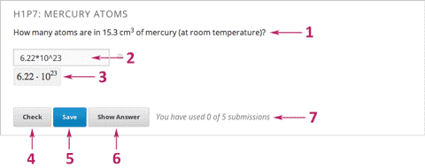
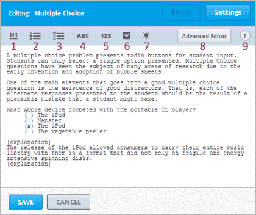
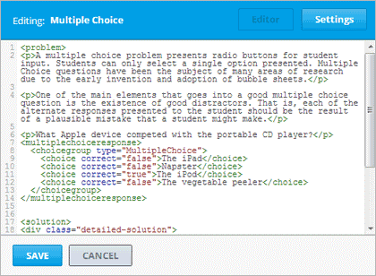
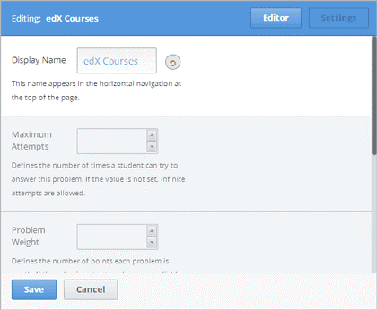
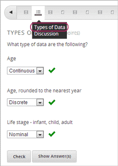
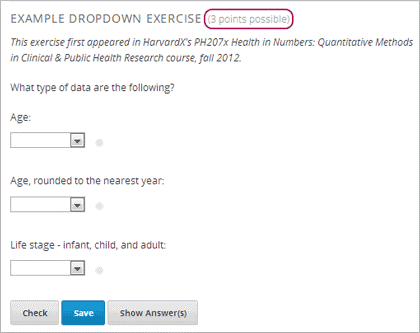
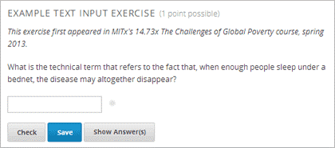

.. _Working with Problem Components:

################################
題型
################################

******************************
前言
******************************

本節將說明各種題型的設定與維護方式，使用者可以自行增加多種互動式與自動計分的練習題。

所有的題目都可計分，請先進入小節的評量類型，修改預設值，讓系統自動計分。

請點入以下標題，以取得更多詳細資訊。

* :ref:`Components and the User Interface`
* :ref:`Problem Settings`
* :ref:`Multiple Problems in One Component`
* :ref:`Modifying a Released Problem`

.. _Components and the User Interface:

************************************
功能項目與使用者介面
************************************

此部分將說明題目的各種功能項目，即學生在學習管理平台看到的題目，以及為開課教師說明Studio user interface。

==============================
學生瀏覽畫面
==============================

凡是出現在edX平台的題目都包含以下功能項目。

#. **問題說明。** 說明文字允許使用符合標準的HTML格式。

#. **答題欄位。** 學生必須在此欄位作答。答題欄位的樣式會根據題型而變化。

#. **顯示完整的數學公式。** 因應部分題型需求，Studio使用MathJax呈現完整的數學公式。

#. **提交答案。** 學生透過此功能輸入或確認答案是否正確，若正確答題，則出現綠色的打勾符號，若答題錯誤，則以紅色的X符號表示。系統會同步儲存分數與作答結果。

#. **儲存答案。** 此功能允許學生儲存作答內容，而非提交，因此，學生可回頭修改與提交答案。

#. **顯示答案。** 此功能可同時顯示正確答案與解題說明。出題者可選擇是否開啟此功能。

#. **提交答案次數。** 出題者可設定題目的作答次數，從特定次數到不限次數。

   .. image:: Images/AnatomyOfExercise2.gif

#. **回饋功能。** 學生提交答案後，系統會以符號表示答案是正確或錯誤。

   .. image:: Images/AnatomyofaProblem_Feedback.gif

#. **正確的答案。** 多數的題型需要出題者提供唯一的正確解答。

#. **解題說明。** 出題者提供解題的說明。只有使用「顯示答案」功能，才會出現解題說明。

#. **重新作答。** 此功能會清除學生的作答內容，可讓學生重新作答。

#. **隱藏答案。**

   .. image:: Images/AnatomyOfExercise3.gif

#. **自動計分。** 出題者可設定需要自動計分的問題，設定完畢後，該測驗會以藍色的鬧鐘符號表示。

   .. image:: Images/clock_icon.gif

#. **作答期限。** 此功能是用於限制題目的作答時間，一旦過期，就不接受提交答案與提供解題說明。

.. note::  每個題目有 **開啟** 或 **關閉** 的設定，被關閉的問題不能提交答案與更改已儲存的分數，但是，學生仍然可以看見題目、答案與解題說明。
		   

有些題型的屬性功能尚無法立即可用。

-  **隨機顯示題目編號。** 此功能適用於部份題型，出題者可以自行設定，開啟此功能後，每位學生看到的題目編號都不相同。
-  **最高得分。** 可自行設定各個題目的最高得分。

.. _Studio UI:

==============================
使用者介面
==============================

Studio提供兩種設定問題功能項目的介面：簡易編輯與進階編輯

-  **簡易編輯模式** 僅能直接輸入內容，無法透過XML編輯。
-  **進階編輯模式** 就是在edX的XML標準環境下編輯題目。

.. note:: 系統允許使用者隨時從簡易編輯模式轉換到 **進階編輯模式** ，但是，無法從進階編輯模式轉換到簡易編輯模式。

簡易編輯模式
~~~~~~~~~~~~~~~~~
在簡易編輯模式可使用題目製作的套版。下圖為單選題的範例。

為有效編輯與格式化題目，簡易編輯模式提供工具列。以下列出工具列的項目：

1.	製作Level 1的標題
2.	製作單選題的題型
3.	製作勾選題的題型
4.	製作可輸入文字的題型
5.	製作可輸入數字的題型
6.	製作下拉式的題型
7.	製作解題說明，當學生使用 **顯示答案** 時，此說明便會出現在網頁。
8.	在進階編輯模式編輯題目
9.	開啟格式化的提示列表

下圖是簡易編輯模式的單選題範例。

.. _Advanced Editor:

進階編輯模式
~~~~~~~~~~~~~~~~~~~
**進階編輯模式** 是採用XML來製作題目，提供套版使用，包含電路圖。

欲了解更多使用XML製作不同題型，請參見 :ref:`Appendix E`.

下圖是進階編輯模式的製作單選題的範例。

.. _Problem Settings:

******************
題目設定
******************

除了文字雲與開放式問答以外，系統提供以下的設定功能給所有的題目。本功能放在功能項目編輯器的 **設定** 。（在問題類型的頁面，提供開放式問題與文字雲的設定）

-  顯示題目名稱
-  提交答案的次數
-  目最高得分
-  隨機變更數值
-  顯示答案

===============
題目名稱
===============

題目名稱出現在網頁上方的位置，如同標題。

==============================
提交答案的次數
==============================

設定學生作答次數，系統預設是無限次。

.. _Problem Weight:

==============================
題目最高得分
==============================

.. note:: Studio儲存所有問題的分數，但是，學生成績僅計算真正被要求計分的題目。

本節說明如何設定題目的最高得分，設定完成後，該題的最高得分會顯示在題目名稱旁邊。

系統預設每個題目的答題欄位都是1分，每題可以設計多個答題欄位，例如，上圖範例採用下拉式題型，並要求學生回答3個問題，因此，有3個答題欄位，共是3分。

下圖範例採用文字輸入的題型，只有1個答題欄位，因此，只有1分。

計算分數
~~~~~~~~~~~~~~~~

每個問題的 **得分計算公式 = 最高得分 x （正確的答題數 ／ 全部的題目數）**

-  **分數** 即為學生的得分。
-  **最高得分** 為完全答對題目的最高得分。
-  **正確答案** 是指回答正確的題目欄位次數。
-  **答題欄位** 是指題目的答題欄位總數量。

**例題**

以下提供計算分數的例題。

*Example 1  例題1*

題目的 **最高得分** 的設定是空白，且該題目有兩個答題欄位，所以，依照預設值，該題目的最高得分是2分。

若學生僅答對一個答題欄位，另外一個答題欄位答錯，則學生的得分是1分。

*Example 2  例題2*

題目的最高得分是12，該題目有三個答題欄位。

其中，學生答對二個答題欄位，一個答錯，則學生的得分是8分。

*Example 3 例題3*

題目的最高得分是2分，該題目有四個答題欄位。

其中，學生答對一個，答錯三個，則學生的得分是0.5分。

===============
隨機更換計算數值
===============

This setting only applies to problems that have randomly generated
numeric values. It specifies whether random variable inputs are
randomized when a student loads the problem.

===============
顯示答案
===============

本功能有七種設定。

+--------------------------+---------------------------------------+
| **隨時觀看答案**         | 允許學生隨時都可以看到答案。          |
|                          |                                       |
+--------------------------+---------------------------------------+
| **提交答案後看答案**     | 學生提交答案後，才能看到答案。        |
|                          |                                       |
+--------------------------+---------------------------------------+
| **限制回答一次後看答案** | 學生試圖回答一次後，才能看到答案，    |
|                          | 無論學生回答的內容是否正確。          |
|                          |                                       |
+--------------------------+---------------------------------------+
| **無法提交題目**         | 學生達到被要求回答的次數，或是已過    |
|                          | 期無法作答的題目，才能看到答案。      |
+--------------------------+---------------------------------------+
| **題目完成後**           | 要求學生必須答題正確、已無可用的作答  |
|                          | 次數、或是已經過期無法作答的題目，    |
|                          | 才能看到答案。                        |
+--------------------------+---------------------------------------+
| **題目超過有效期**       | 已經過期無法作答的題目，才能看到答案。|
|                          |                                       |
+--------------------------+---------------------------------------+
| **關閉**                 | 不允許使用此功能，一旦選擇此設定，    |
|                          | 顯示答案的功能將被隱藏。              |
|                          |                                       |
+--------------------------+---------------------------------------+

===============
題目類型
===============

Studio提供多種題型的樣本，從單選題到建構虛擬電路，每個題目類型可在該題目的頁面取得。

-  :ref:`Common Problems` 在簡易編輯模式新增題型，可看到Studio提供的 **一般題目類型** 的標籤。
-  :ref:`Advanced Problems` 在進階編輯模式新增題型，可看到各種 **進階** 題型的標籤。
-  :ref:`Specialized Problems` 這些是預設值未提供的進階題型，新增的方式，首先必須調整該課程的進階設定，在 **增加新細項** 顯示進階細項，此時便可以開始編輯特殊題型。
-  :ref:`Open Response Assessment Problems` 提供以短文、附加檔案（如：電腦編碼或圖片）方式回答問題。

.. _Multiple Problems in One Component:

************************************
在單一問題功能項目新增多種題目
************************************

希望能夠讓學生以數字作答單選題，或是想讓學生同時回答多個題目，為了達到這個目的，可以在一個題目下使用多種題型。

先新增一個空白的進階題型，在功能項目編輯器，將XML貼到每個題型與答案，不需要連同其他細項也貼上，像是 **確認答案** 。

把 **確認答案** 、**顯示答案**、**重新提交**與自選的設定，套用到所有題目時，假若自行設定提交答案的次數為3次，表示學生有3次機會回答所有的題目，而非每個題目有3次回答的機會。

.. _Modifying a Released Problem:

************************************
修改已發佈的題目
************************************

.. warning:: 修改已經發布的題目時，要特別留意！

當學生重新提交答案時，Studio會更新已有的分數，但是，若出題者修改題目內容或屬性，Studio不會自動更新已經儲存的分數。

舉例來說，原本公布的題目與答案是3，而且已有學生完成作答，後來發現有誤，必須更正答案為2，此時，若原本學生的答案是2，Studio不會修正該學生的分數，會以修正前為主。因此，該學生不會取得此題目的分數。

在學生作答之後，才將答題欄位由原本的2個增加至3個，學生的得分則變更成0分、1分、2分、或3分。

變更題目的最高得分，原本系統儲存的分數，透過重新下載 **Progress** 頁面，即可更新分數。

===============
暫時解決方案
===============

修改已發佈的題目，因而影響到分數時，系統提供二種選項，但是，都必須請學生重新提交該題目的答案。

-  在題目功能項目中，增加提交答案的次數後，請學生重新提交答案。
-  刪除原本的題目，新增新的題目與設定方式，請學生完成新題目的答案提交。