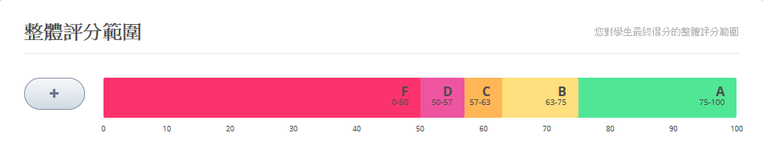
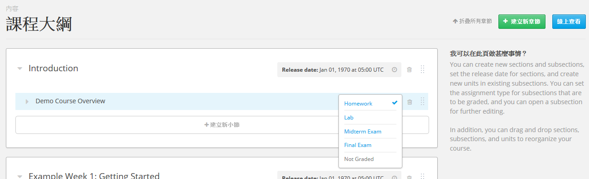
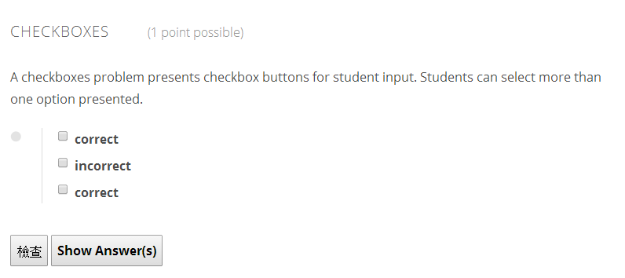
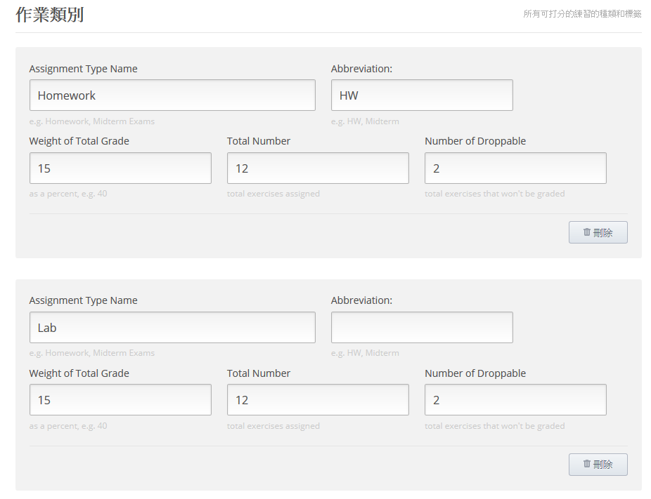
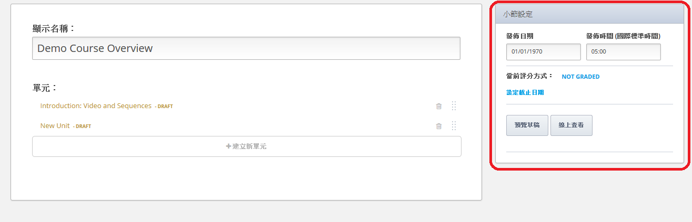
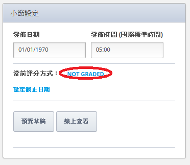
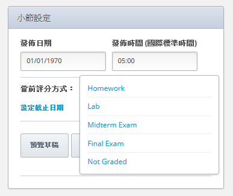

***************************
建立Grading Policy  
***************************
  

Overview 
********
  
  
在edX中的成績是基於assignment以及exam。
  
  
在edX Studio中設定成績需要許多步驟。 這些步驟將會在接下來的課程中詳細解釋。
要跳到詳細資訊，點擊下面的連結。 
  

1. 建立一個overall grading policy，也見 :ref:`Set Grade Brackets<Set-Grade-Brackets>`.
          

  
This is done at the course level in the **Course Settings** menu.
  
          
建立是否你的課程是pass-fail或graded by letter，及各個分數的threshold為何。
     
          
創建課程的assignment類型以及確定weight of the student's total grade for each assignment type。 例如，你有10個assignment，占成績的50%; 3次exam，占成績的10%; 和1個final exam，占成績的20%。 預設下，當你創建課程時，Studio 包含4種assignment類型: homework, lab, midterm exam, and final exam。你也可以
創建額外的assignment類型，像是quizzes。
    
            
2. 在body of the course裡創建一個包含graded assignments的subsections， 
見 :ref:`Create Subsections that Contain Graded Assignments<Create-Graded-Subsections>`.
              

你課程中的每一個subsection都可被劃定為你在grading policy指定的assignment types的其中一種。
你也可以指定發佈日期以及截止日期。
  
  
.. note::
	
		你可以在Studio中創建problems而不必指定subsection為assignment type。 然而， problems do not count toward a student's grade unless you set the subsection as a graded assignment type.

有關creating problems的更多資訊，見 `Create a Problem <Create_Problem.html>`_ . 
 
3. 在assignment subsections中，創建個別的problems 

  
  
你可以為這些problems建立設定  (including the number of attempts a student has and the problem's point value, or weight).  

Once a grading policy is in place, students can view both their problem scores and the percent completed and current grade at the top of their  **Progress** tab for the course.
  
此外，做為instructor，你也能在graded content存取你學生的分數。在Edge上你的課程的live published page(not from the Preview page in Studio)，點擊 **Instructor** 分頁。 出現許多選項用於觀看或下載snapshot of the currently stored student grades。 在 **Instructor** 分頁你也可要求觀看student's individual progress page的連結，包括graded及not graded scores。 更多資訊，見 Progress and Certificates.

  
.. _Set-Grade-Brackets:

Set Grade Brackets 
++++++++++++++++++ 
  
設定course grades的thresholds:
    
1. 在navigation bar，點擊 **Course Settings**，接著點擊 **Grading**。
  
2. 在 **Overall Grade Range**，點擊並拖曳grade divisions之間的dividing line以移動threshold上下。
  
.. note::

	預設的grade divisions為Pass and Fail。 要增加更多grade divisions (比如A, B, C, or D)，點擊加號(+).
    
  
.. image:: Images/image133.png    

要移除grade division，用滑鼠滑過grade division (shown above) 接著點擊出現在grade division上的 **Remove** 連結。

.. _Set-Grace-Period:
設定Grace Period 
++++++++++++++++++
    
你可以為學生設定grace period用於擴充homework due dates。 注意此設定會套用到整個課程;
你無法為個別的assignments設定grace period。
  
  
1. 在navigation bar，點擊 **Course Settings**，接著點擊 **Grading**。
  
  
2. 在 **Grace Period on Deadline** box中的 **Grading Rules & Policies** 輸入數值。
  
  
創建Assignment Types
+++++++++++++++++++++++  
  
  
預設上，當你創建課程時，Studio 包含4種assignment類型: homework, lab, midterm exam, and final exam. 
你設定每個assignment type對student's total grade占的比重。
  
  
要設定一個assignment type:
  
  
1. 在navigation bar，點擊 **Course Settings**，接著點擊 **Grading**。
  
  
2. 在 **Assignment Types**，找到你要的assignment type設定。
  
  
若你想要創建新的assignment type，捲動到頁面底部，點擊 **New Assignment Type**。
  
  
3. 輸入下列boxes中的數值。
  
  
**Assignment Type Name:** 
這是assessment的一般分類 (homework, exam, exercise)。所有有一樣assignment type的assignments有一樣的weight。
學生能看到這個。
  
  
**Abbreviation:** 
這是會顯示在學生的**Progress** 分頁旁的短名(see below)。
  
.. image:: Images/image141.png
      
  
**Weight of Total Grade:** 
The assignments of a particular type together account for the percent value set in **Weight of Total Grade**.
  
  
**Total Number:** 
你想呈現在你課程中的assignments type的數量。
  
  
**Number of Droppable**
(optional): Specify the number of assignments that the grader will drop. The grader will omit the lowest-scored assignments first.
  
  
例如，以下的課程有兩種types of assignments。 整個課程的成績分為40% Homework及60% Final Exam。 有八個Homework assignments， and the grader will omit the lowest-scored assignment from the final grade. Thus, the seven remaining Homework assignments are each worth 40 7 = 5.8% of the final grade.
  

          
Troubleshooting
+++++++++++++++
   
若你創建assignment types時發生問題，嘗試下列。
        
在 **Weight of Total Grade** field，忽略 % sign。 確定 **Weight of Total Grade** fields 加到了100。
    
.. _Create-Graded-Subsections:  

.. raw:: latex
  
      \newpage %

創建包含Graded Assignments的Subsections
**************************************************
   
在你建立你的grading rubric後，你可以創建一個graded assignment或是給學生的test。 要做到這個，
你必須先創建一個subsections並且為其設定grading。 包含設定assignment type, the assignment release date, and the due date.
  

.. note::

	當你設定截止日期，注意學生將來自世界不同時區。 預設上，the time zone appears as UTC-not the student's local time. If you tell your students an assignment is due at 5:00 PM, make sure to specify that the time is 5:00 PM UTC and point them to a time converter.
      
  
另外， 你可以 :ref:`set a grace period<Set-Grace-Period>` for your assignments to cover any misunderstandings about time. For example, some classes have set a grace period of 1 day, 6 hours, and 1 minute. This grace period applies to the entire course. 
      
請記住一個subsection只能有一個assignment type。 若你想為某一主題創建一個homework assignment及一個lab，
你可以為其主題創建兩個subsections。 你可以設定其中一個subsection為Homework assignment type另一個為Lab assignment type。 這兩個subsections可包含其自己的內容及實際的homework或lab problems。
  
  
All assignments of a particular type are automatically worth the same amount. Thus, a homework assignment that contains 10 problems is worth the same percentage of a student's grade as a homework assignment that contains 20 problems. If you want the assignment with 20 problems to be worth twice as much as the assignment with 10 problems, you can create two assignments.
  
  
1. 在navigation bar，點擊 **Course Content**，接著點擊 **Outline**。
  
  
.. image:: Images/image145.png

      
2. 在 **Course Outline**，找到你想要增加assignment的section。
  
3. 在name of the section，點擊 **New Subsection**。
       
4. 在text box中，以你的subsection name取代 **New Subsection** ，接著點擊 **Save**。
      
點擊你要的subsection。 開啟此subsection的edit page。 在頁面的右上角，找到 **Subsection Settings** box。

      
設定assignment type. 做下列，找到 **Graded as**旁的藍色連結。
因為所有subsections都預設設為**Not Graded**。此連結的文字是 **NOT GRADED**。

    
Click this link to open a list of the assignment types that you specified in your grading rubric, and then click the assignment type that you want.
  
  

要設定assignment的發佈日期及時間。 要設定日期， 在**Release date** field中點擊，接著在出現的calendar裡選取你要的日期。 要設定發佈時間，在time input field中點擊，接著指定你要的時間。
       
要為assignment設定截止日期。 做下列，點擊藍色 **SET A DUE DATE** 連結，接著在**Due date** box中點擊，
接著在出現的calendar裡選取你要的截止日期。 要設定時間，在time input field中點擊，接著指定你要的時間。

修改Subsection的Assignment Type
+++++++++++++++++++++++++++++++++++++    
  
要為一個subsection設定assignment type:
  
1. 在navigation bar，點擊 **Course Content**接著點擊 **Course Outline**。

2. 在 **Course Outline**，找到你要的subsection。
  
3. 在screen右側，點擊subsection的藍色check mark，並選取assignment type。
  
.. image:: Images/image153.png   

.. note::

	若你在Grading page裡修改了assignment type name， 確定其依然與Course Outline裡的assignment type names匹配。
