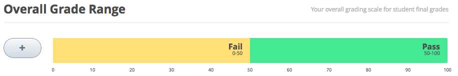
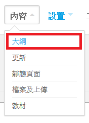
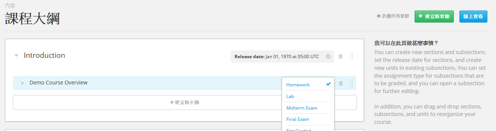

.. _Establish a Grading Policy:

##############################
建立成績規則
##############################

*******************
前言
*******************

透過以下步驟，建立成績規則：

#. :ref:`grade`
#. :ref:`Set the Grace Period`
#. :ref:`configure`
#. :ref:`set_assignment`
#. :ref:`student_view`

<<<<<<< HEAD
=======
這部份需於課程內部的 **課程設置** 選單完成。
  
再來您要建立課程的評分方式為及格與否或是等第制，同時設定每個等第之間的級距。     
>>>>>>> 529851508041f3ac8bbe1c63416923240662ea04

.. _grade:

*******************
設定分數級距
*******************

每堂課都必須設定分數級距，設定完畢後，學生分數將轉換成「通過／不通過」，或是以「A到F」表示。

請至 **設定** ，選擇 **分數** ，即可設定級距範圍。

控制功能顯示在分數頁面的上方。

上圖範例是系統預設值以50分為基準，採用「通過／不通過」。

利用分數級距控制功能來變更設定：

* 點 **「+」** 符號，增加分數級距。

  要在兩個級距中間加入新的級距，必須在預設值增加級距，如下圖範例，級距會改成 **F** (0至50分), **B** (50至75分), 以及 **A** (75至100分)。

  .. image:: Images/grade_range_b.png
    :width: 800

* 使用滑鼠移動兩個級距之間的界線，往左或往右，可以更改級距的分數範圍。

  移動的過程，可以看到分數的改變。放開滑鼠即完成變更。

* 更改級距的名稱，只要滑鼠在名稱上方點兩下，名稱反白後，即可重新輸入名稱。例如，原本的級距名稱是「通過」，滑鼠雙擊名稱後，輸入「優等」，便可置換舊名。
  
<<<<<<< HEAD
  但是，系統不允許更換 **F** 或 **不通過** 。
  
* 利用滑鼠將級距範圍全部選取，在級距的上方會出現 **移除** 的連結，點下此連結，即可完成移除級距。
=======
設定課程評分的等級
    
1. 在導覽列點擊 **設置** ，接著點擊 **評分** 。
  
2. 在 **整體評分範圍** ，點擊並拖曳評分分級之間的分數條以移動分數上下界線。
>>>>>>> 529851508041f3ac8bbe1c63416923240662ea04
  
  無法移除F或A。
  
只要對級距有任何變更，請務必點網頁下方的 **儲存變更** 。

.. _Set the Grace Period:

*************************
設定寬限期 
*************************
    
設定作業的寬限期

.. note:: 寬限期的設定適用於課程，而非個別作業。
  
本功能放置於設定級距內的 **級距規則與規定** 。在 **寬限期期限** 欄位輸入時間，格式為：時：分。

.. _configure:

******************************
設定評量類型
******************************

每堂課都必須設定評量及其權重。

舉例來說:

* 10個作業，佔總成績的50%。
* 期中考試，佔總成績的20%。
* 期末考試，佔總成績的30%。

系統預設每堂課有四種評量類型：

* 作業
* 實驗
* 期中考試
* 期末考試

以上評量類型可修改、移除與新增。

進入設定級距，點 **新增評量類型** ，會出現設定的欄位，即可新增評量類型。

==========================
評量類型欄位
==========================
替每個評量類型設定以下的欄位:
    
<<<<<<< HEAD
* **評量名稱**
=======
您可以為您的學生設定一個寬限期，允許他們遲交作業。
請注意，寬限期會套用到整門課程上，您無法單獨為一次作業設定寬限期。  
  
1. 在導覽列點擊 **設置** ，接著點擊 **評分** 。
  
  
2. 在 **評分規則與策略** 框中的 **截止日期的寬限時間** 輸入數值。
  
  
創建作業類別
++++++++++++
  
  
當您創建課程時，Studio 預設會包含四種作業類型：回家作業、實作、期中以及期末考試。 
您可以設定每種類別於學生整體分數所佔的比重。
  
  
要設定一個作業類別：
  
  
1. 在導覽列點擊 **設置** ，接著點擊 **評分** 。
  
  
2. 在 **作業類別** 找到您要的作業類別設定。
  
  
若您想要創建新的作業類別，捲動到頁面底部，點擊 **新增作業類別** 。
>>>>>>> 529851508041f3ac8bbe1c63416923240662ea04
  
  學生可以看見評量名稱。
 
  .. note:: 評量類型的權重設定完畢後，題目多寡不會影響原有的權重設定。舉例來說，10題的作業與20題的作業，最後都是以相同的權重計算。
  
  
* **名稱縮寫**
  
<<<<<<< HEAD
  進入學生的 **學習進度** 標籤，可於評量旁邊看見名稱的縮寫。
      

* **總成績權重**
=======
**作業類別名稱(Assignment Type Name)** 
這邊列出了常見的測驗類別 (回家作業、考試、練習等)。
所有相同類別的作業在分數評分上有一樣的權重，這邊定義的名稱將會顯示給學生作為參考。
>>>>>>> 529851508041f3ac8bbe1c63416923240662ea04
  
  在 **總成績權重** 計算百分比。
  
<<<<<<< HEAD
  評量類型的權重總計是100。
=======
**簡稱(Abbreviation)** 
這是會顯示在學生的 **進度** 分頁旁的短名(請見下圖)。
>>>>>>> 529851508041f3ac8bbe1c63416923240662ea04
  
  .. note:: 本欄位不包含百分比的符號（%）。
  
<<<<<<< HEAD
  
  
* **預估的評量數量**
=======
**在總分中的權重(Weight of Total Grade)** 
作業在總分計算中所佔的權重可以百分比的形式設定在 **在總分中的權重** 裡。
  
  
**作業總量(Total Number)** 
您想呈現在課程中的作業類別的數量。
>>>>>>> 529851508041f3ac8bbe1c63416923240662ea04
  
  預計課程中所使用的評量數量。
  
<<<<<<< HEAD
=======
**可拋棄的數量(Number of Droppable)**
(選項)：指定評分程式可以拋棄的數量，評分程式會從最低分的成績開始拋棄。
>>>>>>> 529851508041f3ac8bbe1c63416923240662ea04
  
  
* **拋棄不用的數量**
  
  可以先拋棄最低分的評量。

.. _set_assignment:

**********************************************
在計分的小節設定評量類型
**********************************************
設定好評量類型之後，可在課程的小節，替需要計分的題目，設定評量類型。

指定某個小節為其中一種評量類型，但是，必須是已經設定好的評量類型。也可以設定到期日。
  
請見 :ref:`subsections` ，取得設定小節的的說明。

在小節中，可以新增評量的題目，但是，在同一個小節中，不能夠新增不同類型的評量。

舉例來說，要在特定主題下新增作業與實驗，必須新增兩個小節，指定其中一個為作業，另一個是實驗。因此，小節涵蓋內容說明以及作業或實驗題目。

.. note:: 可以在Studio新增題目，而且不用設定某個小節作為評量，但是，此類型的題目不會列入學生成績。

請見 :ref:`Working with Problem Components`，取得設定新增題目的說明。

<<<<<<< HEAD

=======
1. 在導覽列點擊 **內容** ，接著點擊 **課程內容** 。
  
  

      
2. 在 **課程內容** 中找到您想要增加作業的章節。
  
3. 在章節名稱區塊中，點擊 **建立新小節** 。
       
4. 在文字方塊中，以您的小節名稱取代 **建立新小節** ，接著點擊 **儲存** 。
      
點擊您要編輯的小節，開啟此小節的編輯頁面。
在頁面的右上角，找到 **小節設定** 對話框。
>>>>>>> 529851508041f3ac8bbe1c63416923240662ea04

=======================
設定計分規則
=======================

已知可以指定某個小節作為評量，也可設定計分規則。

可從兩個地方設定計分規則：
	課程大綱
	小節的頁面

課程大綱，找到要計分的小節， 點下確認符號，系統會自動跳出一個小視窗，請在視窗內勾選評量類型。

<<<<<<< HEAD
    .. image:: Images/course_outline_set_grade.png
       :width: 600

進入小節的頁面，在頁面右邊，點下計分方式的標籤，系統會自動跳出一個小視窗，請在視窗內勾選 **評量類型** 。

    .. image:: Images/subsection_set_grade.png
       :width: 600

請見 :ref:`Establish a Grading Policy` ，取得更多相關資訊。

=======
修改小節的作業類別
++++++++++++++++++
  
要為一個小節設定作業類別：
  
1. 在導覽列點擊 **內容** 接著點擊 **課程內容** 。

2. 在 **課程內容** 中找到您要的小節。
  
3. 注意畫面右側，點擊小節的藍色圈選方格，並選取作業分類。
  

>>>>>>> 529851508041f3ac8bbe1c63416923240662ea04

==================
設定到期日
==================

在小節中設定到期日，學生必須在到期前完成作答。請依照以下步驟完成：

#. 進入小節的頁面，點 **設定到期日** ，系統會出現日期與時間的欄位。
#. 利用滑鼠選擇日期。
#. 利用滑鼠選擇時間。

.. note:: 學生可能分布在不同的時區，系統預設是UTC（世界標準時間），並非學生當地時間，因此，必須告知學生，並請他們計算時差，避免逾期。

 :ref:`Set the Grace Period` 能夠解決學生在不同時區與時間換算的問題，像是設定一天、6小時與1分鐘不等的寬限時間。設定後可套用至所有的評量。

取得更多相關資訊，請見 :ref:`Establish a Grading Policy`

.. _student_view:

**************************
觀看成績
**************************
計分規則設定完成後，點選課程的 **學習進度** 標籤，學生可以看到自己的評量得分、百分比與目前的成績。
  
  .. image:: Images/Progress_tab.png
    :width: 800
