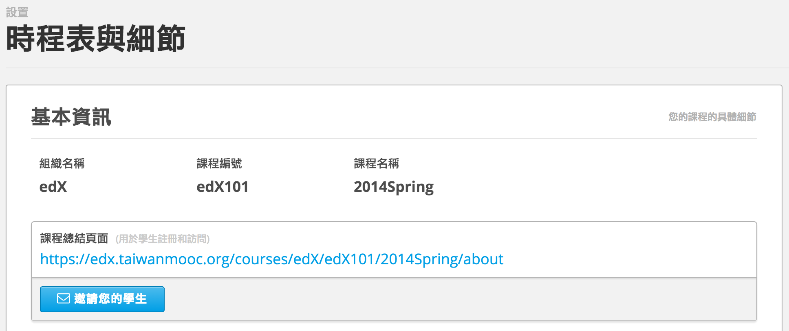

**********
邀請學生註冊
**********
 
要邀請學生註冊您在 Edge 上的課程，請先引導學生至註冊頁面，接著提供完成註冊作業的指示。
 
 
1. 要確定連到您在 Edge 的課程的註冊頁面連結，請參考下列步驟：

 
a. 在 Studio 中點擊您課程的 **設置** 分頁，接著找到 **時程與細節** 的部分。
 
 
b. 在 **基本資訊** 下方，您會看到一個連結，可用來連到電子郵件並邀請學生來註冊您的課程。
 
 
c. 點擊 **邀請您的學生** 連結，系統會自動創建一個電子郵件樣板供您參考。
 
 
.. image:: Images/image286.png
 
 
d. 將其寄送到您欲寄送的郵件清單或個人電子郵件信箱。
