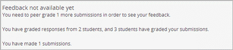

.. _Open Response Assessment:

開放式互動評分問題(Open Response Assessment)
---------------------------------

開放式互動評分問題介紹
~~~~~~~~~~~~~~~~~~~~~~~~~~~~~~~~~~~~~~~~~

.. note:: 開放式互動評分問題仍在開發，在我們未準備好前，
若您想使用此功能，我們建議您仔細的做測試，
在測試課程先測試它並且只將它加入 **未** 開始運作的課程。

開放式互動評分能夠讓教師在未提供明確答案的問題中評分學生的學習成果。
數以千計的學生們將在為其他學生的作業（如程式碼或是圖片）評分後收到回饋。
開放式互動評分技術包括自我評分（self assessment）、同儕評分（peer assessment）、與人工智慧（artificial intelligence assessment ）評分。
當進行自我評分時學生將透過比較您所創建的評分規則評分。
當進行同儕評分時，學生將其他同學的作答與您創建的評分規則進行比較並評分。

關於開放式互動評分的幾個注意事項
~~~~~~~~~~~~~~~~~~~~~~~~~~~~~~~~~~~~~~~~~~~

** 開放式互動評分技術仍在開發（beta 版） ** 
對於開放式互動評分，請注意以下守則。

-  請仔細的做測試，不要再正式的課程使用開放式互動評分，只在測試的課程中使用它。
-  如果您的課程將加入開放式互動評分，請在課程開始 *前* 做全面的測試。
-  設定開放式互動評分為可選擇的、不計分或是可遺棄的練習題直到您熟悉使用此技術。
-  請謹慎使用開放式互動評分。只在您的課程加入一些，並且確定您在發生問題後有對應方法。

最後，如果您在edX合作大學並且您計畫加入開放式互動評分在一個磨課師課程，
請務必通知您的edX專案管理員。

開放式互動評分的組成元件
~~~~~~~~~~~~~~~~~~~~~~~~~~~~~~~~~~~~~~~~~

一個開放式互動評分有三個元素組成：

-  在自我評分、同儕評分、與人工智慧中，這些評分類型和其評分順序將顯示在開放式互動評分問題的右上角。
   在下面例子中，學生進行自我評分，然後進行同儕評分，最後進行人工智慧評分。

   .. image:: Images/CITL_AssmtTypes.gif

-  您希望學生作答的問題，將出現在元件的頂部，然後學生將在後面的欄位對問題進行作答。

   .. image:: Images/CITLsample.gif

-  您所設計的評分規則 (rubric)。
   在學生對問題進行作答並點擊 **送出後** ，如果評分法是自我評分，學生將看見評分規則在他的答案之下，並與其答案做比較評分。
   如果評分是人工智慧或是同儕評分，那麼學生將只看到以提交的訊息的回應。

   .. image:: Images/CITL_SA_Rubric.gif

開放式互動評分類型
~~~~~~~~~~~~~~~~~~~~~~~~~~~~~~

在此有三個開放式互動評分類型，
分別是自我評分，人工智慧評分，與同儕評分。

-  自我評分允許學生對問題進行作答，並且根據您的評分規則 (rubric) 評定自己的答案。
-  在人工智慧評分中，一個電腦演算法將學習如何去根據評分規則從100個以上的教師評分，來評定分數。
   並且試圖以同樣的方法去評定其餘的學生。
-  同儕評分允許學生去評定其他同學的分數並提供回饋。

您能夠在任何問題使用一個或是多個這些評分法。
您可以為每一個評分法設定一個門檻，
當分數低於評分的門檻時，評分階段將不會移動在下一個評分階段。

有效的問題
~~~~~~~~~~~~~~~~~~~

當您出一個問題，我們建議您指定一個大約的作答字數。
使學生有一個主要參考能夠對問題進行作答，您或許還需要提供學生一些訊息以使用學習管理系統(LMS)。
如果您要求學生要上傳文件，您可以提供學生上傳文件的說明。
您能夠讓學生了解他們答題後會發生什麼狀況，向學生們說明他們可以嘗試答題的次數。

.. _評分規則(Rubrics):

評分規則(Rubrics)
~~~~~~~

同樣的評分規則(Rubrics)能夠用於三種開放式互動評分的類型，
而且能夠加入任何您想加入的訊息。

在Studio中，評分規則是按照 *類型* 排列，
每個類型能夠有兩個或多個 *選項* ，每個選項代表一分。

選項必須從0開始算起。
舉例來說:在一個有三個選項的類別中，
第一個選項0分，第二個選項1分，第三個選項2分，
當人或是人工智慧演算法要評分時能夠從中選擇分數。

不同類別的評分規則在同樣問題中可以有不同數量的選項。

建立一個開放式互動評分問題
~~~~~~~~~~~~~~~~~~~~~~~~~~~~~~~~~~~~~~~~~~

為了建立一個開放式互動評分您必須執行以下幾個步驟：

#. 建立開放式互動評分元件。
#. 加入問題。
#. 加入評分規則(rubric)。
#. 設定評分類型和分數。
#. 設定問題名稱。
#. 設定其他選項。
#. 儲存問題。
#. 加入同儕評分介面(如果有選擇同儕評分類型)。
#. 測試問題。

上述每個步驟將在下面詳細說明。

步驟一.建立開放式互動評分元件
~~~~~~~~~~~~~~~~~~~~~~~~~~~~

#. 為開放式互動評分加入進階元件，為了加入此元件，
   請加入“peergrading”,”combinedopenended”值到 **進階設置** 頁面上。
   (詳細見
   :ref:`Specialized Problems`.)
#. 在Studio中新增一個單元以創建開放式互動評分。
#. 在 **Add New Component** 上, 點 **Advanced** , 並點 **Open Response Assessment**.
#. 在問題元件出現後，點擊 **Edit** ，並在浮動框框點 **OK** 後，編輯元件將開啟。
#. 編輯元件包括一個簡單的問題(prompt)，評分規則(rubric)，和評分類型(assessment type)與分數(scoring)的程式碼。
   您能夠以範例程式碼來更新您問題的內容。
 
.. image:: Images/ORAComponentEditor.gif
  
步驟二.加入問題
~~~~~~~~~~~~~~~~~~~~~~~~

#. 在編輯元件上找到[prompt]標籤。 

   .. image:: Images/ORA_Prompt.gif

#. 以您的問題替換 **[prompt]** 標籤中的範例問題，
   並確認您的問題格式必須如下。

   -  在 **[prompt]** 標籤之間。
   -  所有訊息必須以HTML標籤撰寫。

步驟三. 加入評分規則
~~~~~~~~~~~~~~~~~~~~~~

.. 注意:: 當您在已開課的課程加入您的問題，
		  確保您不會改變評分規則以影響得分，
		  如：加入或刪除一個選項，
		  更改評分規則可能導致您的課程發生錯誤。

#. 在編輯元件中，找到[rubric]標籤。(此範例評分規則可能過長，
   所以您必須去捲動視窗以找到第二個[rubric]標籤)
   
   .. image:: Images/ORA_Rubric.gif

#. 以您的評分規則取代範例評分規則。
   須做到以下幾點。

   -  在[rubric] 標籤中撰寫。
   -  在類別前標記(+)號。
   -  在選項前標記(-)號。
   -  清單的選項第一項得分為0，第二為1，第三為2依此類推。

   例如以下為評分規則的範例

::

    [rubric]

    + Writing Applications
    - The essay loses focus, has little information or supporting details, and the organization makes it difficult to follow.
    - The essay presents a mostly unified theme, includes sufficient information to convey the theme, and is generally organized well.

    + Language Conventions 
    - The essay demonstrates a reasonable command of proper spelling and grammar. 
    - The essay demonstrates superior command of proper spelling and grammar.

    [rubric]

步驟四.設定評分類型和分數
~~~~~~~~~~~~~~~~~~~~~~~~~~~~~~~~~~~~~~~~~~~

.. 注意:: 當您在已開課的課程公開您的問題，
		  確保您不會改變評分類型與分數，
		  否則更改這些程式碼可能導致您的課程發生錯誤。

為了在您的開放式互動評分設定評分類型和分數，
您必須輸入指定的類型與評分類型的順序，
並為每個評分設定一個分數門檻。其程式碼如下。

::

    [tasks]
    (Type 1), ({min-max}Type 2), ({min-max}Type 3)
    [tasks] 

-  程式碼寫在 **[tasks]** 標籤中。
-  **Type 1**, **Type 2**, 和 **Type 3** 為評分的類型，評分類型將以此順序執行。
-  **Min** 是此評分階段要進入到在下一次評分階段所必須達到的最小值。
   需要注意的是您不必第一個評分階段時就定義一個分數門檻，
   因為在其之前沒有評分階段。
-  **Max** 是此評分階段所能達到的分數最大值。
   這個最大分數是在第一個評分類型後面所有的類型的兩個數字的第二個數字。

例如:以下為一個問題的範例程式碼。

::

    [tasks]
    (Self), ({5-7}Peer), ({4-7}AI)
    [tasks]

此問題有以下幾個特點。

-  這個問題有一個自我評分，同儕評分，和一個人工智慧評分。
-  最高分數為7。
-  要進到同儕評分階段，自我評分分數最低必須為5。
-  要進到人工智慧評分階段，同儕評分分數最低必須為4。

.. 注意:: 如果一個回答的分數沒有達到指定分數，
		  則此回答將不會進到下個評分階段。

設定類型和分數
^^^^^^^^^^^^^^^^^^^^^^^^

#. 在編輯元件中，找到[tasks]標籤。

   .. image:: Images/ORA_Tasks.gif

#. 將自己的問題取代範例問題。

步驟五.設定問題名稱
~~~~~~~~~~~~~~~~~~~~~~~~~~~~

.. 注意::   當您在以開課的課程公開您的問題，確保您不會改變問題的名稱。
		    當問題公開後改變問題名稱可能會導致學生資料遺失。當您還在測試問題時，

			您能夠改變問題名稱。然而須注意的是當您改變問題名稱後，
			所有和此問題相關的測驗作答與分數將會遺失。
			在教師介面上更新問題名稱後，需對此問題送出一個新的測試訊息。

問題的名稱將成為每個問題的標題並出現在教材頁面上。
並且它也會在 **員工評分** 頁面上顯示問題列表。

.. image:: Images/ORA_ProblemName1.gif

為了變更問題名稱:

#. 在編輯元件的右上角點擊選 **設置** 。
#. 在 **Display Name** 欄位中，
   將 **Open Response Assessment** 改為您的問題名稱。

步驟六. 設定其他選項
~~~~~~~~~~~~~~~~~~~~~~~~~

如果您想改變問題的設定，
其中包括一個學生必須為多少同學的作答評分與學生是否可以上傳文件，
點擊 **設置** 然後指定您想變更的選項。

.. image:: Images/ORA_Settings.gif

一個開放式互動評分包括以下設定。

+---------------------------------------------+--------------------------------------------------------------------+
| **允許同儕評分超過限制數量			      | 這個設定只針對同儕評分。如果所有的作答已被評分完，				   |
| (Allow "overgrading" of peer submissions)** | 教師可以允許學生評分之前已評分過的問題。				           |
|                                             | 果教師認為同儕評分可以幫助學習，						           |
|                                             | 或是如果學生不足以評完系統要求的需評分的作答數量，			       |
|                                             | 但是所有可評分的作答以被評分那此設定是有益的。				       |
+---------------------------------------------+--------------------------------------------------------------------+
| **允許檔案上傳(Allow File Uploads) **       | 這個設定能讓學生可以上傳文件，例如圖片或是程式碼。 				   |
|                                             | 文件可以是任何類型的文件。										   |
+---------------------------------------------+--------------------------------------------------------------------+
| **取消品質過濾器(Disable Quality Filter)**  | 這個設定只針對同儕評分與人工智慧評分。							   |
|											  | 當品質過濾器被關閉(當它的值是 **True** )時，					   |
|											  | 一些作答被系統認定為品質差(作答很短或是有很多錯字語法錯誤)		   |
|											  | 的作答會被允許進入同儕評分與人工智慧評分階段。					   |
|											  | 例如:如果您想讓學生引用 **URL** 到外部網站您可以取消品質過濾器，   |
|											  | 否則系統會將URL視為錯誤語法( **URL** 中的隨機字串，拼寫錯誤的字)   |
|											  | 過濾掉此文章。當品質過濾器被開啟(取消品質過濾器值為 **False** )	   |
|											  | 系統將不會允許品質差的文章進入同儕評分階段。 					   |  
+---------------------------------------------+--------------------------------------------------------------------+
| **顯示名稱(Display Name)**	              | 這個名稱會出現在LMS(學習管理系統)的兩個頁面:					   |
|                                             | 課程功能表上與練習題上面。					                       |
+---------------------------------------------+--------------------------------------------------------------------+
| **評分(Graded)**                            | 這個設定可以指定此問題是否要算入學生成績分數中。		           |
|                                             | 預設情況下，如果一個小節被設定為計入分數，    					   |
|                                             | 則在此小節中每個問題都被設為計入分數，							   |
|                                             | 但是如果一小節被設定為計入分數，      							   |
|                                             | 而您希望此問題是練習題，那麼您將此值設為 **False** ，        	   |
|                                             | 則此問題不會被記入學生成績分數中。         						   |
+---------------------------------------------+--------------------------------------------------------------------+
| **最大嘗試次數(Maximum Attempts)**          | 這個設定可以指定學生作答的最大嘗試次數。						   |
|                                             | 需要注意的是，每次學生嘗試作答， 								   |
|                                             | 此作答的評分對於其他嘗試的評分都是獨立評分的，      			   |
|                                             | 如果一個學生送出兩次問題嘗試給同儕評分 							   |
|                                             | (如:當學生在一次嘗試時獲得了較差的分數或是他想改變原來的答案，     |
|                                             | 可以點選 **新的提交** 鈕)則兩次的問題嘗試將會個別丟給三個同儕評分. |
|                                             | 因我們建議最大嘗試次數最好低一點。      						   |
+---------------------------------------------+--------------------------------------------------------------------+
| **最大同儕評分校準     					  | 這個設定只適用於同儕評分。										   |
|   (Maximum Peer Grading Calibrations)**     | 您能夠設定一個學生開始為其他同儕評分時"評分練習"的最大數量。   	   |
|                                             | 此值預設值為6，但是您能夠設定此值從1到20的任意數。   			   |
|                                             | 這個值必須要大於等於 **最小同儕評分校準** 的值。		    	   |
+---------------------------------------------+--------------------------------------------------------------------+
| **最小同儕評分校準    					  | 這個設定只適用於同儕評分。 										   |
|   (Minimum Peer Grading Calibrations)**     | 您能夠設定一個學生開始為其他同儕評分時評分練習的最小數量。   	   |
|                                             | 此值預設值為3但是您能夠設定此值為1到20的任意數。   				   |
|                                             | 這個值必須要小於等於 **最大同儕評分校準** 的值。				   |
+---------------------------------------------+--------------------------------------------------------------------+
| **每個作答的同儕評分數量             		  | 這個設定只適用於同儕評分。這個設定指定  						   |
|   (Peer Graders per Response)**             | 每次作答的評分次數必須達到多少 									   |
|                                             | 才能夠計入分數並回饋給為問題作答的學生。  						   |
+---------------------------------------------+--------------------------------------------------------------------+
| **互評紀錄變更(Peer Track Changes)**        | 這個設定還在開發中。此設定只適用於同儕評分。 				       |
|                                             | 當此設定被開啟(設為 **True** )，  								   |
|                                             | 評分者可以線上修改他們已評過的分數。  							   |
|                                             | 而提交此次作答的同學，能夠查看這個問題的評分規則與意見。      	   |
+---------------------------------------------+--------------------------------------------------------------------+
| **問題權重(Problem Weight)**                | 這個設定決定此問題的價值。每個問題的預設值為一點。			       |
|                                             |                                                                    |
|                                             | **注意:** *每個問題的權重值必須最少有一點，					       |
|                                             | 如權重值為零則其將不會出現在教師介面上。*                          |
+---------------------------------------------+--------------------------------------------------------------------+
| **需要同儕評分(Required Peer Grading)**     | 這個設定指定每個學生對一個問題作答後，							   |
|                                             | 必須評多少分數才能夠收到其分數。 								   |
|                                             | 這個值可以和 **每個作答的同儕評分數量** 一樣，  				   |
|                                             | 但是我們建議您設定這個值高於 **每個作答的同儕評分數量** 		   |
|                                             | 以確保每個同學都被評分。     								       |
|                                             | (如果沒有作答等待評分，但是學生還需要評分，    				       |
|                                             | 您可以設定 **允許同儕評分超過限制數量** 為允許，  				   |
|                                             | 那這些學生就可以評之前已評完的作答分數。) 						   |
+---------------------------------------------+--------------------------------------------------------------------+

步驟七. 儲存問題
~~~~~~~~~~~~~~~~~~~~~~~~

-  在您建立一個問題與評分規則後，設定評分類型和分數，
   變更問題名稱，與指定額外設定，點擊 **保存** 。

   此問題元件將會出現在Studio系統，在右上角您可以看到此問題評分的類型。

   .. image:: Images/ORA_Component.gif

步驟八. 加入同儕評分介面(同儕評分專用)
~~~~~~~~~~~~~~~~~~~~~~~~~~~~~~~~~~~~~~~~~~~~~~~~~~~~~~~~~~~~~~~~~~

您可以為整個課程，加入一個同儕評分介面或是您可以為單獨的問題加入同儕評分介面。

為課程加入單個同儕評分介面
^^^^^^^^^^^^^^^^^^^^^^^^^^^^^^^^^^^^^^^^^^^^^^^^^^^

當您只需要為整個課程加入一個同儕評分介面。
我們建議您建一個同儕評分介面在單獨的章節讓學生可以容易的找到它。
學生將透過這個同儕評分介面存取整個課程的開放式互動評分問題。

#. 創建一個新的章節加入一個小節再加入一個單元，您可以為其取任意的名稱，
   並在單元中加入一個"同儕評分介面"。
   一個"同儕評分介面"可以為課程中所有互動式評分問題評分。.
#.  在 **添加新元件** 上，點選 **Advanced** 並點
    **Peer Grading Interface** 
	
	一個新的同儕評分介面元件將會出現。

#. 為了在課程上看到同儕評分介面，設定此單元為 **公開的(Public)** ，
   並點 **線上查看**。

   以下頁面將被打開.

   .. image:: Images/PGI_Single.gif

   當學生在課堂上提交問題的作答進入同儕評分階段，
   則此問題名稱將會出現在這個介面。

加入同儕評分介面到單一問題
^^^^^^^^^^^^^^^^^^^^^^^^^^^^^^^^^^^^^^^^^^^^^^^^^^^^^^^

當您為單一問題加入同儕評分介面，
您必須為同儕評分介面加入一個此問題的識別標籤。
如果您沒加入識別標籤，這個介面將會顯示課堂上所有的同儕評分問題。

注意:同儕評分介面不一定要放在您希望關聯的問題下面。
只要您加入此問題的識別標籤，
這個同儕評分介面將會被關聯到此問題，
即使您在後面的單元加入此同儕評分介面
(如:如果您想在下一周再出此題)。.

#. 創建一個單元加入開放式互動評分問題
#. 如果此單元是公開的，點擊 **線上查看** 。如果此問題是私有的，
   點擊 **預覽** ，將會在一個新視窗開啟學習管理系統(LMS) 進入此這個單元。
   確保您在員工視圖而不是學生視圖。
#. 將視窗捲動到開放式互動評分問題下面並點擊 **Staff Debug Info** 。
#. 以下圖將會開啟，找到 **location** 右邊的字串並將包含 **i4x **後面的字串複製起來。I

   .. image:: Images/PA_StaffDebug_Location.gif

#. 切換到Studio系統的單元畫面。如果此單元設定是 **公開的(Public)** ，
   將它設為 **私有的(Private)** 。
#. 捲動視窗到單元底部。點擊 **添加新元件** 上的 **Advanced** ，點擊 **Peer Grading Interface **。
#. 在同儕評分介面元件，點擊 **編輯** 。
#. 在同儕評分介面元件編輯器中，點擊 **設置** 。
#. 在 **Link to Problem Location** 欄位貼上剛剛在步驟4複製的字串。
   然後改變 **Show Single Problem** 值為 **True** 。

   .. image:: Images/PGI_CompEditor_Settings.gif

#. 點擊 **儲存** 以關閉編輯元件。

步驟九. 測試問題
~~~~~~~~~~~~~~~~~~~~~~~~

為了測試您的問題加入一個問題並為作答評分。

#. 在Studio系統上，打開一個包含您的開放式互動評分問題的單元。

#. 在 **單元設置** 上改變它的設定為 **公開的(Public)** 並點選 **線上查看** ，

   點選 **線上查看** 後將會在新視窗開啟學習管理系統(LMS)進入此單元中。

#. 在學習管理系統(LMS)下，找到您的開放式互動評分問題，
   然後在此問題下的Response欄位輸入您的作答。

   .. image:: Images/ThreeAssmts_NoResponse.gif

   注意:當您在學習管理系統(LMS)以教師身分查看開放式互動評分問題，
   您將看到以下訊息出現在問題下。這些訊息將不會出現在學生視圖。

   .. image:: Images/ORA_DuplicateWarning.gif

#. 測試此問題以確保它會按照您所預期來運作。

為了測試您的開放式互動評分問題，
您可能要使用一個不同於教師帳號的新帳號，
以學生的身分註冊您的課程。

-  如果您想保持您的教師編輯頁面以編輯課程並以學生身分登入測試，
   可以在Firefox或Chrome啟動隱身模式以
   開啟新瀏覽器視窗或是使用不同瀏覽器登入學生帳號，
   例如:您用Firefox登入教師帳號，使用Chrome登入學生帳號。
-  如果您不需要保持您的教師編輯頁面開啟以編輯課程，
   登出您的帳號，並且以不同的帳號登入。
   注意如果您登出教師帳號，您必須將學生帳號登出後再登入教師帳號才能編輯課程。

當您測試完您的問題後，您可能希望提交一個測試作答，
包括簡短的文字、隨機字串或是其他您不希望學生會回應的作答。
開放式互動評分包含一個品質過濾器防止教師或是學生看到這些"低品質"的作答。
這個品質過濾器是預設開啟的，如果您想要看到所有的測試結果，
包括"低品質"的作答，請關閉這個品質過濾器。

為了關閉品質過濾器，開啟一個問題元件點擊 **設置** ，
並設定 **Disable Quality Filter setting** 值為 **True** 。

為開放式互動評分問題評分
~~~~~~~~~~~~~~~~~~~~~~~~~~~~~~~~~~~~~~~~~

您將會以人工智慧評分和同儕評分，
從學習管理系統(LMS)的 **員工評分** 頁面為學生的作答評分。
在此花一些時間為您來熟悉這個頁面的功能。

員工評分頁面
^^^^^^^^^^^^^^^^^^^^^^^

當一個作答已經可以讓您評分時，
一個黃色的驚嘆號將會出現在頁面上方的 **打開已關閉的面板** 旁邊。

.. image:: Images/OpenEndedPanel.gif

為了進入 **員工評分** 頁面，點擊 **打開已關閉的面板** 

當 **打開已關閉的面板** 開啟後，點擊 **Staff Grading** 。
請注意 **新提交的評分** 通知。

.. image:: Images/OpenEndedConsole_NewSubmissions.gif

當 **員工評分** 頁面開啟後，您的開放式互動評分將會出現在下面多個列。

.. image:: Images/ProblemList-DemoCourse.gif

+----------------------------------------------------+--------------------------------------------------------------------+
| **問題名稱(Problem Name)**                         | 這個問題的名稱。點擊此名稱可以開啟此問題。 					      |
|                                                    | 直到至少一個您的問題的作答被送出並為可評分，   					  |
|                                                    | 否則您課程上的問題不會出現在 **員工評分** 頁面。      			  |
+----------------------------------------------------+--------------------------------------------------------------------+
| **已評分(Graded)**                                 | 這個數字表示多少此問題的作答已被評分。。     					  |
|                                                    | 即使人工智慧演算法已經評完所有的作答，         					  |
|                                                    | 您還能夠將人工智慧演算法指定   									  |
|                                                    | 為低信心的作答並點擊問題名稱以評分這些作答     					  |
+----------------------------------------------------+--------------------------------------------------------------------+
| **可評分(Available to grade)**                     | 所有還未評分的學生的作答數量                  					  |
+----------------------------------------------------+--------------------------------------------------------------------+
| **需要評分(Required)**                             | 需要去訓練人工智慧演算法評分的剩餘評分數量，    				      |
|                                                    | 或是校準同儕評分的回應數量。   									  |
|                                                    | 如果您的開放式互動評分問題要求人工智慧和同儕評分，        		  |
|                                                    | 每20份您評的同儕評分分數將計入100份人工智慧評分。          		  |
+----------------------------------------------------+--------------------------------------------------------------------+
| **進度(Progress)**                                 | 顯示您的評分流程進度。											  |
+----------------------------------------------------+--------------------------------------------------------------------+

為作答評分
^^^^^^^^^^^^^^^

#. 進入 **員工評分** 頁面。
#. 在 **問題名稱** 下點擊您想評分的問題。

   當問題開啟後，已可評分的作答與已評分的作答數量會顯示出來，
   並且教師需要評分的問題會出現在問題名稱下面。
   您也能夠找到人工智慧演算法的錯誤率。
   這個錯誤率是由教師評分和人工智慧演算法比對所得出的資訊。

   .. image:: Images/ResponseToGrade.gif

#. 在作答下面的評分規則，選擇對於此作答最符合的說明選項。
#. 如果您想的話，您可以加入您想回饋學生的訊息。

   -  您能夠為學生在 **書面回饋** 欄位提供建議
   -  如果您覺得您不能夠為學生的作答評分(例如，您是此課程的員工，
      但是您覺得還是由評分教師評分比較好。)您可以點擊 **跳過** 以跳過評分。
   -  如果學生的作答為不適當的內容，
	  您可以勾選 **標記為不恰當的內容需要再次審查** 選項。
	  標記不適當的內容將能夠透過 **員工評分** 頁面存取。如果有必要的話，課程員工可以禁止對此學生評分。

   .. image:: Images/AdditionalFeedback.gif

#. 當您完成作答評分，點擊 **提交**  。

當您的課程正在運行，另一個作答將在您評完第一個評分後自動開啟，
並顯示訊息在頂部。

.. image:: Images/FetchingNextSubmission.gif

當您評分完這個問題的所有的作答， **No more submissions to grade** 。
訊息將顯示在頁面上。

.. image:: Images/NoMoreSubmissions.gif

點擊 **Back to problem list** 來回到問題列表。
您也能夠等一段時間並點擊 **Re-check for submissions** 按鈕
以查看是否有任何學生已送出答案。

.. 注意:: 當您已經為人工智慧演算法評完足夠的作答，
		  **Available to grade** 欄位的數量將會快速的減少，
          這是由於人工智慧演算法在數秒內評完學生們的作答，學生們的資料並沒有遺失。

.. 注意:: 當一個您開啟一個作答以評分，這個作答會離開目前的”評分池” 
		  使其他的教師或是學生無法對此問題評分，
		  這是為了要防止其他學生或教師在您評分期間對這個作答評分。 
		  
		  如果您沒有在30分鐘內送出這個作答的分數，
		  這個作答將會回歸於評分池(使其能夠被其他人評分)，
		  即使您還未關閉視窗，仍在為這個作答評分。
		  
		  如果這個作答回到評分池(因為30分鐘過去了)，
		  但是這個作答還在評分中，您仍然可以送出此作答的評分。
		  
		  如果其他教師或學生評分了回歸於評分池的作答，而之後您送出了此作答的評分，這個作答將會收到兩次評分。
 
          如果在您點擊 **提交 **以提交評分之前，
		  您點擊了瀏覽器的 **上一步** 鈕回到問題列表，
		  則此問題將會停留在評分池內，直到30分鐘過去。
		  當此作答重新回歸評分池，則可再次評分。

存取分數與回饋
~~~~~~~~~~~~~~~~~~~~~~~~~~

您可以存取人工智慧與同儕評分您的作答的分數透過 **打開已關閉的面板** 頁面。

#. 從學習管理系統(LMS)的任意頁面點擊頁面上面的 **打開已關閉的面板** 。

   .. image:: Images/OpenEndedPanel.gif

#. 在 **打開已關閉的面板** 頁面，點擊 **Problems you have submitted** 。

   .. image:: Images/ProblemsYouHaveSubmitted.gif

#. 在 **打開已關閉的面板** 頁面，
   確認 **狀態** 欄位以查看是否您的作答有被評分。
#. 當此問題以被評分完了，
   點擊問題列表上的問題名稱以查看您的成績。
   當您點了問題的名稱，此問題將會在教材元件打開。

人工智慧與同儕評分的分數將會出現在您的作答下面的評分規則中。
在同儕評分中，您也能夠看到不同評分者寫的回饋。

**人工智慧評分完成畫面**

.. image:: Images/AI_ScoredResponse.gif

**同儕評分完成畫面**

.. image:: Images/Peer_ScoredResponse.gif

如果您想看到全部同儕評分以及人工智慧評分的評分規則，點擊 **開關完整規則** 。

.. 注意:: 對於同儕評分，如果您沒有足夠的同學評完您的分數，您將看不到您的分數訊息。

