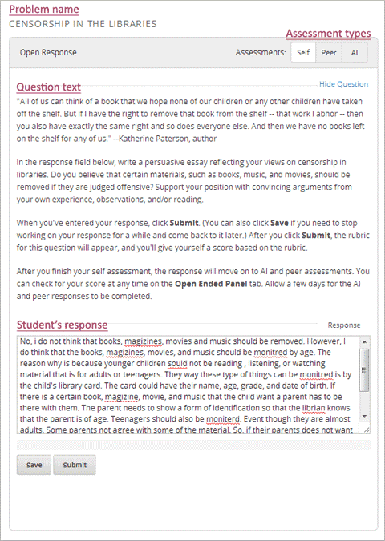
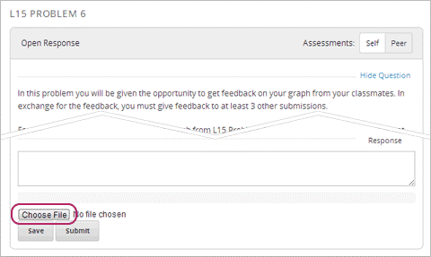
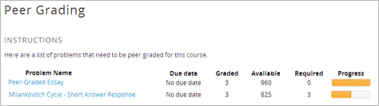
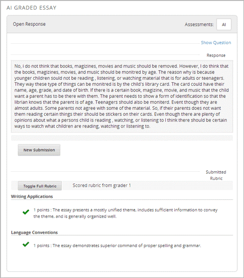
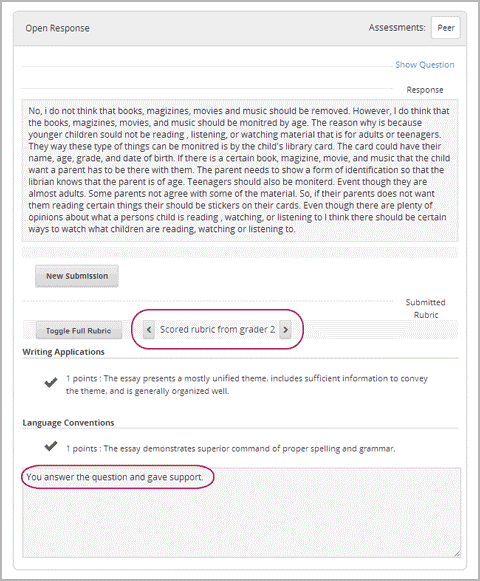

.. _ORA for Students:

開放式問答─學生須知
======================================

.. _ORA Introduction:

前言
-----------------------------------------

.. warning::

    據課程內容修改本章節內容，例如，開放式問答的題目並未包含同儕評分或電腦評分，可以刪除這些字句：「為取得更多資訊，請見 :ref:`ORA Peer Assessment`"
    ，以及為取得更多資訊，請見 :ref:`ORA AI Assessment`" 。文件中的說明也可以刪除。

開放式問答可讓學生輸入一段文字、短文或附加檔案，如：圖片或電腦程式碼。

在開放式問答的頁面，請見下圖，提供題目名稱、評量類型、題目敘述、答題欄位、 **儲存答案** 與 **提交答案** 的按鈕。

利用此題型設計，要求學生上傳檔案，頁面會出現上傳檔案的按鈕，請見下圖。

*評量類型* 包含 *自我評分* 、 *同儕評分* 與 *電腦評分* 。依照此順序出現在題目內。

- 根據教師的評分標準，批改自己的答案，並給予分數。
  請詳見 :ref:`ORA Self Assessment`.

- 同儕評分是指共同修課的同學，相互批改答案，並給予分數。
  請詳見 :ref:`ORA Peer Assessment`.

- 電腦評分指由電腦根據運算規則，批改作答內容，並給予分數。
  請詳見 :ref:`ORA AI Assessment`.

不需要同時使用全部的評量類型，例如，指定某個問題要採用自我評分與電腦評分，另一個問題採用自我評分與同儕評分，或是只用同儕評分。

開放式問答的題目，作答方式大多都相同，請詳見 :ref:`ORA Submit a Response`.

提交答案之後，接下來是評量的方式。請見 :ref:`ORA Self Assessment`, :ref:`ORA Peer Assessment`, and :ref:`ORA AI Assessment`.

答案提交之後，可能在很短時間內可以查看分數。查看分數的方式，請詳見 :ref:`ORA Access Scores`.

利用 `EdX Demo <https://courses.edx.org/courses/edX/DemoX/Demo_Course/info>`_
課程，可以測試開放式問答。請至 `Self-Assessed Essay <https://courses.edx.org/courses/edX/DemoX/Demo_Course/courseware/graded_interactions/machine_grading/2>`_
單元，在 **答題欄** 輸入答案或使用 `Sample Answers <https://courses.edx.org/courses/edX/DemoX/Demo_Course/courseware/graded_interactions/machine_grading/6/>`_
單元的答案。

.. _ORA Submit a Response:

提交答案
-----------------

用文字或上傳檔案作為答案，兩者提交的方式有些許差異。

#. 輸入答案：

   - 以文字作答，學生在 **答題欄** 打字。

   - 以上傳檔案作答，點下 **答題欄** 下方的 **選擇檔案** ，在新的對話框，選擇要上傳的檔案，然後點下 **開啟**。

#. 點下 **提交答案** ，再點下 **確認** 。

   .. note:: 系統允許可以先儲存作答內容，並於稍後再作答或提交，點下 **儲存** ，此時，在 **儲存** 與 **提交答案** 的按鈕下方，出現此段提醒文字：已儲存作答內容，但是，尚未提交。

提交答案後，評量的類型會出現在題目旁邊。請見 :ref:`ORA Self Assessment`, :ref:`ORA Peer Assessment`, 或 :ref:`ORA AI Assessment`.

.. _ORA Self Assessment:

自我評分
---------------

.. warning::

    開放式問答若未使用自我評分時，可以刪除此章節。
	

評分標準在提交答案後，會立即顯示在答題欄下方，學生遵循此標準自我評分。

自我評分的步驟
~~~~~~~~~~~~~~~~~~~~~~~~~

#. 提交答案。

#. 出現評分標準，比較答案與標準，選擇合適的項目。請見下圖。

   .. image:: /Images/Rubric1.gif

#. 點下 **輸入評分結果**

   送出評分後，可以立即看見評分結果。

.. _ORA Peer Assessment:

同儕評分
---------------

.. warning::

    開放式問答若未使用同儕評分時，可以刪除此章節。

設定每個答案需有多少位學生評分，每位學生就必須完成同樣的評分題目數量，同時，得先完成設定的評分題目數量，才能夠查看自己的分數。完成基本的評分數量後，可自行決定是否對其他學生的答案進行評分。

提交作答內容後，會出現下方訊息。

    **答案已送出，請稍候確認分數。** 

同儕評分介面
~~~~~~~~~~~~~~~~~~~~~~

此部份即為評分的介面。每堂課至少包含一個同儕評分介面。整個課程可能只有一個同儕評分界面，或是個別的題目有其同儕評分介面。範例如下圖。

同儕評分的步驟
~~~~~~~~~~~~~~~~~~~~~~~~~

同儕評分會有截止日期的限定，在期限之前，必須完成提交作答內容，以及完成評分。

同儕評分的步驟描述如下：

#. :ref:`Access Responses`, 從課程或是 **開放式問答操作** 頁面。
#. :ref:`Learn to Grade` （此部分稱為 *評分校準* ）。
#. :ref:`Grade Responses`

.. _Access Responses:

步驟一：查詢其它學生的答案。
^^^^^^^^^^^^^^^^^^^^^^^^^^^^^^^^^^^^^^^^^^^^

.. warning::

	系統允許根據課程需求修正本小節內容。舉例來說，假使學生只能夠透過 **開放式問答操作** 頁面評分，藉由修改以下的指引的字句，並且刪除第二點與第三點。

**備註** *符合此三種情況才能夠評分：完成作答的題目、教師已經完成至少20位學生的評分、以及尚未給予分數的短文。反之，尚未作答或是沒有作答的題目，無法給予評分，系統會出現下圖的訊息。*

   .. image:: Images/PAStudent_NoSubmissions.gif

根據課程的設定，決定查詢學生答案的方式。

-  點選 **開放式問答控制** 標籤，進入 **開放式問答操作** 頁面，此功能出現在課程畫面的上方。進入本頁面後，系統會列出已被回答的題目，點下題目名稱開始評分。

   .. image:: Images/PGI_FromOEC_2Problems.gif

-  教師將同儕評分作為題目的評量方式，開放式問答的功能才會出現。進入有開放式問答評量題目的單元，可以查看答案。同儕評分介面出現在題目下方的位置。請見下圖範例。

   .. image:: Images/PGI_InUnitComposite.gif

-  若在課程中未看見本功能，請進入各小節，如下圖範例。例如，MIT的6: 00x: 電腦科學與程式語言導論，設計了幾個小節，點選小節的題目名稱，可以開始評分。

   .. image:: Images/PGI_Multiple-600x.gif

.. _Learn to Grade:

步驟二：學習評分
^^^^^^^^^^^^^^^^^^^^^^

學生開始評分之前，必須先學習與教師採用同樣標準來評分，此學習過程稱為：*評分校準* 。先從教師評分過的題目開始練習，當學生的評分與教師的評分接近，即可開始正式替其他學生評分。

#. 點下題目名稱，出現 **學習評分** 的頁面，點選 **開始學習評分** 。

#. 先比較答案與教師的評分標準，選擇最合適的項目後， **提交** 結果。

#. 系統會告知學生，是否與教師的評分有差異。閱讀完 **評分校準結果？** ，點下 **繼續** ，練習下一個題目。

   .. image:: Images/PG_Calibration_Correct.gif

   .. image:: Images/PG_Calibration_Incorrect.gif

   練習新題目時，同時會看見一段黃色的 **已儲存評分校準短文** 的訊息出現在頁面的左上角。

#. 正確地完成練習後，系統會告知學生可以開始 **正式評分** 。

.. _Grade Responses:

步驟三：評分
^^^^^^^^^^^^^^^^^^^^^^^

學生除了從評分標準選擇分數之外，還可以給予意見回饋。

#. 從評分標準選擇適當的分數。

   若學生對於作答內容產生疑慮，可以勾選其他項目，替該題作記號，提醒教師審閱。在勾選之前，不用替題目評分。

   -  例如：不知該如何評分，請勾選 **我無法確認評分結果是否恰當** 。
   -  例如：答案令人反感，或是懷疑抄襲他人資料，請勾選 **此作答內容含有不友善字句、或是懷疑抄襲他人資料** 

#. 在 **意見回饋** 寫下個人評分的想法。

#. 點下提交評分，網頁會自動出現 **已成功儲存您的意見** 的訊息，然後出現下一個待評分的答案。

#. 完成所有的作答內容後（通常是3個），系統會出現以下訊息。

   .. image:: Images/DoneGrading.gif

   已成功儲存您的意見，前往下一個短文。已經完成指定的數量，可自行選擇是否繼續評分。
   
   看到上述的訊息時，學生可查看自己的得分，請見 :ref:`ORA Access Scores`.

回到 **同儕評分** 頁面，點下欲評分的題目名稱，開始對其他的題目評分，系統允許學生隨時評分。

.. note:: 系統將需要評分的答案放置於目前的評分區，提供教師或學生評分，同時也避免教師與其他學生針對同一個題目評分。開始評分後，若在30分鐘內未評分，系統會自動將作答內容放回評分區，重新開放給大家使用，即便自己的電腦螢幕仍然顯示該答案的評分畫面。

          已知30分鐘內未評分，系統會將作答內容放回評分區，假使電腦螢幕仍然顯示該答案的畫面，系統會允許學生繼續評分，若在送出分數之前，已有其他人完成評分，則該答案會有兩個評分結果。

          使用瀏覽器的 **返回上一頁** 功能鍵，回到題目清單，而且尚未送出分數，題目的狀態是回到評分區，30分鐘期限將重新計算，此時便可評分。

.. _ORA AI Assessment:

電腦評分
---------------------------------------

.. warning::

    若開放式問題的評量方式不採用電腦評分，可刪除此章節。

教師先提供評分樣本，電腦的學習運算功能會依照此樣本，提供評分模組。

學生提交答案後，系統會自動顯示以下訊息：

    **你的作答內容已送出，請稍後查看分數。**

可能在幾分鐘或幾天後可以查看分數，依照教師提供給電腦的答案樣本時間而定。此外，系統不會自動通知，請自行查看。

取得更多資訊 :ref:`ORA Access Scores`.

.. _ORA Access Scores:

查詢分數與意見回饋
--------------------------

.. warning::

    可以依照課程需求，修改本章節文字

**自我評分** 的分數確定後，可以立即查看。

從 **開放式問答操作** 頁面查看 **同儕評分** 與 **電腦評分** 的分數。

#. 進入EdX Demo課程，點下 **開放式問答控制** 標籤。

#. 進入開放式問答操作頁面，點下 **已完成的題目**。

#. 進入開放式問答問題頁面，點 **狀態** 查看分數。因此，問題的狀態可能是 **等待評分** 或 **已完成評分**。

#. 點下 **已完成評分** 的問題名稱查看分數。

電腦評分與同儕評分的分數與評分標準，出現在作答內容的下方並用簡易的說明方式呈現。請見下圖。

同儕評分的部分，還可看到評分者的意見回饋。

點下 **觀看詳細評分標準** ，可看見完整的評分標準。

.. note:: 在同儕評分的部分，若學生未完成足夠的評分題目數量，系統會提醒學生還有多少題目待評分。請見下方訊息。

.. image:: Images/FeedbackNotAvailable.gif

請見 :ref:`ORA Peer Assessment` ，獲得更多資訊。

再次提交答案
-----------------------

.. warning::

    若不允許學生提交多次答案，可刪除此章節。

針對可以多次提交答案的開放性問答題目，在原本的作答內容下方，系統提供 **新的提交答案** 按鈕，學生利用此功能，能夠多次提交答案。

點下 **新的提交答案** 清除之前的答案，點下 **確認** 。開始重新輸入答案。
