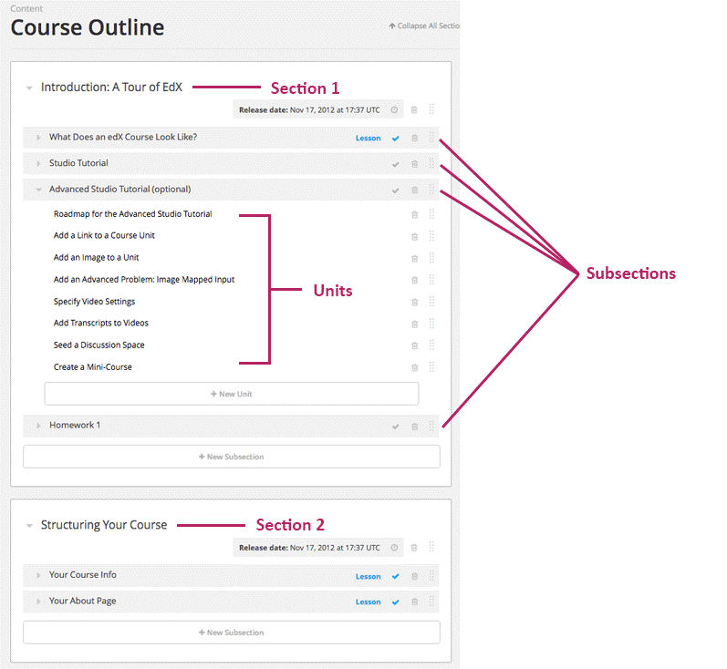
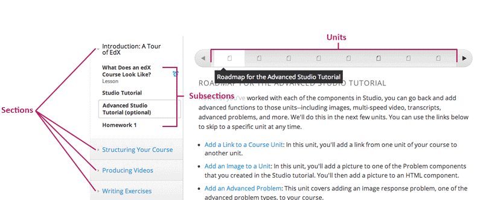
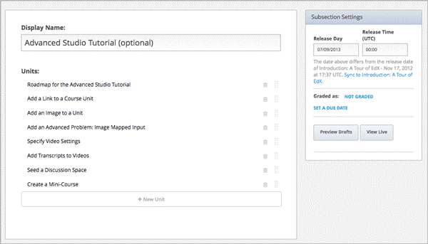
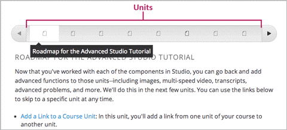
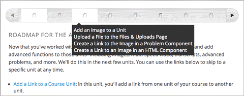
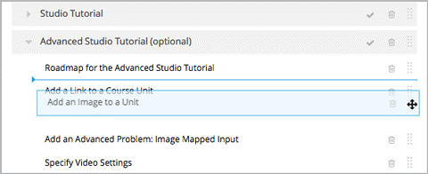

.. _Organizing Your Course Content:

###############################
組織課程內容
###############################

.. _How a Course is Organized:

*************************
如何組織課程
*************************

您可依照下列層級概念組織課程內容：

- :ref:`Sections`, which contain
    - :ref:`subsections`, which contain
        - :ref:`units`, which contain
            - :ref:`components`, which contain your actual course content.

Studio提供彈性的組織方式，一般的課程模組的章節層級是指每週授課項目，小節所指的是每堂課程項目。

.. note::  建議您於發展課程前，先參考可用內容建置指導方針 :ref:`Guidelines for Creating Accessible Content` 。

==================
課程大綱
==================

在Studio的內容(Content)選單裡點選 **大綱(Outline)** ，可瀏覽該門課程的 **內容組織** 層級，下列圖片呈現出課程中所包含的章節、小節和單元項目：

下列圖片是學習管理平台(LMS)所呈現的課程大綱畫面：

.. _Sections:

********
章節
********

章節是課程組織中的第一個層級，顯示該門課程的時間週期、每週授課項目等。此層級之下包含多個小節內容。

設定步驟如下：

#. 在課程大綱(course outline)頁面點選 **建立章節(New Section)**
#. 輸入章節標題
#. 點選 **儲存(Save)**

第一次新增的課程章節項目將依建立時間由上至下排序。
學生將於發佈日期當日才可瀏覽章節內容。詳細資訊請參閱發佈課程
 :ref:`Publishing Your Course` for more information.

.. _Subsections:

****************
小節
****************

依課程組織層級而言，章節之下是小節，小節之下又分為各單元項目。在小節中主要呈現出當週課程主題以及學習順序。

設定步驟如下：

#. 在 **課程大綱(course outline)** 頁面的章節項目之下，點選 **建立小節(New Subsection)** 。
#. 輸入小節標題
#. 點選 **儲存(Save)**

第一次新增的小節項目將依建立時間由上至下排序。在各小節之下可新增單元項目。

==================
編輯小節
==================

在 **課程大綱** 頁面中可新增、刪除小節項目。

各小節的設定功能是獨立的，點選小節標題可編輯下列功能：

- 修改標題
- 新增或刪除單元項目
- 設定發佈日期和時間
- 將小節設定為評量
- 設定評量截止日期
- 預覽草稿
- 檢視線上版本

學生將於發佈日期當日才可瀏覽章節內容，詳細資訊請參閱發佈課程 :ref:`Publishing Your Course`.

評量設定說明，請參閱建立評分政策 :ref:`Establish a Grading Policy`.

草稿預覽及線上版本檢視功能，請參閱預覽課程 :ref:`Preview Your Course` 、檢視線上課程 :ref:`View Your Live Course`.

.. _Units:

******
單元
******

依課程組織層級而言，小節之下分為單元，單元之下又包含各項目。在學習管理平台中，單元連結顯示於畫面上方的橫軸，下列畫面中顯示8項單元內容：

在課程大綱頁面或小節頁面中點選 **新增單元(New Unit)** 即可建立單元內容。

在新增單元頁面中可編輯下列功能：

- 設定單元名稱
- 建立單元項目
- 修改單元可見性(系統將單元可見性預設為隱藏，詳細資訊請參閱發佈課程 :ref:`Publishing Your Course`.
- 預覽草稿
- 檢視線上版本

.. warning::

  請勿同時多人於不同瀏覽器中編輯相同的單元內容！
  由於Studio無法自動更新網頁，因此可能造成舊版資料取代新版資料的問題。提醒您，編輯公開或隱藏的單元內容時，務必執行網頁重新整理的功能。

.. _Components:

**********
項目
**********

依課程組織層級而言，單元之下包含各項目，也就是線上版本所顯示的課程內容。

將滑鼠停留在單元橫軸上，即可瀏覽該單元包含的項目名稱(如下圖)

在頁中單元網點選項目類型即可新增下列4種項目類型：

- **討論區** ：可設定討論區功能，讓學生能夠在此與同儕互相交流討論。
- **網頁語法(HTML)** ：可增加文字、圖片和其他學習工具。
- **問題** ：可增加不同類型的測驗題型，例如單選題、多選題以及複雜迴路練習等。
- **影音** ：可增加課程影片。

.. image:: Images/AddNewComponent.gif

詳細資訊請參閱：

- :ref:`Working with Discussion Components`
- :ref:`Working with HTML Components`
- :ref:`Working with Problem Components`
- :ref:`Working with Video Components`

.. _Reorganize Your Course:

**********************
重新組織課程內容
**********************

需要重新組織課程內容排序方式時，將滑鼠移至欲調整的項目右方，出現四向箭頭游標時即可將該項目開始拖曳。(如下圖)

.. image:: Images/DragAndDrop.gif

進行拖曳時，畫面上的藍線代表該項目被調整後的位置。

