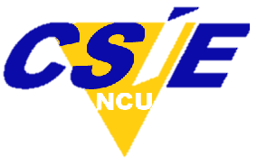

****
讀我
****

這個 edX "開始使用Studio" 裡面的 "幫助" 和 PDF 文件是使用 Sphinx 1.2b1 and LaTex 所創建的。
您或者使用者社群可以幫忙更新和修訂這個專案文件，原始內容在 GitHub 上的 ::

  edx\edX-platform\userdocs\source

任何 pull request 都會需要一個 edX 工程師批准。而這份文件的 edX 聯繫人是mchang@edx.org 

正體中文版本由 **edX 平台開發研究實驗室** 所維護，您可以在從以下網址取得原始碼 ::

    https://github.com/edXPDRLab/manuals.git

正體中文版本每次的更新都會公佈於 edX 平台開發研究實驗室的網站，您亦可於此處取得 PDF 版本文件 ::

	http://edxpdrlab.logdown.com

線上閱讀版本與原始碼是同步的 ::

	http://edx-ca-zhtw.readthedocs.org/en/latest/index.html

關於 edX 平台開發研究實驗室
**************************

edX 平台開發研究實驗室由國立中央大學及國立中央大學資訊工程系所共同成立，專注於 edX/Open edX 平台開發與研究工作，同時擔任 Open edX 正體中文語系版本的維護與協調工作。

.. image:: Images/logo_ncu.png

