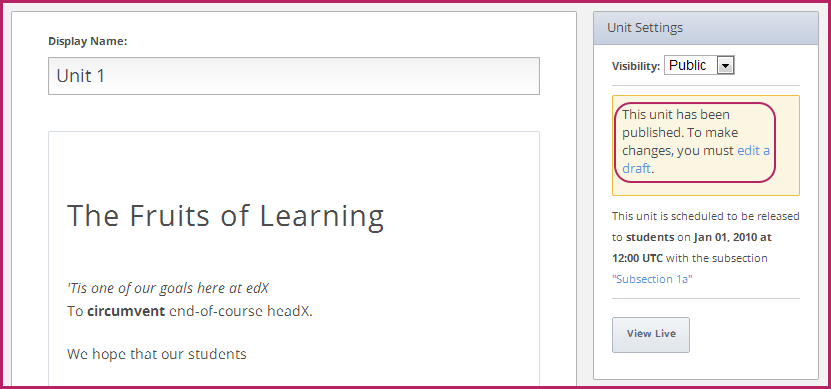
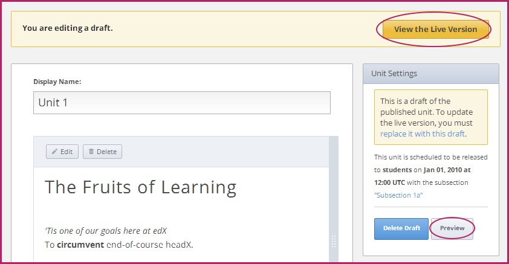
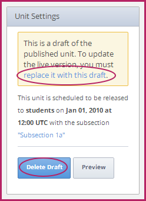

<<<<<<< HEAD
.. _Publishing Your Course:

###########################
發佈課程
###########################
=======
*********************
設定內容發佈日期及能見度
*********************
>>>>>>> 529851508041f3ac8bbe1c63416923240662ea04

當您完成課程內容組織以及訂定評分方式後，即可發佈課程，供學生選課。透過下列四項要點，可以瞭解學生能夠瀏覽的課程內容以及知道如何修改學生可瀏覽的課程內容項目：

* :ref:`Understanding Content Students Can View`
* :ref:`Release Dates`
* :ref:`Public and Private Units`
* :ref:`Modifying Public Units`

.. _Understanding Content Students Can View:

<<<<<<< HEAD
******************************************
瞭解學生可瀏覽的課程內容
******************************************

當您在Studio建置課程時，學生在開課日期之前無法瀏覽課程內容。 
開課後，您可以透過發佈日期(release dates)和可見性(visibility)功能，管理學生可瀏覽的課程內容。
=======
    1. 在 **內容** 選單點擊 **課程內容** 。

    2. 在課程內容裡尋找您要找的章節。
>>>>>>> 529851508041f3ac8bbe1c63416923240662ea04

* **發佈日期(release dates)** ：您可以設定章節、小節的發佈日期。如果章節和小節的建置日期早於發佈日期，課程內容不會被公開，學生也無法進行瀏覽。
  
  當章節和小節的發佈日期早於當前日期時，學生才可瀏覽其內容。章節內容已開放，但小節內容尚未開放的情況下，學生則無法瀏覽小節的內容。

<<<<<<< HEAD
  在發佈日期之前，課程人員可於從學習管理平台(LMS)瀏覽章節和小節內容。
  
* 各單元必須是 **公開的** 。每一個單元皆具備 **公開** 、 **隱藏** 的 **可見性功能設定** 。當您建置單元項目時，其可見性預設為 **隱藏** ，即使您已發佈章節和小節內容，學生此時仍無法瀏覽其內容。
 
  若 **尚未** 發佈章節和小節內容，學生則無法瀏覽 **已公開** 的單元項目。
  
  課程人員 **無法** 瀏覽學習管理平台(LMS)中被隱藏的單元項目。
  
簡要而言，必須發佈上一層的章節和小節，且單元項目必須是 **公開的** ，學生才可瀏覽課程內容。
=======
 .. image:: Images/C09_01.png
>>>>>>> 529851508041f3ac8bbe1c63416923240662ea04

.. _Release Dates:

*******************
發佈日期
*******************

發佈日期功能明確指定課程內容開放的日期，此項功能設定可於章節和小節層級中使用。直到發佈日期當天，學生才可瀏覽章節及其相關內容，課程人員不在此限。

========================================
設定章節發佈日期
========================================

您可為每一章節個別設定發佈日期和時間，在此日期和時間之前，學生無法瀏覽章節內容。設定步驟如下：

#. 在 **Will Release** 中，選擇下一步(next)至章節標題(section title)，點選 **編輯(Edit)** 
#. 以月/日/年(MM/DD/YYYY)的時間格式輸入發佈時間(以世界標準時間為準)
#. 點選 **儲存(Save)**

========================================
設定小節發佈日期
========================================

小節的預設發佈日期會依照章節的發佈日期而定，但是各小節可以另行設定不同的發佈時間。需要注意的是，小節發佈日期早於章節發佈日期時，學生在章節發佈日期之前無法瀏覽小節內容。章節的發佈日期設定效力大於小節的發佈日期設定。設定步驟如下：
#. 開啟小節。
#. 在右上角找到 **小節設定框(Subsection Settings box)** 
#. 以月/日/年(MM/DD/YYYY)的時間格式輸入 **發佈時間** (以世界標準時間為準)

================================================
同步小節發佈日期
================================================

您或其他課程人員可能不小心將小節發佈時間設定早於章節的發佈時間，在此情況之下，需到章節發佈日期當天，才會發佈小節內容。為了幫助您組織管理課程的發佈時間，Studio會標示出早於章節發佈日期的小節項目。當您開啟小節時，在設定介面中就會看到下列訊息：

``The date above differs from the release date of <Section Name> - <Section release date and time>. Sync to <Section Name>.``

Click **Sync to <Section Name>** to have the subsection inherit the later section release date.

.. _Public and Private Units:

*************************
公開與隱藏單元
*************************

單元開放日期為小節設定之開放日期。

此外，單元中具備 **可見性(Visibility)** 功能，可設定是否 **公開** 或 **隱藏** 單元項目。

當您建置一個單元時，其預設為隱藏，即使上一層的小節內容已進行發佈，學生仍無法瀏覽。

當您修改單元之可見性功能從隱藏改為公開時，表示您已發佈此單元內容。您必須將單元設定為公開，學生才能夠進行瀏覽。

課程人員無法瀏覽學習管理平台(LMS)中的隱藏單元項目。

.. _Modifying Public Units:

*************************
修改已公開之單元
*************************

若要修改已公開的單元內容時，請您建置與編輯該單元之草稿(draft)。

.. warning:: 修改已公開之單元項目將影響學生已完成的問題功能項目，請參閱修改 :ref:`Modifying a Released Problem` ，取得更多資訊。.

前往單元頁面，點選右邊視窗中的 **編輯草稿(edit a draft)** 建置草稿。

當您編輯單元草稿時，可由下列兩種方式進行瀏覽：

* 點選網頁右上角的 **瀏覽已開放使用的版本(View the Live Version)** 
* 點選 **預覽(Preview)** ，瀏覽未公開的內容

當您準備公開修改完成的草稿內容時，點選右方視窗的 **以草稿取代此版本(replace it with this draft)**

若您選擇不保留此修改內容時，點選 **刪除草稿(Delete Draft)** 。

.. Warning:: 將完全刪除單元內容的舊版本，不予保留！當您以草稿內容進行取代後，將無法回復舊版本內容。

  
  