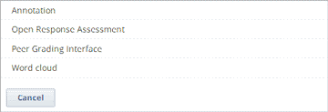
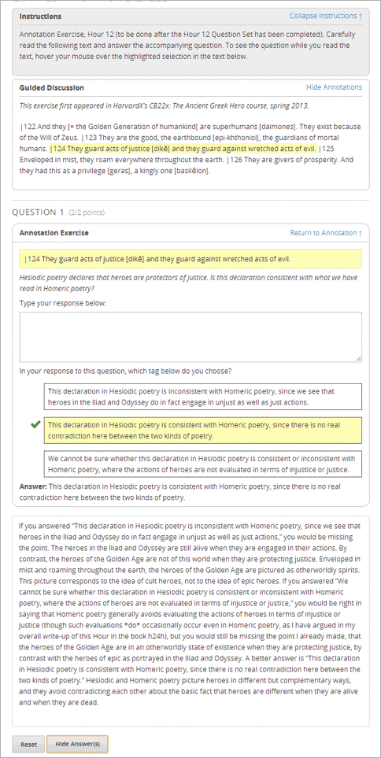
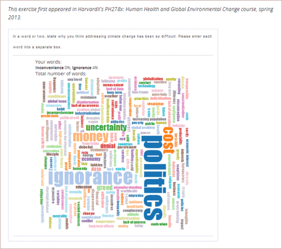

.. _Specialized Problems:

特殊題型
====================

特殊題型是指註解、開放式問答和文字雲等進階題型，可於Studio進階功能項目中進行設定。
您必須先修改進階設定，才能在各單元的增加新項目中新增進階功能項目。

-  :ref:`Annotation` 註解題型是指當學生將滑鼠游標移至重點文字上時，題目敘述才會顯示在文字上方，讓學生閱讀後再填寫答案。
-  :ref:`Open Response Assessment` 學生輸入答案或短文後，由電腦或同儕進行評分。
-  :ref:`Word Cloud` 以彩色圖像彙集與呈現學生填答時所輸入的詞彙。

.. _ Add Advanced Component:

**新增進階功能項目**

當您新增功能項目時，Studio預設下列功能：

建立特殊題型之前，您必須先新增進階功能項目，步驟如下：

#. 在 **設定** 表單中點選 **進階設定** 。

#. 在 **進階設定** 頁面的使用規則定義 **(Manual Policy Definition)** 區塊，將 **advanced_modules** 
   填入規則序號(Policy Key)欄位(序號於清單最上方)

   .. image:: Images/AdvancedModulesEmpty.gif

#. 將滑鼠游標移至規則數值 **(Policy Value)** 欄位裡的方括弧之間，輸入您所要建立的問題類型，並確認輸入引號。

   -  建立註解時輸入 **"annotatable "**。

   -  建立開放式問答時輸入 **"combinedopenended”,”peergrading "** 。 (兩個文字之間僅以逗號區隔，不用輸入空格)

   -  建立文字雲時輸入 **"word_cloud "** 。

   您可建立一種以上的問題類型，建立時確認在個別問題類型名稱兩側都須加上引號，並以逗號區隔，不用輸入空格。
   
   例如您要在課程中新增註解、開放式問答、文字雲，只需將下列紅字部分輸入方括弧之間即可。

   ::

       "annotatable","combinedopenended","peergrading","word_cloud"

   .. image:: Images/AdvSettings_Before.gif

#. 下拉至網頁底部，點選 **儲存更新** 。

   本網頁會自動更新，網頁最上方會顯示更新資訊已儲存的提醒資訊。
   
   **規則數值** 欄位中的文字呈現樣式如下圖：

   .. image:: Images/AdvSettings_After.gif

#. 回到單元頁面，確認進階功能項目已新增完成。

   .. image:: Images/AdvancedComponent.gif

點選進階功能項目後，確認畫面出現下列清單後，即可開始建立註解、開放式問答、文字雲，各題型網頁上皆有提供建立說明指引。

.. _Annotation:

註解
----------

在註解題型中，導讀重點文字會顯示於大型文字框，然後再寫出與本文相關的問題。當學生將滑鼠游標移至重點文字上時，才會顯示題目敘述，下方則是學生回答欄位。

建立註解題型
~~~~~~~~~~~~~~~~~~~~~~~~~~~~

步驟如下：

在 **進階設定** 頁面新增 “annotatable” 鍵值。(詳細資訊請參閱:ref:`Specialized Problems`.)

新增 **題型內的說明指引** 和 **引導式討論** ：

#. 在單元頁面中點選 **增加新項目** 的 **進階** 。
#. 在題型類型清單中選擇 **註解** 。
#. 點選 **編輯** 。
#. 在項目編輯模式中輸入編碼規則。
#. 點選 **儲存** 。

在題型樣目中新增 **註解題型** ：

#. 在註解項目之下新增進階題型項目。
#. 在進階題型項目中複製貼上下列編碼規則，以您的課程內容取代欄位輸入提示。

       ::

           <problem>
            <annotationresponse>
            <annotationinput>
            <text>PLACEHOLDER: Text of annotation</text>
            <comment>PLACEHOLDER: Text of question</comment>
            <comment_prompt>PLACEHOLDER: Type your response below:</comment_prompt>
            <tag_prompt>PLACEHOLDER: In your response to this question, which tag below 
            do you choose?</tag_prompt>
            <options>
            <option choice="incorrect">PLACEHOLDER: Incorrect answer (to make this 
            option a correct or partially correct answer, change choice="incorrect" 
            to choice="correct" or choice="partially-correct")</option>
            <option choice="correct">PLACEHOLDER: Correct answer (to make this option 
            an incorrect or partially correct answer, change choice="correct" to 
            choice="incorrect" or choice="partially-correct")</option>
            <option choice="partially-correct">PLACEHOLDER: Partially correct answer 
            (to make this option a correct or partially correct answer, 
            change choice="partially-correct" to choice="correct" or choice="incorrect")
            </option>
            </options>
            </annotationinput>
            </annotationresponse>
            <solution>
            
PLACEHOLDER: Detailed explanation of solution

            </solution>
           </problem>

#. 點選 **儲存** 。

.. _Open Response Assessment:

開放式問答
------------------------

成千上萬名學生可以透過開放式問答發佈回覆文章或上傳檔案、圖片等，並且獲得同儕的回饋。

因為開放式問答較其他題型複雜，詳細設定步驟請參閱 
:ref:`Open Response Assessment Problems`.

.. _Word Cloud:

文字雲
----------

文字雲是以彩色圖像彙集與呈現學生填答時所輸入的詞彙，最受歡迎的詞彙字體越大，當有輸入詞彙的學生數量越多時，文字雲的尺寸也隨之改變。學生可以透過文字雲瞭解同儕回覆和想法。

例如下圖是學生回答HarvardX課程問題所組成的文字雲。

建立文字雲
~~~~~~~~~~~~~~~~~~~~~~~~~~~~

步驟如下：

#. 在 **進階設定** 頁面新增“word_cloud”鍵值。(詳細資訊請參閱 :ref:`Specialized Problems`.)
#. 在單元頁面中點選 **增加新項目** 的 **進階** 。
#. 在題型類型清單中選擇 **文字雲** 。
#. 點選 **編輯** 。
#. 在項目編輯模式中進行功能設定，除了 **名稱** 之外，其他項目可保持為預設值。

   -  **名稱** ：顯示於項目上方以及課程畫面上方的橫軸。
   -  **輸入項** ：學生可於文字框輸入的字數。
   -  **最大顯示字數** ：文字雲顯示的最大字數，若學生輸入300個不同的文字，但最大顯示字數設定為250時，文字雲僅會顯示250個文字。
   -  **顯示百分比** ：每個文字旁會顯示出輸入該文字的學生比例。

#. 點選 **儲存** 。

詳細資訊請參閱： `Xml Format of "Word Cloud" Module 
<https://edx.readthedocs.org/en/latest/course_data_formats/word_cloud/word_cloud.html#>`_.