*******************
查看課程內容
*******************

當您在Studio上創建課程時，您可以控制何時讓學生看到您課程的內容。
這代表您可以繼續建立一個課程，一直到您讓這些改變available之前，學生都不能看到您所更動的內容。
您可以設定釋出日期來決定何時把內容釋出到網路上。您也可以設定specific Units (a subdivision that helps you organize your course content) 的能見度為
公開或者私人。
預設情況下，所有的內容都為私人。
 
當您遇到以下三種條件之前，您在edX或Edge上的內容不會被學生看到：

1. 課程已經到開課日期。

2. Section和Subsection釋出日期包含的內容have passed。
 
* Sections and Subsections 是您用來組織您的課程用的。
例如，Sections相當於您課程的每個Weeks，而Subsections相當於您課程的每個主題。
 
 
* 不論是Section或是它的內容，直到釋出日期之前都不會被看見，
如果這個Section的釋出日期已經過了，而Subsection的釋出日期還沒過，那學生可以看到
Section的heading在左側pane。但是，學生不能看到Subsection的heading或任何Subsection的內容。

 
* Subsections 繼承了它們在Section的釋出日期，但是您可以在Section已經釋出之後，
更改這個日期來使得個別的Subsections釋出時間不一樣。
 
 
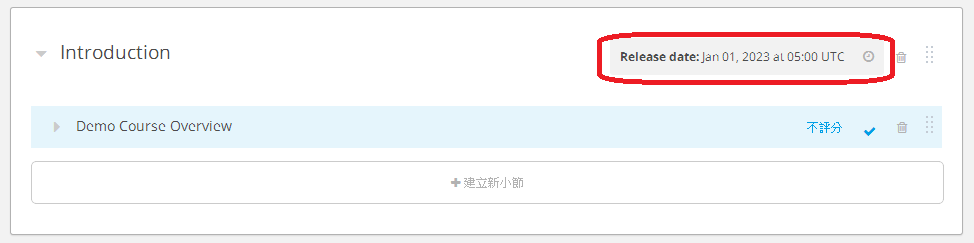
 
 
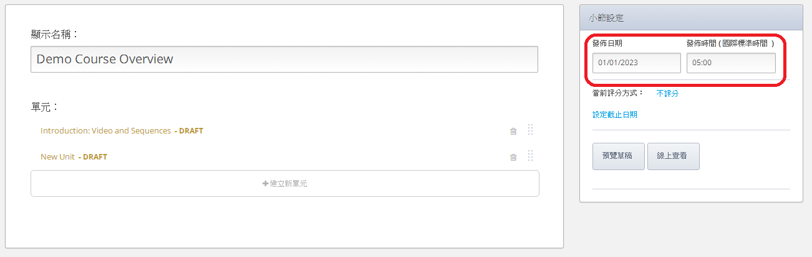

 

3. 您可以設定這個包含開放內容的Unit。** 預設情況下，所有Units都被設為私人。
 
 
當您還在創建中，這裡有四種方式來觀看您在edX或Edge的課程：

 
* 在Studio

.. note::
	
	您在Studio中看您課程的方式與學生在edX或Edge上看您課程的方式不一樣。
	 
 
 
* 在edX或Edge上的預覽模式
	
	任何被設定為私人的內容只能在預覽模式看到。
 

* 老師在edX或Edge上 

	當您以老師角度觀看內容時，您會看到 **Instructor** 標籤在畫面的上方。

 
 
* 學生在edX或Edge上 

.. raw:: latex
  
      \newpage %
 

大綱View
============

 
當您想要看到您在Studio中的整個課程架構，您可以到 **Course Outline **頁面。
在 **Course Outline **上，您可以看到課程的 "macro" 大綱，down to individual Units。
 
 
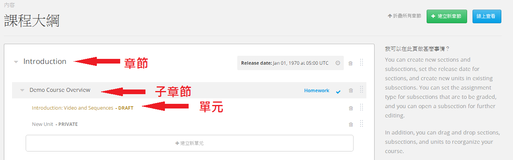

.. raw:: latex
  
      \newpage %
 
小節 View
===============
 
您也可以觀看Subsection的內容。在這個view，您可以看到Subsection和Subsection中的Units名稱。
您可也看到這個Section是否is graded或not graded；如果is graded，您可以看到Subsection中的作業類型。
您也可以看到個別的Units是設定為公開或私人。
私人Units會在Unit名稱旁邊顯示為淺灰色的文字 "PRIVATE"。所有其他的Units都是公開。
 
 
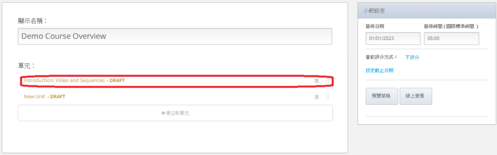

.. raw:: latex
  
      \newpage %
 
單元 View
=========
 
當您想要在您的課程中看到實際的文字、問題或其他內容，您可以開啟一個個別Unit。
您就可以看到Unit的Components。不論它設定為公開或私人以及不論它的釋出日期過了沒，您都可以看到這些內容。
 
 
接下來的例子顯示出在"What Does an edX Course Look Like?" Subsection中兩個Units的Studio View。
 
 

接下來的Unit被設定為公開。Subsection的釋出日期已經過了。

 
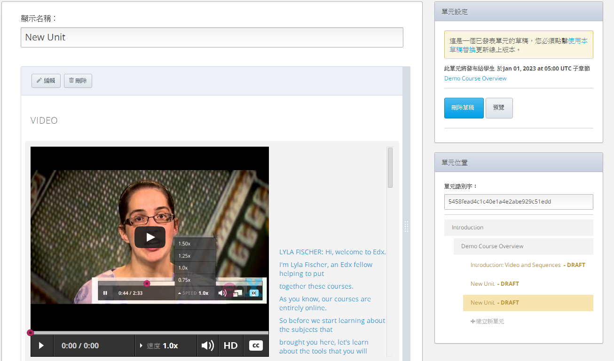
 
 
接下來的Unit被設定為私人。Subsection的釋出日期已經過了。

 
 
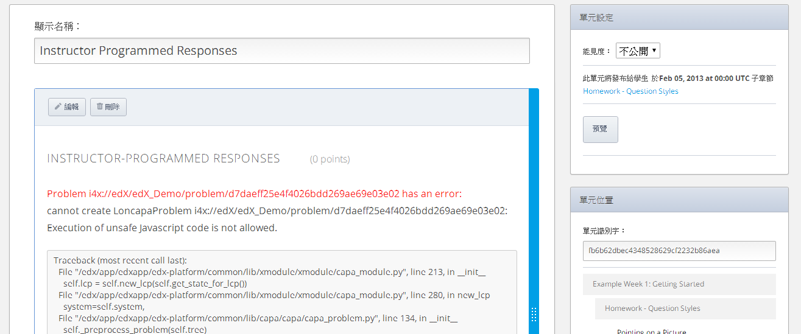
 
 
如果改變"What Does an edX Course Look Like?"這個Subsection的釋出日期為未來 (在這個例子中，為 January 1, 2099)，
您依然可以在Studio看到這兩個Units。

 
 
公開單元
^^^^^^^^^^^

 
 
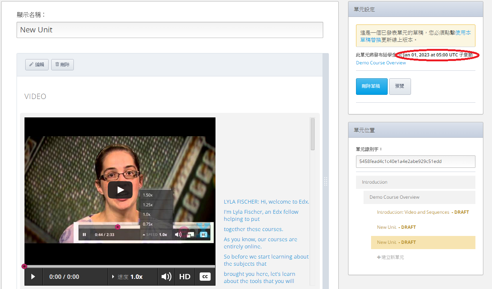
 
 
私人單元
^^^^^^^^^^^^

 
 
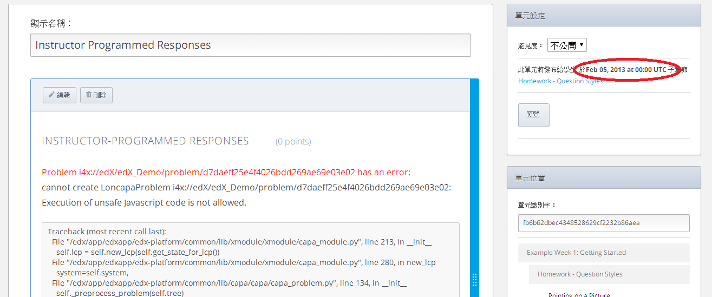

.. raw:: latex
  
      \newpage %

 
預覽模式
============
 
當您使用預覽模式在edX或Edge上觀看您的課程，您可以看到所有在您課程中的Units，
不論他們是否設定為公開或私人以及不論是否釋出日期已經過了。

 

**使用預覽模式是唯一可以看到已經設定為私人內容的方式。
**學生會看到它**
 
 
您可以以兩種方式進入預覽模式。
 
 
1. 在任何Subsection頁面，點擊 ** Preview Drafts** 。
 
 
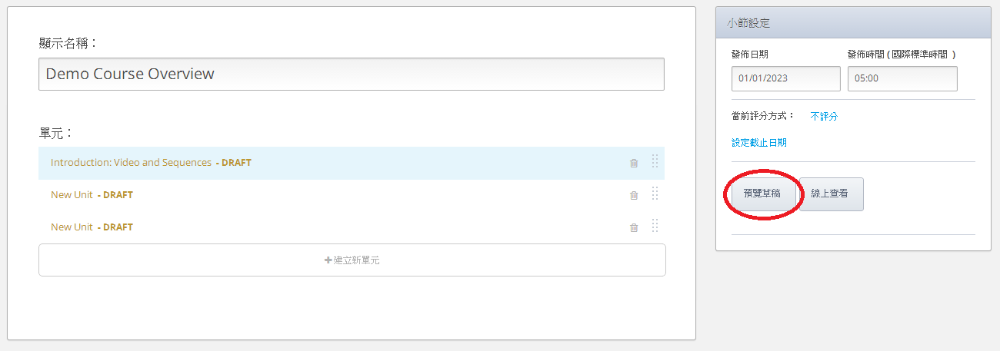
 
 
2. 在任何Unit頁面，點擊 **Preview**。
 

接下來的例子是Unit被設定為公開那個頁面的 **Preview** 按鈕。
 
 
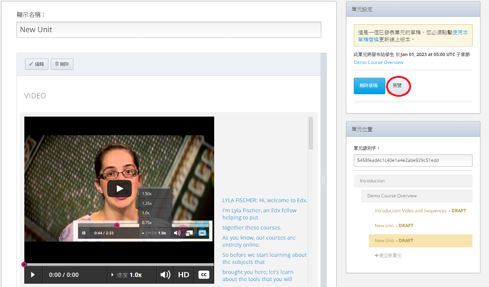
 
 
接下來的例子是Unit被設定為私人那個頁面的 **Preview** 按鈕。
 
 
.. image:: Images/image209.png
 
例子
=======
 
接下來的例子是在預覽模式下第一個Unit "What Does an edX Course Look Like?" 的Subsection。 
 
.. image:: Images/image211.png
 
 
請記得Subsection的釋出日期是過去的。
然而，即使您改變"What Does an edX Course Look Like?"Subsection的釋出日期為未來，
您依然可以在預覽中看到這兩個Units。
 
 
在"What Does an edX Course Look Like?" Subsection中，Unit 1 ("Welcome to
edX 101") 被設定為公開，以及Unit 2 ("New edX Information") 被設定為私人。
這兩個Units顯示在畫面上方的課程ribbon。
 
 
.. image:: Images/image213.png

當您在課程ribbon點擊Unit 2，您就會看到在Unit 2中的內容：
 
 
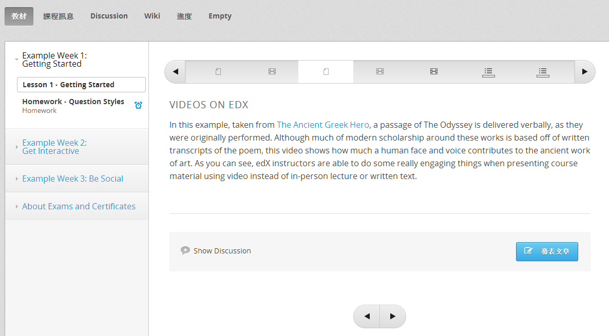
 
**On edX or Edge as an Instructor**
 
當您以老師的角度在edX或Edge看課程。
 

* 您會看到您課程中所有您已設為公開的Units。
* 釋出日期不重要。

 
您沒有看到設為私人的Units。
 
 
另外，在edX或Edge頁面上方，您可以看到 **Instructor** 標籤。

 
 
以老師的角度觀看您在edX或Edge上的課程，點擊 **View Live**。
這個 **View Live ** 按鈕在三個地方是available。** **

 
**Course Outline** 頁面。
 
 
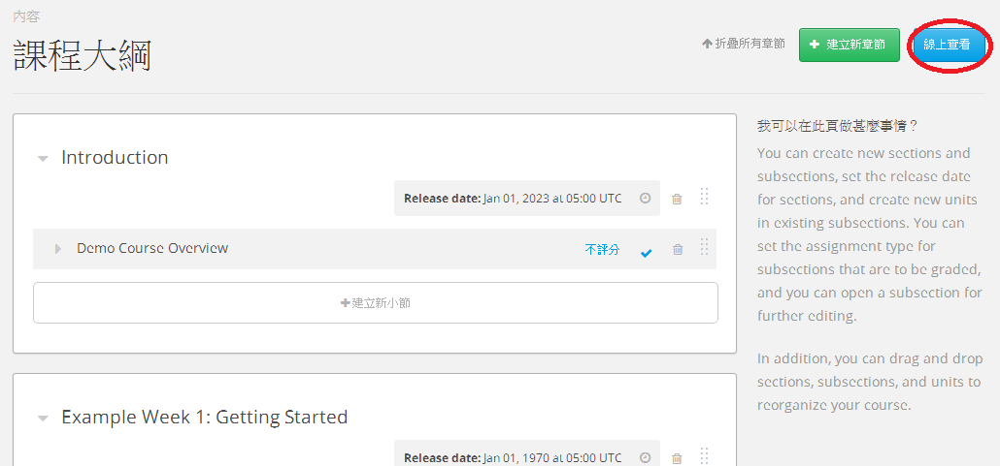
 
 
任何Subsection頁面。
 
 
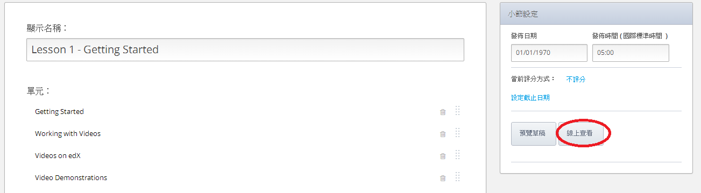
 
 
 
Unit頁面，Unit是否為公開。
 
 
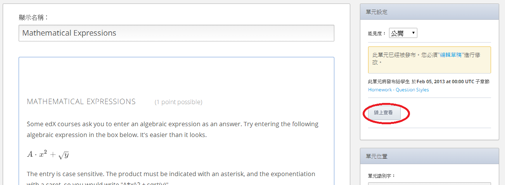
 
例子
=======
 
接下來的例子是如果您過去以老師的角度在edX或Edge上正在觀看第一Unit中
"What Does an edX Course Look Like?" Subsection。注意**Instructor** 在頁面的上方。
 
 
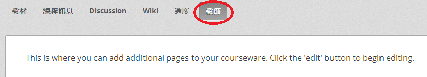
 
 
"What Does an edX Course Look Like?" Subsection的釋出日期被設定為January 1, 2099。
但是，您依然可以以老師的角度在edX or Edge看到這個Unit。

 
 
另一方面，請記得Unit 1被設定為公開，Unit 2被設定為私人。
則Unit 2不是被顯示在課程ribbon中畫面的上方。
取而代之的是在下一個公開Unit， **Tabs**，顯示。
 
 
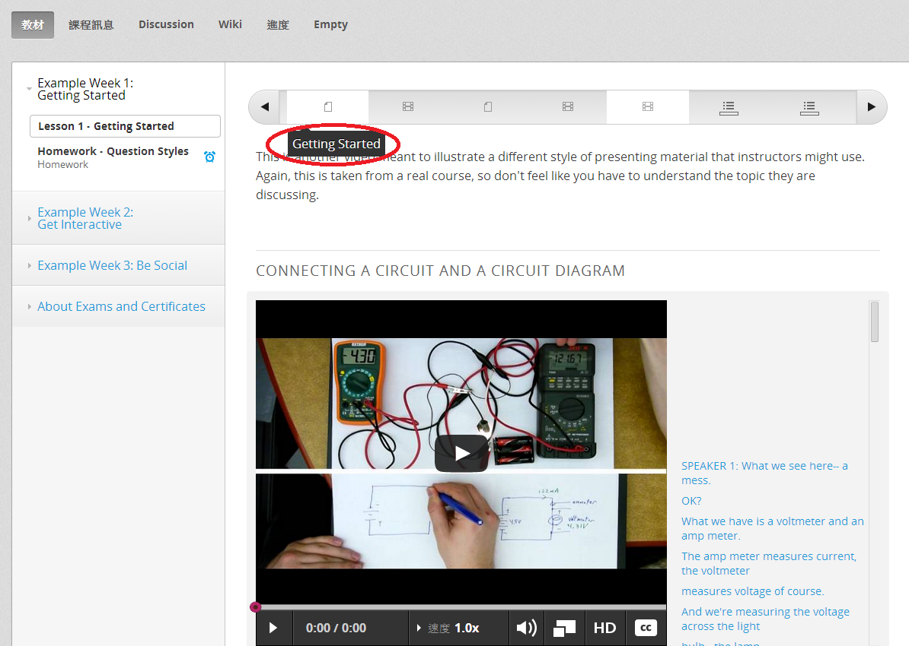
 
**On edX or Edge as a Current Student**
 
當您以目前學生的角度觀看您的課程，您只能夠在滿足三個發佈條件下看到教材：

 
 
當開課日期已過。
 

* Section和Subsection的釋出日期已過。

* 這個包含教材的Unit被設定為公開。
 

您可以使用這個view來確保教材不是過早顯示在您的課程中。

 
 
為了以學生的角度來觀看課程，在edX和Edge上以is not associated with您的課程團隊的郵件地址來設定好一個測試帳號，
之後進入您的課程網址並且註冊您的課程。

例子
=======
 
接下來的例子是如果您過去以學生的角度在edX或Edge上正在觀看第一Unit中
"What Does an edX Course Look Like?" Subsection 。
注意 **Instructor** 標籤不是顯示在頁面的上方。

 
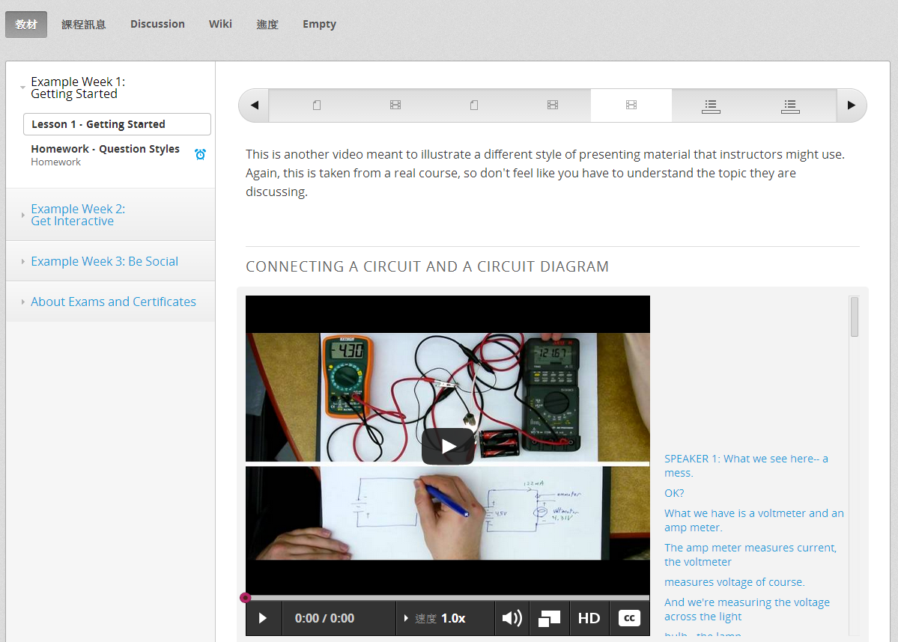
 
 
請記得Unit 1被設定為公開，以及Unit 2被設定為私人。Unit 2不是顯示在畫面上方的課程ribbon。
取而代之的是在下一個公開unit， **Tabs**，顯示。

 
 
.. image:: Images/image229.png
 
 
如果您改變Subsection的釋出日期為未來 (像是 January 1, 2099) ，學生就不能看到它。

 
 
如果您設定Unit為私人，學生就不能看到它。
