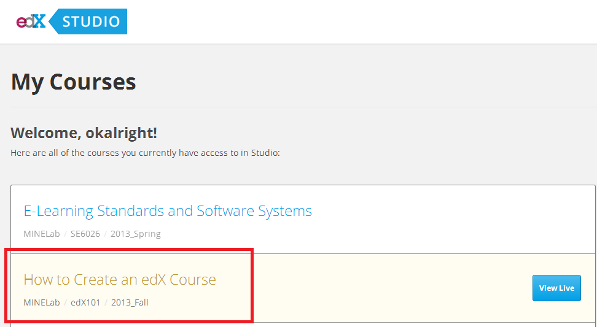
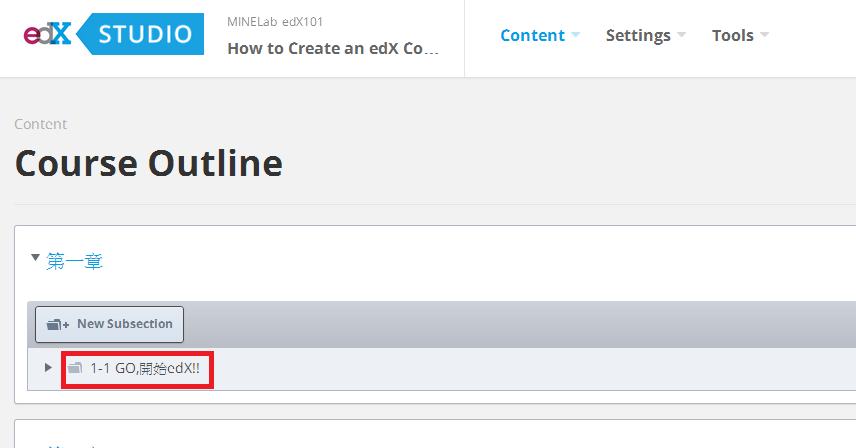
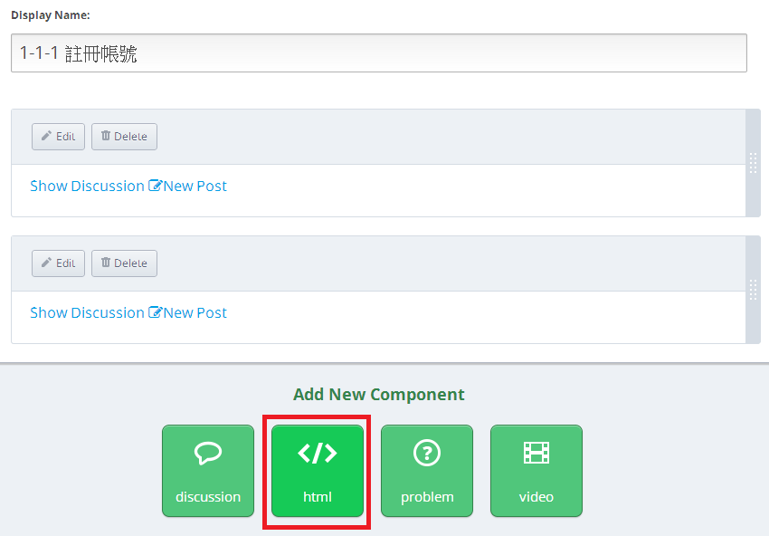
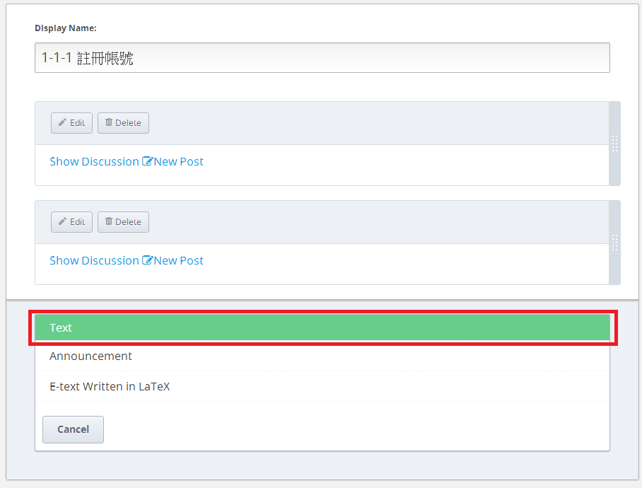
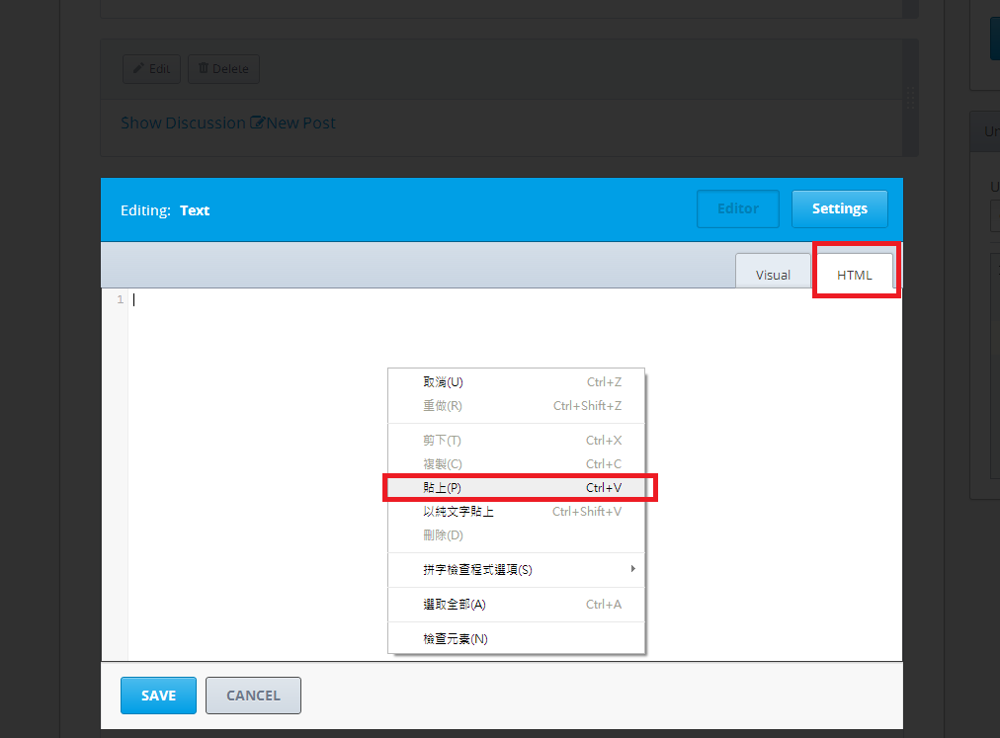
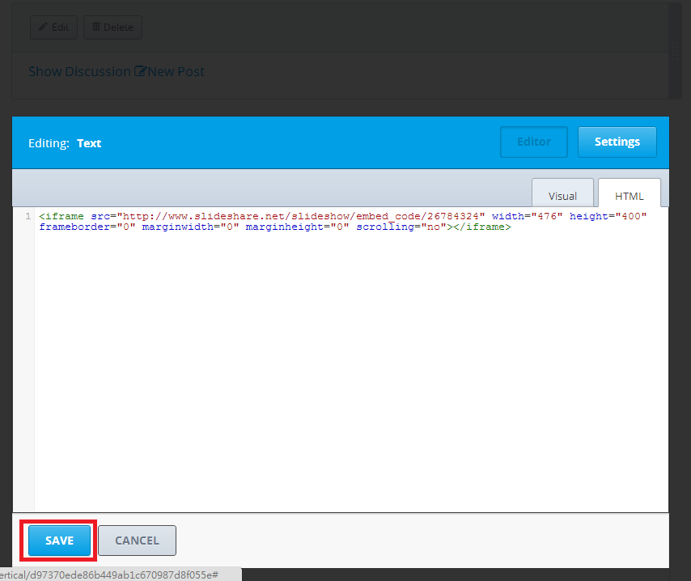
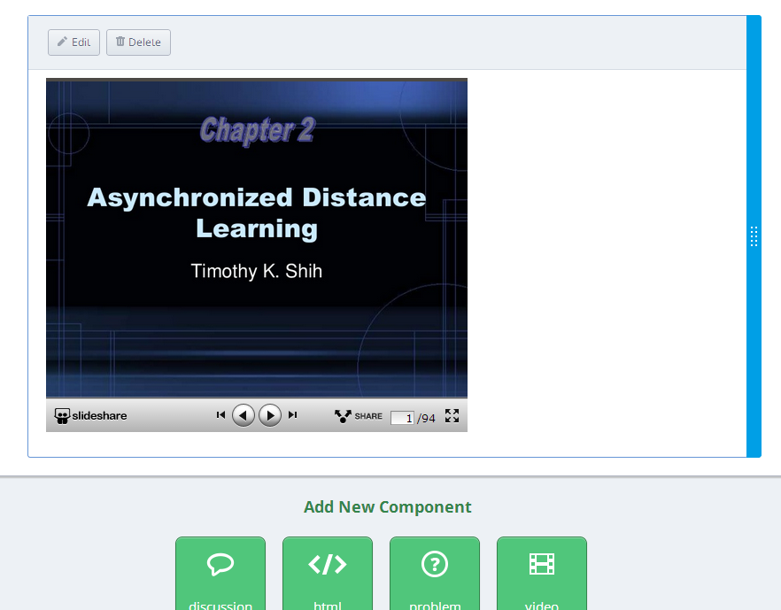

#################
加入簡報至edX課程
#################

要將上傳至SlideShare的簡報加入edX課程中，您需要用到HTML組件，將SlideShare提供的分享HTML語法加入至課程中。

1. 請先登入edX Studio課程編輯系統

2. 進入小節
   選擇要插入簡報的單元

3. 選擇加入HTML組件

   選擇使用純Text的HTML樣板

5. 貼上您於SlideShare網站上取得的HTML語法

   記得儲存您的變更

   儲存以後您會看到一個SlideShare的簡報瀏覽畫面，完成！

