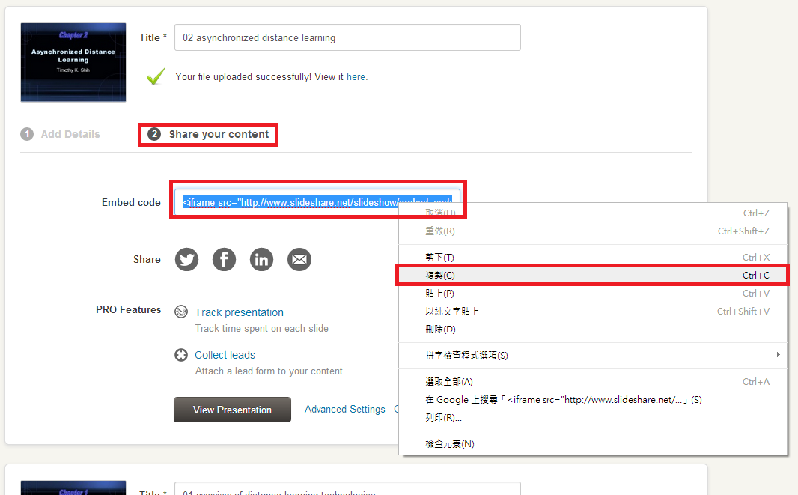
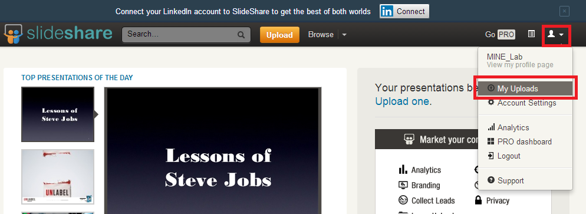
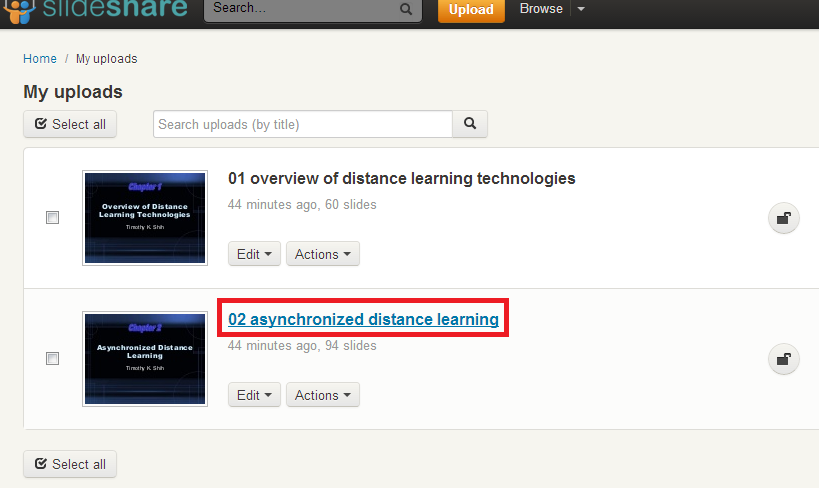
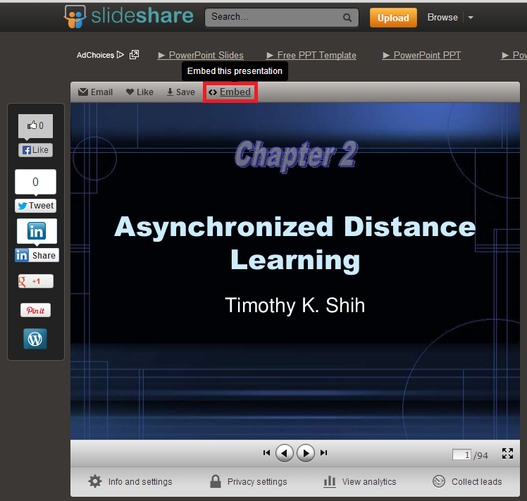
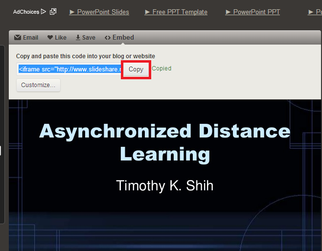

########
分享簡報
########

SlideShare提供了相當方便的分享功能，要將SlideShare的簡報加入edX課程中，請參考下列步驟：

1. 您可以選擇SlideShare提供給您的嵌入專用程式碼

2. 或者從已上傳的檔案中挑選出您欲加入的簡報檔案

3. 找到您要分享的檔案之後，您可以看到畫面上方有個”Embed”的按鈕可以點選，點下後您會看到一段HTML語法，請複製下來

4. 保留這段複製下來的語法，在下一章您會需要它
