########
關於課程
########

關於課程這個章節，將詳細的向您介紹課程資訊頁面中，各個分頁的功能如何使用。
誠如前章所介紹，在這個課程資訊當中擁有「課程資訊」、「教材」、「課程討論區」、「Wiki」、「學習進度」、「教科書」這些分頁資訊。本章將引領您如何使用各個分頁提供的功能，讓您能順利瀏覽課程內容，並與其他學習者、教師進行互動，以達到學習的目的。

********
課程資訊
********

此分頁為這門課程的新增公告或更新，作業與考試的提醒，學生課程行事曆的變動通知，以及學生需要銘記的重要步驟等，主要說明本課程目前概況。

當您從控制台點擊課程連結進入課程頁面的同時，系統會自動將您轉載至此頁面。
此頁面為每一門課程的課程主頁，對於課程的現況做簡要的說明，以讓您了解目前課程進度為何，目前進行的作業或是考試是哪些，並且可以透過提供的連結，快速地進入課程的活動以進行課程活動。

以「MITx: 6.00.1x Introduction to Computer Science and Programming」課程為例:

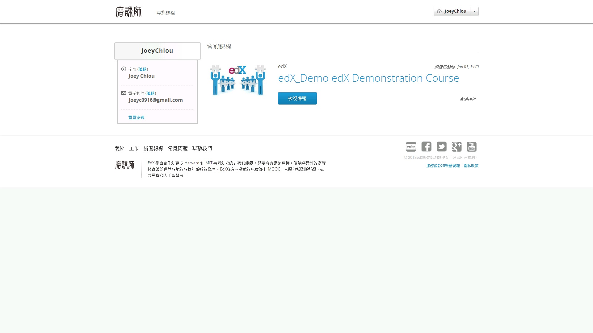
 
您可看見此頁中間的部分，有對於目前本週課程的進度概述，以及建議學習者投入多少的學習時間來進行這些活動，像是作業是否批改完成，同時會提供連結供學習者點選，以讓您點擊後可快速進入該頁面，了解相關的資訊。
而右方也有提供一些連結來引導您更快速進入連結，以 「MITx: 6.00.1x Introduction to Computer Science and Programming」課程為例，分別為「課程討論區的說明」、「與其他學習者合作的建議」、「課程大綱」以及「課程學習建議」。
另外，教師在課程進行期間，若有其他的補充建議或資訊，也會提供在這個頁面當中。
 
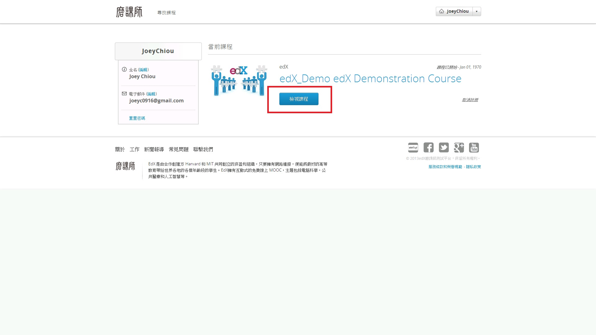
 
************
檢視教材內容
************
 
教材在 edX 的課程當中，是以「章節」的呈現方式存在。
「章節」是最頂層的類別，可以用它來組織您的課程。
許多教師根據位於課程第幾週來命名，像是第一章被命名為「第一週」、第二章被命名為「第二週」，以此類推。
章當中包含了「小節」，裡面包著更多「單元」。有些章節與單元，會依據開課教師的設定，隨著課程的進行與時間的推移，才會顯示該教材內容，讓您得以瀏覽與檢索。
 
因此，您可依照您的學習狀況，來觀看從過去到現在的課程內容。
舉例來說，如果您對於某一週所上的課程內容有疑問，或是經由作業練習與考試後，發現某一部分的課程理解不夠清楚，您可透過列表中的連結，點選過去已學習過的課程再次學習，達到復習的目的。
一般教材內容的規劃，開課教師多數會提前一週發布課程內容，讓您可以提前了解接下來要學習的部分。
因此，您也可透過教材內容預習課程，讓未來在學習課程時能有更好的成效與幫助。 
 
您可點選左方的「章節」連結，來瀏覽該章節的課程投影片以及影片，或是進行該章中的各個課程活動。 
 
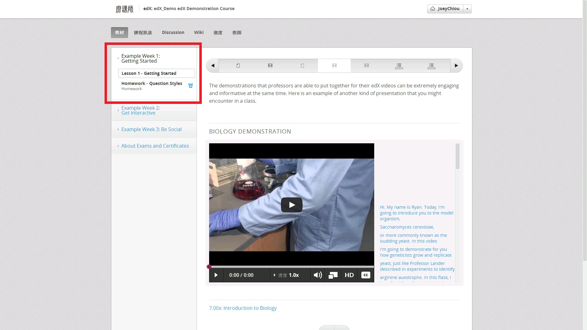
 
另外，您也可以透過上方所提供的「小節」連結，來輔助您更迅速的檢視該章節中的每項課程活動，像是隨堂練習、作業提交、考試，或是與其他學習者討論該章節的課程內容。 
 
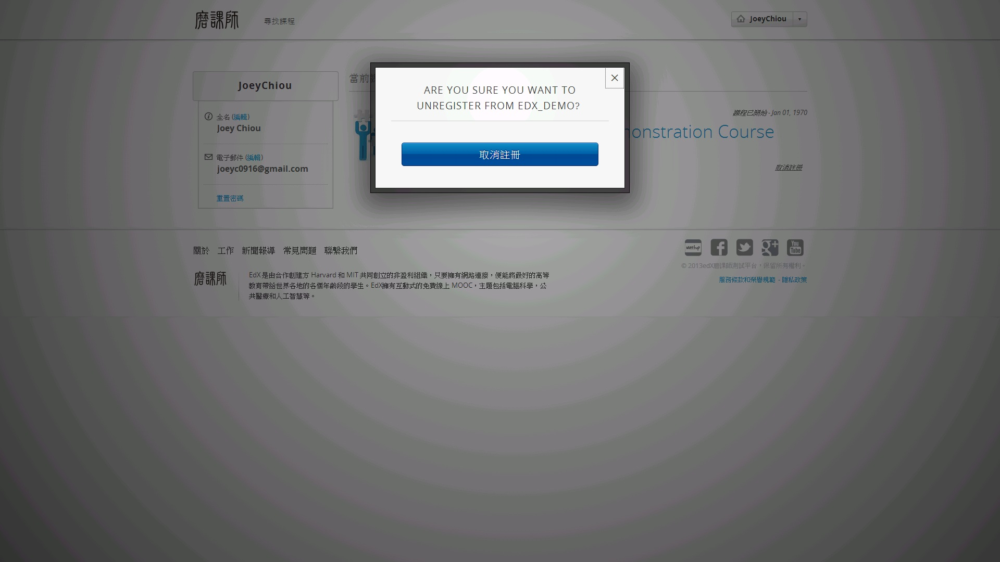

********
課程大綱
********

課程大綱會列出所有課程底下所有的靜態頁面，這些頁面能協助您快速存取課程的重要頁面。
靜態頁面不見得以一個特定的順序分布，觀看開課教師對課程內容的規劃。
舉例來說，靜態頁面中可能包含該課程的教學大綱或該課程的評分標準，您又應該怎麼樣獲取這些分數，以及建議您投入課程的時間。

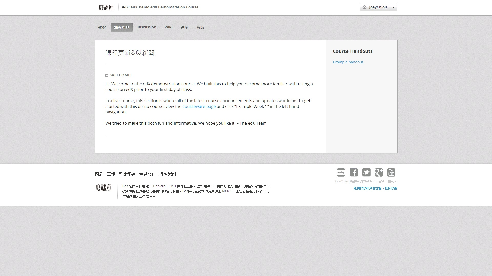
 
 
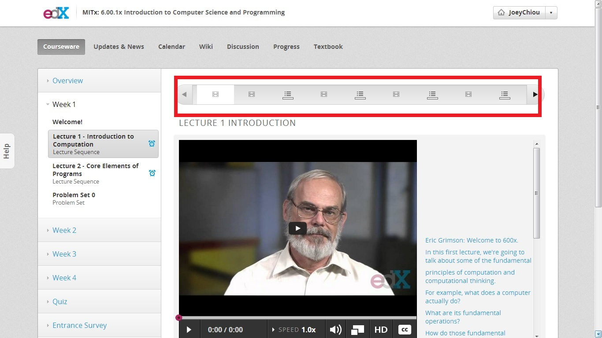

**********
課程時程表
**********

在每一門課程當中，會為您提供一個課程的時程表，開課教師可以創建一個 Google 行事曆讓學生可以合併進他們個人時程表中，或者會使用 HTML 去創建一個動態行事曆讓學生可以點擊連結。
您可透過課程提供的時程表，來新增您個人學習的時程表。
以下將介紹一個透過課程時程表來完成活動的方式，首先您可點擊課程時程表以檢視該課程的課程時程表，接著您可點選欲進行的活動，讓頁面轉載至該活動對應的頁面，以進行該課程活動。
舉例來說，您可透過點選課程連結，來檢視教材內容。

.. image:: Images/image023.jpg
 :width: 800
 
 
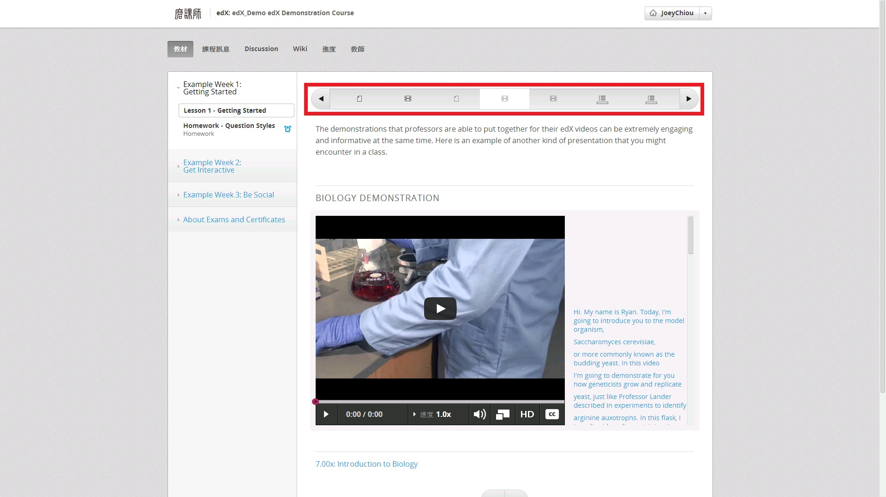

同時，您也可以如下圖的方式，透過點擊課程活動，來進行對應之課程活動。
例如：作業提交、考試等。

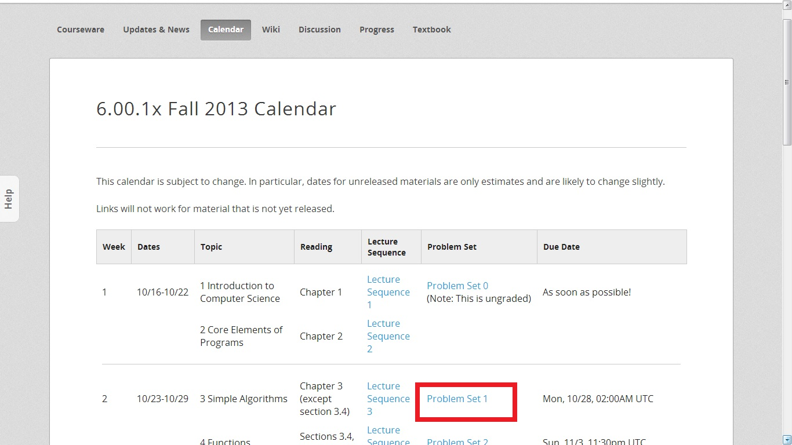
 
 
.. image:: Images/image026.jpg
 :width: 800

****
Wiki
****

提供與 Wiki 相同的功能，提供您開啟與創建一個 Wiki 文件。

**********
課程討論區
**********

您可以在您所註冊的課程中，進入該課程的「課程討論區」，與其他學習者或是教師討論，達成溝通及互動的目的。
課程討論區可讓您提出對於課程內容的疑問，或是提供補充資料給其他學習者。
同時，您可藉由課程討論區了解其他學習者對於課程的了解程度，像是其他學習者所發問的問題類型、相關資料，對您在學習課程時將更有幫助。
基於與其他學習者及教師的互動，可以增加個人對於該課程的了解，以及解決問題的能力，更可以透過解決其他學習者的問題來增加自己對課程的了解程度。
另外，您可以追隨任何一項討論主題，在該主題有任何更新的時候，將會發出通知提醒您前來檢視。
在追隨任何一個討論主題的時候，您也可以針對其他學習者所提出的問題、回應作評論，以推薦其他學習者來觀看這項主題或是回應。
接下來，將一一介紹討論區所提供的各項功能。

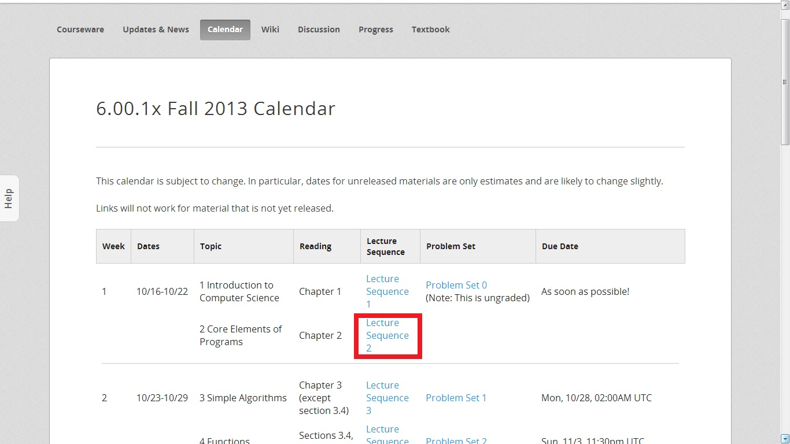
 
**檢視討論主題**
 ----

進入課程討論區後，討論區的左邊將列出目前擁有的各項主題、推薦次數與回應次數，您可透過點選各項主題來檢視各項主題的內容，接著可再針對該主題做推薦與回應等等的討論區互動。

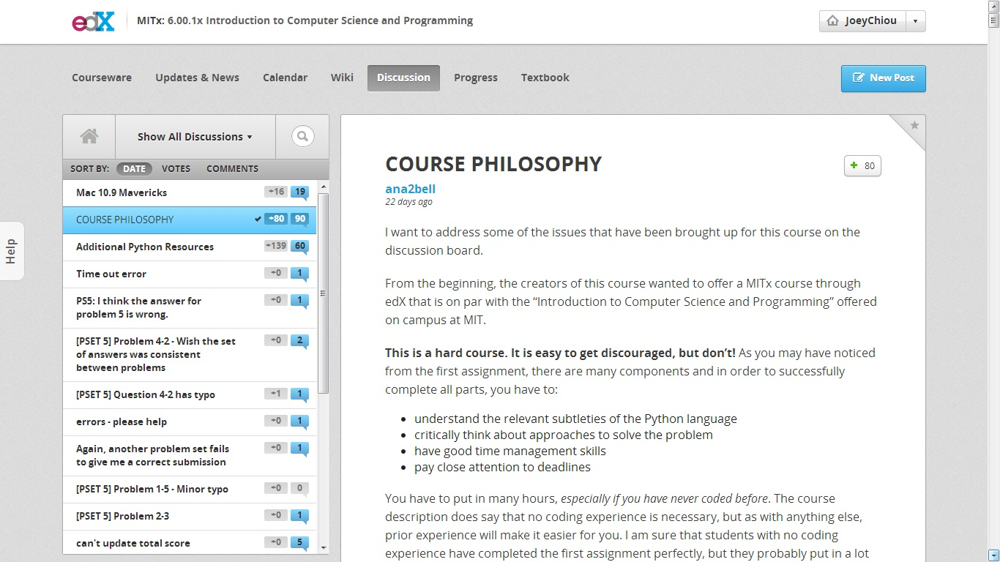

**發表文章**
 ----

進入課程討論區後，若您在左邊的主題列當中找不到您所需要的討論主題，您可點擊 New Post 連結，以發布新的主題來請其他課程參與者來參與您的討論。

如下圖所示，您可點擊 New Post 連結來發布一個全新的主題，您必須填入該主題的名稱、討論的內容，同時您可點選左邊的下拉式選單，來決定您所發布的主題是與課程哪個部分相關聯，讓其他學習者更能容易搜尋及了解這個主題是在探討課程中的哪些部分。
當您填寫完對應欄位中的資料後，即可點擊 Add post 張貼這篇討論，或是可以點擊 Cancel 取消發布。

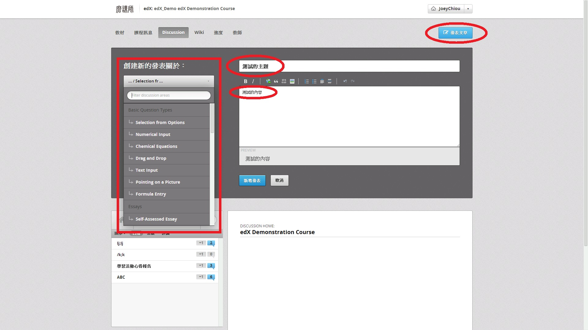

**追隨與推薦主題**
 ----
 
當您進入課程討論區後，在課程討論區左邊點選您想觀看的討論主題，即可觀看該主題目前討論及回應的內容。
如果您對該主題非常有興趣，或是這個問題尚未有其他學習者或教師回答，而您也想了解這個問題的答案，您可選擇追隨這項討論主題。
而若您覺得這項主題非常有趣，或是您認為其中某項回應非常有參考價值，您可透過推薦主題的方式，來推薦給其他課程參與者觀看，進而增進所有課程學習者的互動，讓討論的主題更加熱烈。

您可點擊討論主題的右上角，如下圖中紅筆圈選的地方，來追隨這項討論主題，日後若該討論主題有新增的回應或是新增的內容，將會通知您前來觀看。
而若您要取消追隨這項討論主題，只要再次點擊即可。 
 
.. image:: Images/image030.jpg
 :width: 800

同時，您亦可點擊右上角的「+」號，如下圖紅筆圈選處，來推薦這個主題。
當您點擊推薦主題後，推薦的次數將會增加一次。
在此之後，前來主題討論區尋找主題的其他學習者，即可透過推薦次數作為參考依據，來選擇是否要觀看這項討論主題。

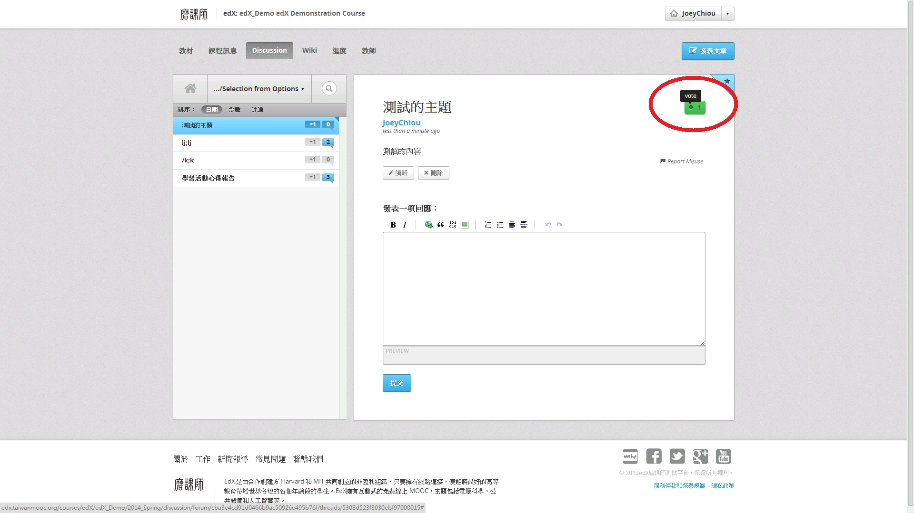

**發表回應與推薦回應**
 ----

在您進入課程討論區後，選擇了討論主題，若您對於該主題的發表內容有興趣，同時您想發表一些您個人的意見，可透過發表回應的方式來對主題做回應，或是針對其他課程參與者的回應發表回應，並且可以推薦某篇回應給其他課程參與者做為參考的依據。

您可將頁面卷軸拉到頁面的最下方，會有發布回應的欄位，在欄位中填寫您對這項主題想發表的意見後，按下 Submit 連結提交至討論區。

.. image:: Images/image032.jpg
 :width: 800
 
同時，您也可針對某篇回應，發表您個人的意見與回應。
另外，若您覺得某篇回覆非常具有參考價值，您可推薦這篇回應。
點擊該篇回覆右上角的「+」號，即可推薦這篇回覆給其他課程參與者。
 
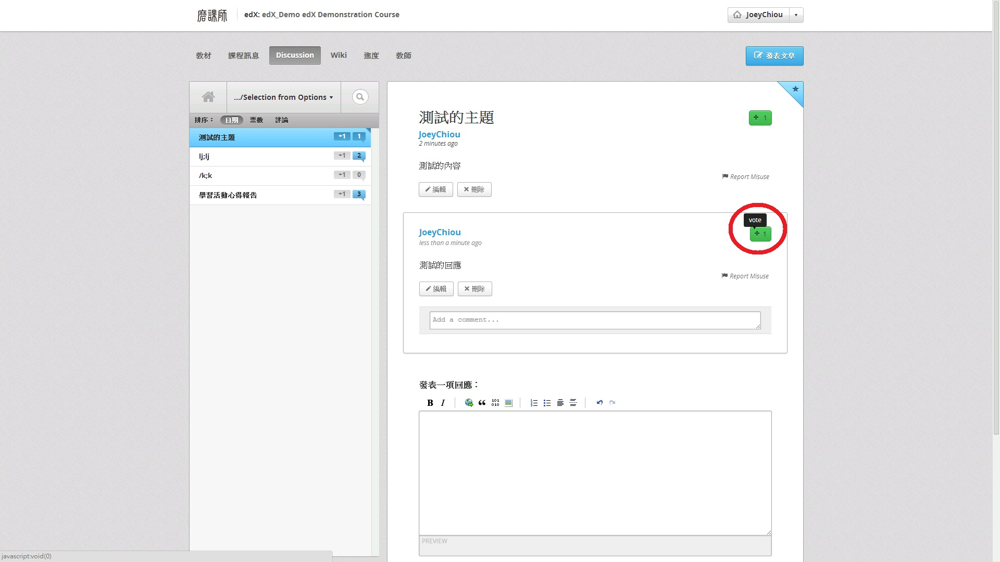
 
**尋找討論串**
 ----
 
若您想要在討論區列表中，尋找某特定關鍵詞的討論主題，您可透過討論區提供的搜尋功能，來協助您找到欲觀看的主題。
同時，您可透過排序的方式，來協助您觀看各項主題，而 edX 提供三種排序的方式分別為：時間（由近而遠）、推薦次數（由多至少）、回應次數（由多至少）。
 
您可在如下圖紅筆圈選處，鍵入您欲查詢的關鍵詞，來協助您尋找特定的討論主題。
 
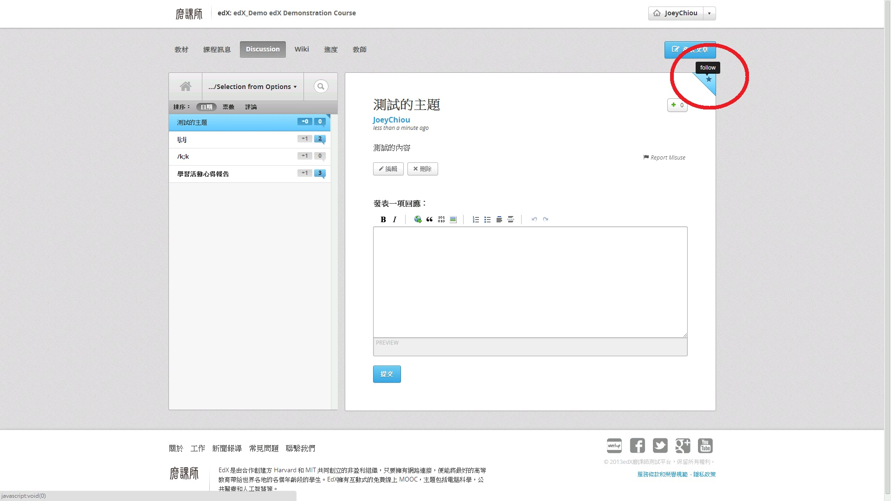
 
另外，也可透過三種不同的排序方式，來協助您尋找欲觀看的主題。 
 
.. image:: Images/image035.jpg
 :width: 800 

********
檢閱歷程
********

在學習的過程當中，時不時的檢閱自己的學習狀況，是一件非常重要的事情。
除了能確實明白自己是不是對課程的某些部分已完全了解，同時也可藉此機會補強自己缺乏的部分，亦可以做第二次的複習，以檢驗自己是否能學以致用。
因此， edX 在您學習的時候，記錄了您學習各課程的歷程，像是作業是否繳交、考試是否餐與、隨堂練習是否完成，而每項活動又拿到了多少分數等。

當您點擊「Progress」連結時，您會看到如下圖所示的進度表。您可透過此進度表，來了解自己對於這門課程的完成度有多少，以及各個部分的完成度又有多少，以對自己的學習做一個檢驗。

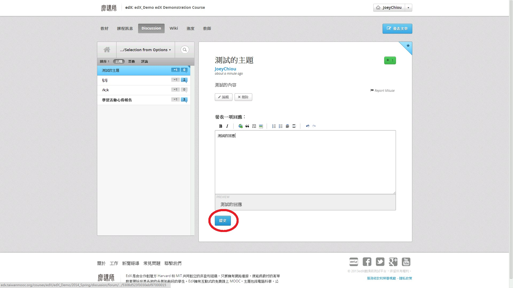

另外，您也可透過進度表下方，edX 提供列表方式的進度表，來了解各個作業與考試的分數，進而了解自己的學習情形。
同時，列表中的每個部分，都與課程章節及課程活動對應，當您點下該連結時，即可將頁面轉載至該課程頁面，完成未完成的課程活動，或是達到複習及再次檢驗的目的。
 

******
教科書
******

開課教師將提供課程使用書籍資訊，若您在學習時需要教科書，您可參考此頁面由教師提供的教科書資訊，以購買教科書，但 edX 並沒有要求學習者一定要購買提供的書籍。 