############
開始使用 LMS
############

****
簡介
****

當我們開始發行 edX 給我們最初的夥伴時，我們已經提供一些機會讓另外的教師們在我們的平台上創建一些課程。
我們努力的果實是 Edge 與 Studio。
這些工具不只對我們的 edX 平台有用，還能對所有大學協會的所有教職員有所幫助。

EdX (http://edx.org) 是我們獨創，最初的學習入口。
在 edX 上能做的事情，端看於您的學校和 edX 達成的協議內容。
您需要您學校的特別批准以將您的課程放置到 edX 上。
一旦課程被放置到 edX 入口，它就變成一個公開大型開放式線上課程(MOOC)。

LMS 是 edX 提供給各使用者所觀看的介面。
為了讓使用者能夠尋找欲學習的課程，並透過各課程提供的課程資訊、作業與考試，以及與其他使用者的互動，來達到學習與獲取知識的目的。
使用者可以透過欲學習的課程名稱或是開課單位，在 LMS 中尋找欲學習的課程註冊，並經由各開課單位所提供的課程內容，作為學習的途徑。

這裡有個如何開始的工作流程，以下是份簡易的總結:

1. 首先進入: https://www.edx.org/ 註冊並且創建一個帳號。

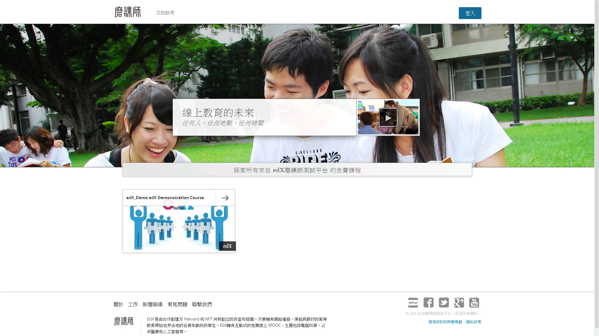
 
2. 在 LMS 尋找欲學習的課程。

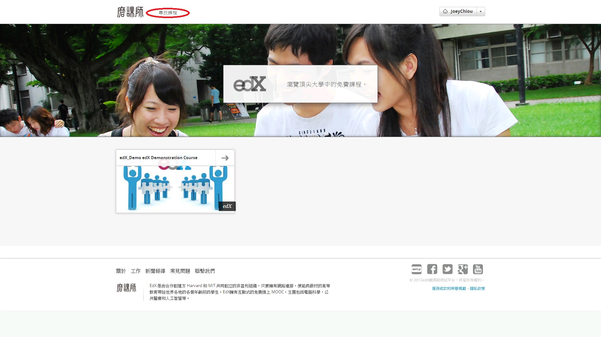

3. 在控制台中點選已註冊的課程連結，開始檢索所有課程相關資訊以及各種操作。

.. image:: Images/image003.jpg
 :width: 800
 
************
創建一個帳號
************

要開始使用 LMS，您必須先以一個獨一無二的使用者名稱及密碼創建一個帳號。
在 LMS 當中所有的學習行為與學習歷程，都將依據您的帳號資訊記錄在 LMS 當中，讓您在未來能夠檢視過去的學習情形。

1. 進入 http://www.edx.org/

2. 點選右上方的 Login 連結，進入登入頁面。

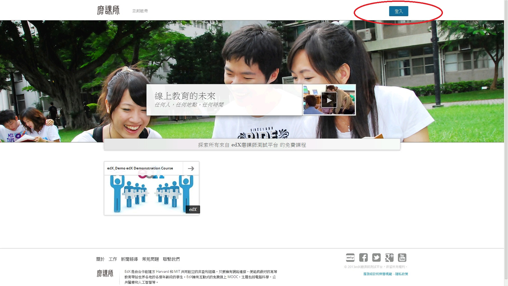
 
3. 點選 Sign up for edX today! 連結，進入創建帳號頁面。

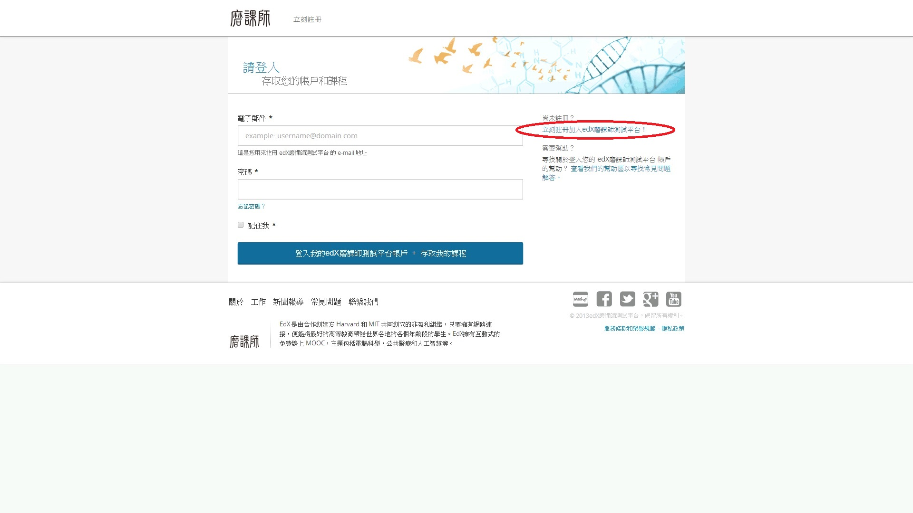

4. 填寫帳號申請之相關資料，有標註星號(*)之欄位為必須填寫的資料。

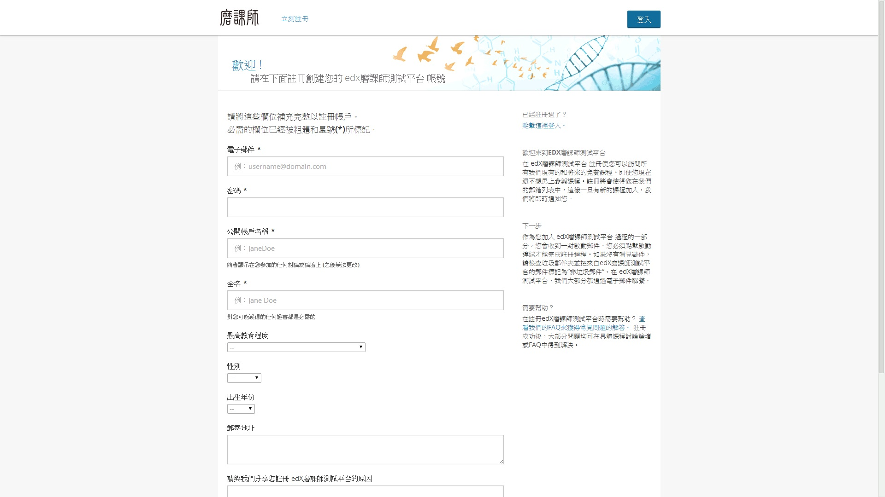

5. 完成註冊，將自動跳轉至個人控制台頁面。

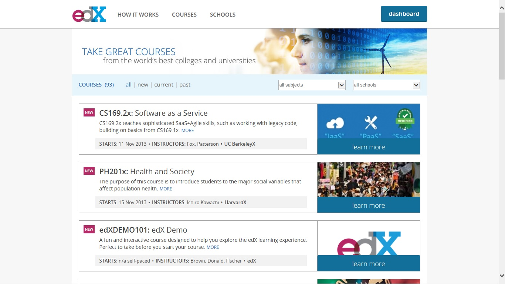

********
尋找課程
********

當您首次登入 LMS ，進入個人控制台頁面時，您將會看到以下的畫面。

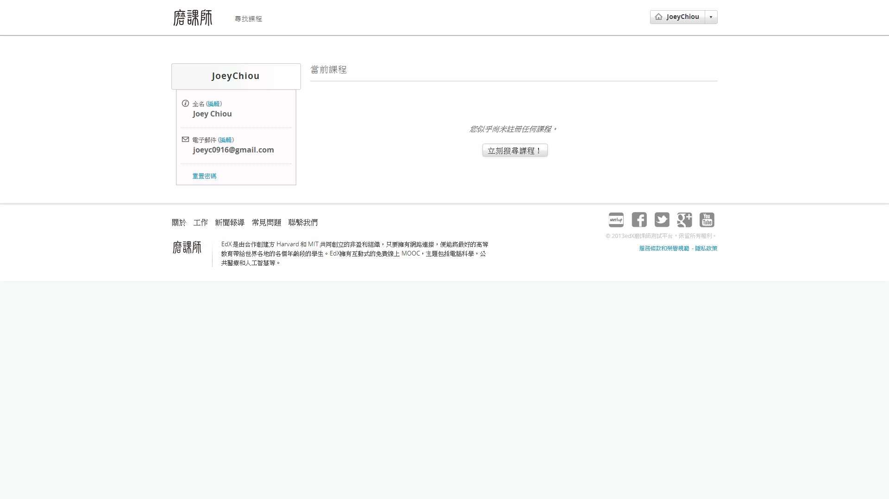

點擊 Find courses now! 連結進入「課程索引」頁面，開始尋找欲學習的課程。
進入課程索引頁面後，您將看到以下的畫面。

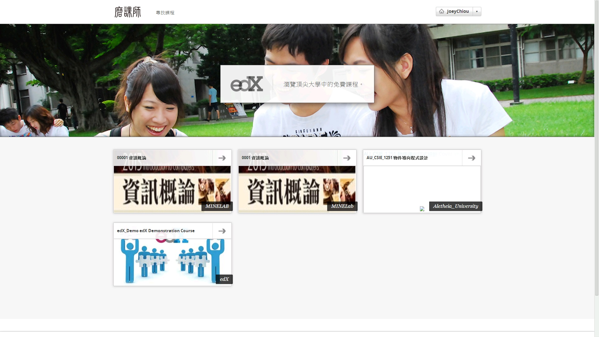
 
在首頁或是尋找課程頁面中，下方的課程圖示及連結，將提供您目前在平台上的課程。您可在此頁面當中，探詢您欲學習的課程，或是瀏覽目前平台中提供的所有課程。

************
註冊一門課程
************

在 LMS 中的學習，都是從註冊一門課程開始，緊接著您可進入這門課程頁面，檢索課程的相關資訊、與其他學習者共同討論、進行作業練習以及檢閱您的學習歷程等。

首先，在尋找到您欲學習的課程後，點擊課程清單右邊的 learn more 連結或是課程圖片，以進入該「課程細節」的頁面中。

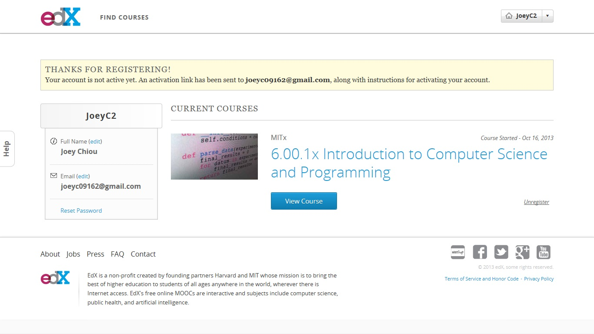

在此課程細節的頁面中，有課程的開課單位、課程編號、開課時間、課程學習時間以及每週建議學習者所需投入多少時間等資訊；並且還有課程的簡介、課程講師以及常見的問答集。
您可詳細閱讀這些資訊，來對課程做初步的了解。

在閱讀完這些相關資訊後，您可點擊 Register for XXXXX (XXXXX為課程編號)之連結以註冊該課程。

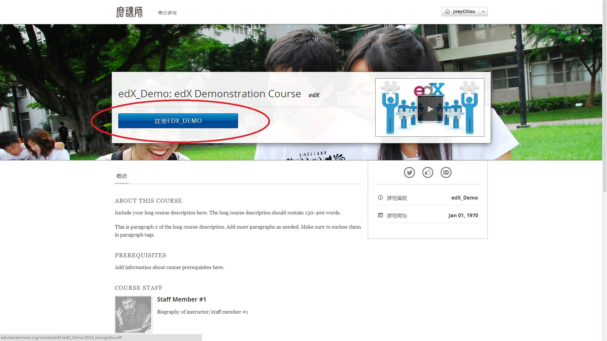

註冊完成後，將自動跳轉至您的控制台頁面當中，同時您會發現，該課程已出現在您的課程學習清單內。

.. image:: Images/image013.jpg
 :width: 800

********
檢視課程
********

一旦註冊了一門課程以後，您將可從控制台頁面來選擇您的課程，以進入課程進行學習。
延續「註冊一門課程」的介紹，您可透過以下畫面，在您欲瀏覽的課程，點擊「View Course」連結進入課程。
 
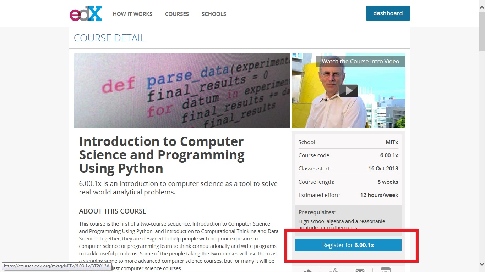

**課程檢索**
 ----

進入課程檢索頁面後，您將被自動轉載至這門課程的「最新消息與更新」分頁，您可看見關於這門課程的最新資訊，像是開課教師近期內發布了哪些投影片、出了哪些作業與希望繳交的時間、對於近期課程的進程與介紹，以及接下來的課程活動等。
同時，您將可透過其他的分頁，看到這門課程的所有相關資訊。
一門課程的分頁所記載的相關資訊如下所列：

.. image:: Images/image015.jpg
 :width: 800

`Course Info`:
此分頁為這門課程的新增公告或更新，考試的提醒，學生課程行事曆的變動通知，以及學生需要銘記的重要步驟等，主要說明本課程目前概況。

`Courseware`:
此分頁將呈現這門課程當中的投影片、影片、作業練習、考試等活動，可進入這個分頁中，以進行投影片的瀏覽、影片的觀看，以及提交您的作業與參加考試等。
同時，可觀看每位學習者餐與各個活動時，所提出的問題或是意見，並與他們進行討論。

`Calendar`:
此分頁為課程詳細的時程表，內容記載著每週的期間，期間內所教授的主題、章節，與該主題、章節相關聯的投影片與影片，作業與考試的規劃，以及建議完成此進度的截止時間。

`Wiki`:
此分頁提供所有課程餐與者，可以共同創建與編修一個關於此課程的 Wiki 討論，使用上與協作 Wiki 的方式大致相同，得以觀看、編輯、修改各項內容。

`Discussion`:
此分頁提供所有課程餐與者，可以開啟一個新的討論串或餐與他人的討論。
能藉由搜尋與排序的方式，找到欲了解或詢問的相關主題，亦可針對各學習者所提出的意見推薦或是回報給管理者，同時可以跟隨有興趣的任一項討論串，在該討論串有相關更新時，會自動通知跟隨此討論串的餐與者。
此討論區建立給授課者與授課者間、學習者與學習者間、授課者與學習者間三種關聯，提供一個詢問問題與討論的管道。

`Progress`:
進度分析表呈現了該學習者對於每項活動的完成度。
當您餐與了一門課程，不論是瀏覽投影片、觀看影片、提交作業、餐與考試，皆會針對您的學習行為做評比與紀錄，這個分頁將呈現您在這門課程中的所有表現情況，以讓您了解您對於這門課程的學習情形，以及是否尚有未完成的課程活動等。
 
`Textbook`:
此分頁為介紹該門課程所建議使用的教課書與教材，您可透過瀏覽此分頁，了解這門課程所使用的教材與教課書資訊，以協助您增加學習效率及對該課程更進一步的了解。

**取消註冊**
 ----

如果您發現對於您已註冊的課程，其實並不是您所想學習的課程，可執行取消註冊的動作，來取消註冊該門課程。
在學習一門課程的期間，或許會發現所學習的課程過於困難，亦或是並非有興趣、想學習的主題，又或著因為缺少太多的課程活動，導致學習效果不佳的情況發生。
此時，您可以考慮取消註冊該門課程，待下次開課時再重新註冊學習，或是找尋其他您需要的課程。

請進入控制台中，在欲取消註冊的課程右下角，點選「取消註冊」的連結，接著點擊彈跳視窗中的「取消註冊」做二次的確認，即可取消該課程的註冊。
該課程將從您的控制台中刪除，並且清除您的學習紀錄。

.. image:: Images/image016.jpg
 :width: 800